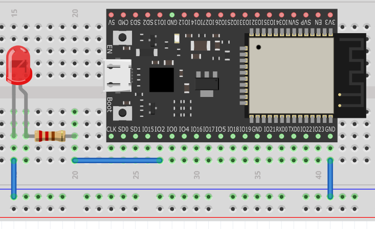

# 第1回 エンジニアのコックピット構築と「電気を見る」

## 🎯 今日の目標（これができれば今日は100点！）

今日は、今後1年間戦っていくための「インフラ（環境）」を開通させます。やることが多いですが、以下の3つができれば完璧です。

1. 自分の手で開発環境（Thonny）を作り、マイコンに命令を出す。
2. **AD3（測定器）** を使って、電気の波形を見る。
3. **Google Colab** に証拠の画像とコードを貼り付けて提出する。

---

## 🛠️ Step 1：コックピットの構築（Thonnyの導入と画面配置）pp.43~

まずは、システム管理者の許可（管理者権限）なしで、このPCに君たち専用の開発環境を構築します。

1. **Thonnyのダウンロード**
   * ブラウザで「Thonny」と検索し、公式サイト（ `thonny.org` ）を開きます。
   * 右上の「Windows」にマウスを合わせ、一番上の **「Installer with 64-bit Python...」** をクリックしてダウンロードします。
2. **インストールと初期設定**
   * ダウンロードしたファイルを実行し、インストールを進めます。
   * 初回起動時に設定画面が出たら、Languageは **「日本語」**、Initial settingsは **「Standard」** のままで「Let's go!」を押します。
3. **画面のレイアウト**
   * **左半分**: `Google Meet`（先生のデモ画面を見るため）
   * **右半分**: `Thonny` と `WaveForms (AD3用)` を並べる
   * **裏側**: `Google Classroom`（最後に使います）

> **💡 Thonny ってなに？**  
> Python のプログラム (ソースコード) はテキスト形式で記述する。「メモ帳」のようなテキストエディタでもプログラミンは可能だが、マイコン用の Python の設定やプログラムの転送機能を別のアプリで実施する必要があり、手間がかかる。そのような手間を減らし、快適にプログラム開発できようにしたツールを IDE という。Python 用 IDE のひとつとして Thonny (ソニー) があり、今回はそれを使用する。(pp.46)
---

## 🔌 Step 2：マイコン (ESP32) を目覚めさせる

脳みそとなる「ESP32」とPCを通信させます。

1. **ESP32 DevKit C** をブレッドボードに指します。  
   ⚠️ 注意: ESP32 DevKit C は幅が広いので、1枚のブレッドボードに挿すと配線用の穴が塞がってしまいます。2枚のブレッドボードをまたぐように挿すと、左右に2つまたは3つのピンの穴が利用できるようになります。
3. **ESP32 DevKit C** をUSBケーブルでPCに接続します（これで電源も入ります）。
4. **Thonny** の右下にある文字（Pythonのバージョン等）をクリックするか、「実行」メニューの「インタプリタの設定」を開きます。
5. 種類を **「MicroPython (ESP32)」** に変更し、ポート（Port）は、USBを挿したことで現れた **「COM◯（数字）」** を選びます。
6. Thonny下部の **「Shell」** に `>>>` という記号が出たら通信成功です！

---

## ⚡ Step 3：測定器 (AD3) を準備する

電気を「見る」ためのツール、AD3をセットアップします。

1. **AD3** をPCにUSB接続し、ソフト **「WaveForms」** を起動します。
2. 左のメニューから **「Scope（オシロスコープ）」** をクリックして開きます。
3. ⚠️ **【超重要・絶対ルール】**
   * AD3から出ている **黒い線（GND）** を、ESP32の **「GND」ピン** に必ず挿してください。
   * ※基準（0V）を合わせないと、デタラメな電圧が表示されてしまいます！

---

## 💡 Step 4：【実験1】手動で電気を操る ＆ 波形観測
ブレッドボードに回路を作り、手動で電気を流してみましょう。


1. **回路を組む**
   * ESP32の `GPIO 2` ピン → `抵抗` → `LED (足の長い方から短い方へ)` → `ESP32のGND` ピン
   <div align="center">
   
   <p>図1 : ESP32 と LED 接続</p>
   </div>


1. **AD3を接続する**
   * AD3の **オレンジの線（Scope Ch1）** を、`GPIO 2` ピン（抵抗の手前）に挿します。
2. **コードを手打ちする**
   * Thonnyの「Shell（`>>>` の後）」に、以下のコードを1行ずつ手打ちして `Enter` を押してください。WaveFormsの画面と、手元のLEDに注目！

```python
from machine import Pin
led = Pin(2, Pin.OUT)
led.value(1)
```
> **👁️ 観察**: `led.value(1)` を打った瞬間、LEDが光り、WaveFormsの波形が **0Vから 3.3V に跳ね上がった** ことを確認してください。（プログラムの「1」は、物理的な「3.3V」のことです）

```python
led.value(0)
```
> **👁️ 観察**: 今度はLEDが消え、波形が **0V に戻った** ことを確認してください。

---

## 🤖 Step 5：【実験2】プログラムで自動化する

毎回手打ちするのは大変なので、プログラムを書いて自動で点滅させます。

1. Thonnyの上画面（エディタ）に、以下のコードを書きます。
```python
import utime
from machine import Pin

led = Pin(2, Pin.OUT)

while True:
    led.value(1)
    utime.sleep(1.0)
    led.value(0)
    utime.sleep(1.0)
```

2. **「保存（フロッピーのマーク）」** を押し、**「This computer」** を選んで `lesson1.py` という名前でPCに保存します。

3. **「実行（緑の再生ボタン）」** を押します。1秒間隔で点滅すれば成功です！

4. **【ミッション】**
   * `utime.sleep(1.0)` の数字を `0.05` などに変更して「実行」し直してみてください。
   * WaveFormsの画面で、波形がどう変化したか観察してください。

---

## 📝 Step 6：レポート提出（エンジニアの記録）

動いた証拠をレポートに残します。

1. Google Classroomから、**「第1回レポート用（Google Colab）」** を開きます。
3. Colabの文字のあたりを **ダブルクリック** すると、編集できるようになります。
4. **コードを貼る**: Thonnyのコードをコピーし、指定の枠内に貼り付けます。
5. **画像を貼る**: WaveFormsの波形が綺麗に出ている画面をスクリーンショット（`Windowsキー + Shift + S`）し、Colabの指定位置をクリックして `Ctrl + V` で貼り付けます。
6. **穴埋め**: 測定した電圧（3.3Vと0V）を記入します。
7. `Shift + Enter` を押してプレビューを確認し、綺麗に表示されていれば **Classroomで提出** して本日は終了です。お疲れ様でした！

