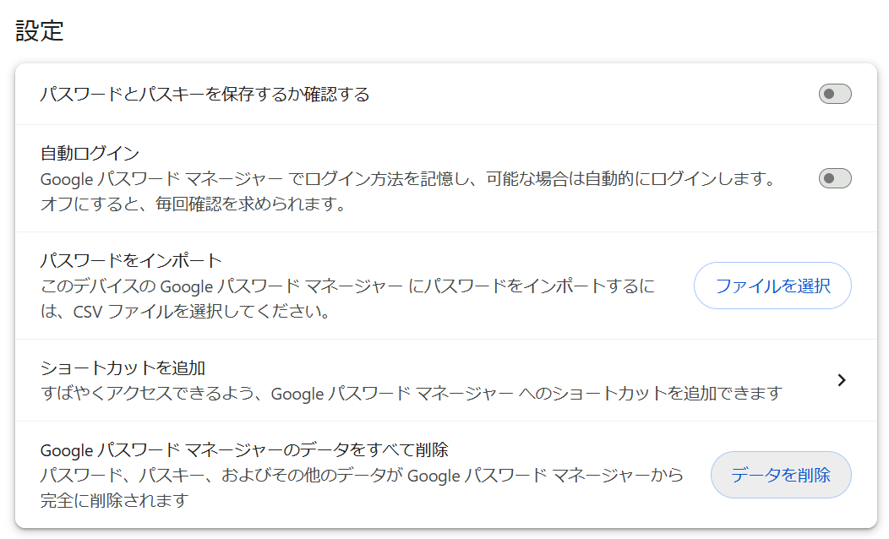
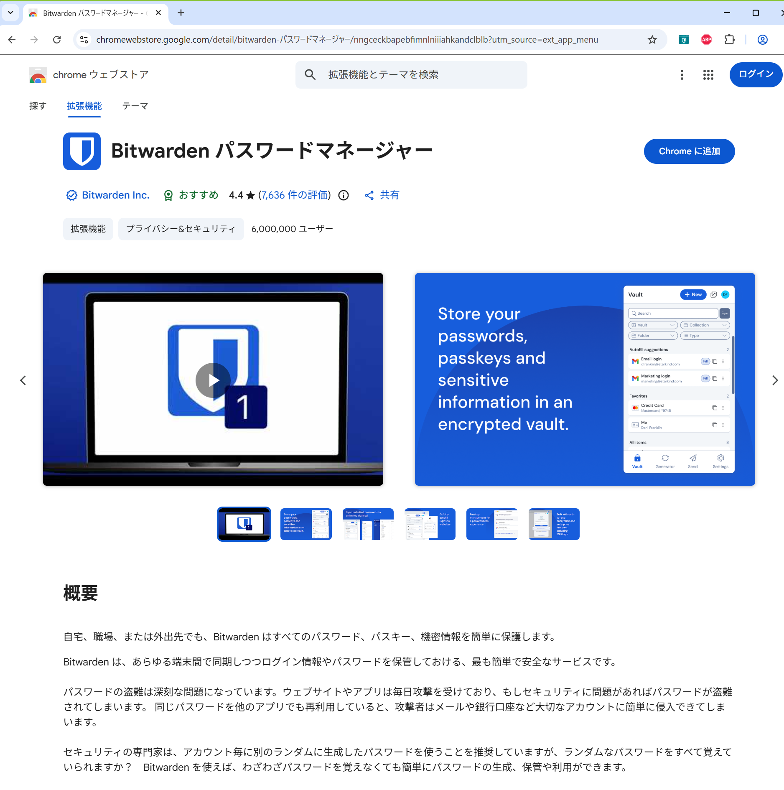
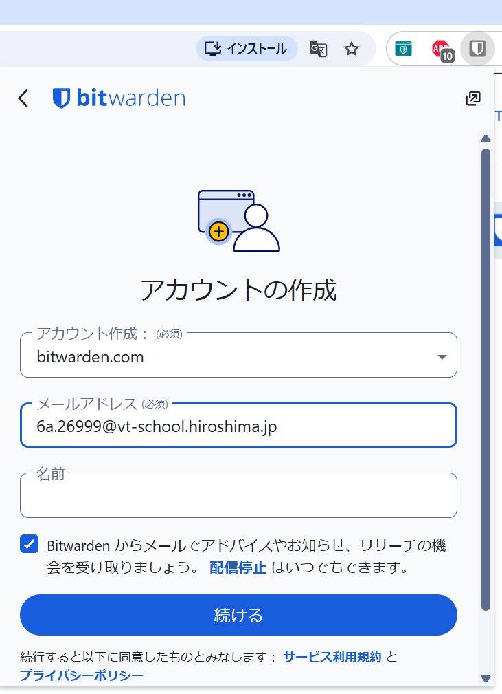
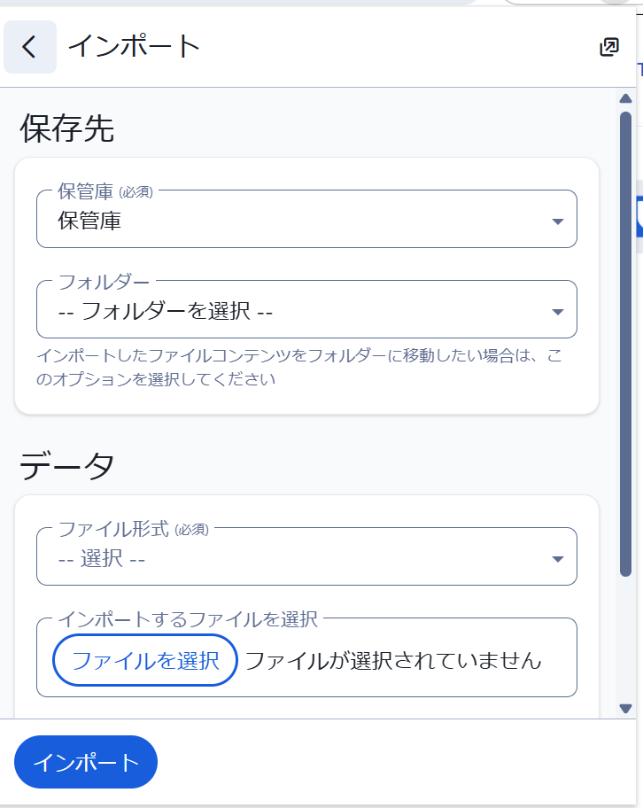
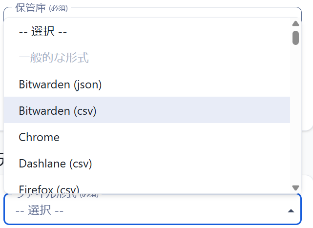

# パスワードマネージャー導入ガイド

インターネットなしでは生活できない世の中になりました。インスタ、tiktok、X といった SNS。アマゾン、楽天、さまざまなチケット予約。メールや LINE といったやりとり。もちろん就活にもインターネットの利用が欠かせません。

それにあわせて必ず必要になるのがユーザー（アカウント）の登録です。

そしてそのとき同時に求められるのが **パスワード** です。秘密の合言葉です。

どうですか、みなさん。パスワード、いろいろなサービスで使いまわしていませんか？
インスタも、X も同じパスワードとか。
数字を入れろと言われたら、`123456` とか誕生日を使ってる、とか。

でももうそういうパスワードは攻撃者にあっというまに攻撃されて暴かれてしまいます。
同じパスワードを使いまわしていたら芋づる式に攻撃されてしまいます。

今日からパスワードの使いまわしをやめましょう。

「え、サービスごとにパスワード変えるの？でもそんなにパスワード覚えきれないよ！」という声が聞こえてきます。

それを解決するのが今日紹介する **パスワードマネージャー** です。

## パスワードマネージャー

パスワードマネージャーとは、インターネット上の　**「超・頑丈な金庫」**　のようなものです。

あなたに代わって、長くて複雑な「絶対に破られないパスワード」を自動で作り、すべてのパスワードを金庫の中に記憶してくれます。あなたが覚えないといけないのは、その金庫を開けるための「たった1つのパスワード（マスターパスワード）」だけです。

ログイン画面に行くと、金庫からパスワードを取り出して自動で入力してくれるので、いちいち手で打ち込む手間も、パスワードを忘れてリセットするストレスもなくなります。

### Bitwarden

今回皆さんに使ってもらうのは、**Bitwarden（ビットワーデン）** というアプリです。

数あるパスワードマネージャーの中でも、世界中で非常に人気があり、セキュリティの専門家からも安全性が高く評価されています。

* **無料で使える**: 今回使う基本的な機能はすべて無料で利用できます。
* **スマホでも使える**: 学校のパソコンだけでなく、自分のスマホ（iPhone/Android）にアプリを入れれば、同じ金庫を共有できます。

今日はこの Bitwarden を使って、学校のシステムを安全・快適に使える最強の環境を作っていきましょう！

## 事前準備：Chrome のパスワード保存をオフにしよう

これから最強の金庫（Bitwarden）を使うので、Chrome に最初からついている「ちょっと弱い金庫」は閉じておきます。これをしないと、2つの金庫が喧嘩してしまいます。

1. `Chrome` を起動します。
2. Chrome の右上「⋮」 > 「設定」をクリックします。
3. 左側のメニューから「自動入力とパスワード」>「Google パスワード マネージャー」を開きます。
4. 左側の「設定」を開き、**「パスワードを保存できるようにする」** と **「自動ログイン」** のスイッチを **オフ（グレー）** にします。

## Bitwarden 拡張機能のインストール

1. Chrome 右上の「⋮」 > 拡張機能 > Chrome ウェブストアにアクセス
2. `Bitwarden` で検索
3. 「Chrome に追加」をクリック

これでパスワードマネージャー **Bitwarden** がブラウザにインストールされました。

いつでも呼び出せるように右上のパズルのアイコンをクリックして Bitwarden をピン留めしておきましょう。

## Bitwarden アカウントの作成

1. メールアドレスの登録

メールアドレスに学校のアドレス `6a.2620X@vt-school.hiroshima.jp` を入力。「続ける」をクリック。
名前はなくてもいいです。

**【重要】この直後に「マスターパスワード」の作成画面が出ます。これが金庫を開けるための「命の鍵」です。絶対に忘れないものを設定してください。**
※設定後、「メールを確認してください」と表示が出ても、今はまだメールが見られないので**一旦無視して進んでください。**

## 学校用アカウント情報のインポート

学校用アカウント情報を取り込みます（インポート）。
みなさんの "I:\" ドライブに "学籍番号_bitwarden.csv" というファイルがあるのでそれをインポートしましょう。

1. 設定 > 保管庫のオプション > インポートを選択

2. ファイル形式：Bitwarden (csv) を選択

3. ファイルを選択

`I:\学籍番号_bitwarden.csv` を選択。

4. 「インポート」をクリック。

これで学校生活で必要な Google アカウントと Microsoft アカウントが登録されました。

## 注意事項

1. **拡張機能はブラウザごとにインストールする必要があります。もし Edge を使うひとは Edge 用の拡張機能をインストールしてください。**
2. スマホアプリもあるのでインストールするとスマホともパスワード情報が連携できます。
3. アカウント作成時に設定した**マスターパスワードが「命」**です。これを忘れると金庫は二度と開きません。絶対に忘れないように、そして誰にも知られないようにしましょう。
