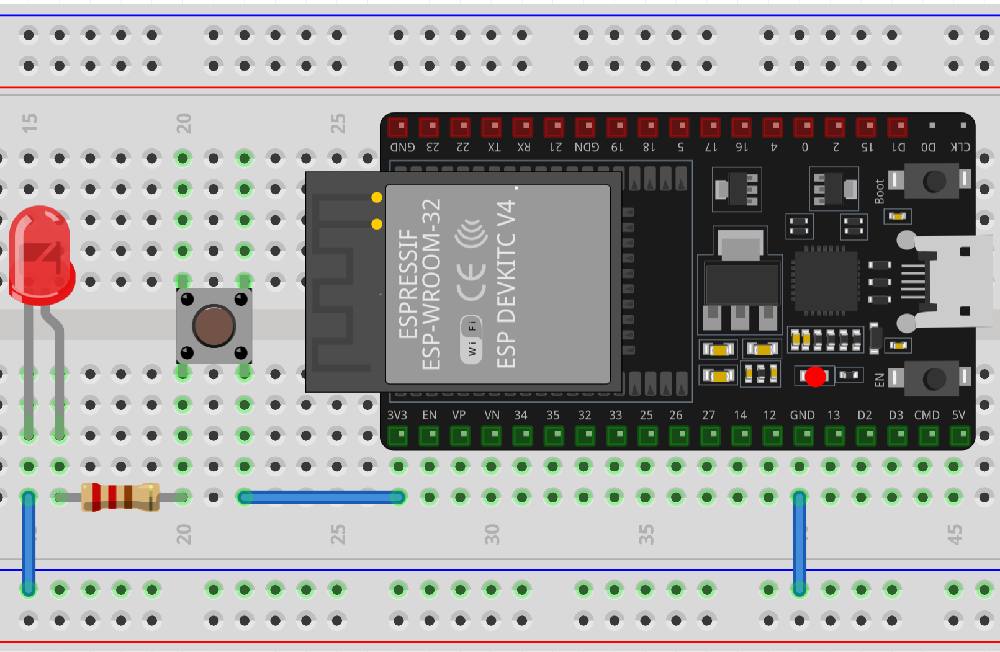
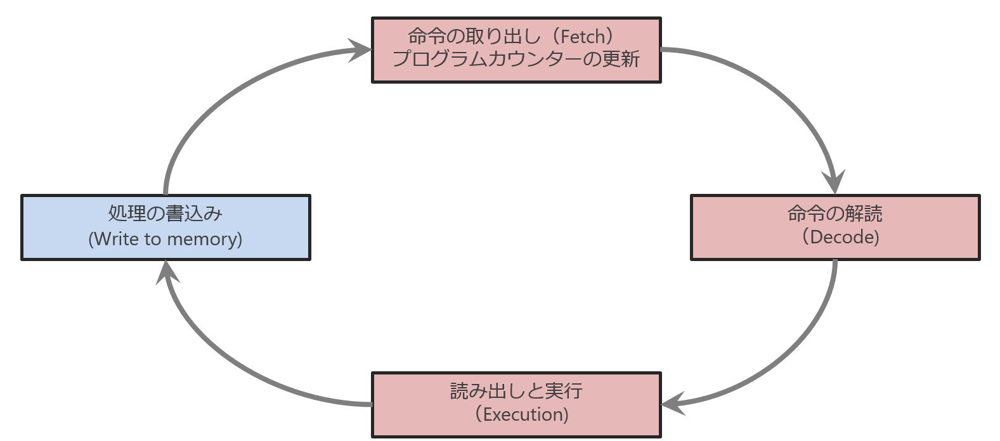
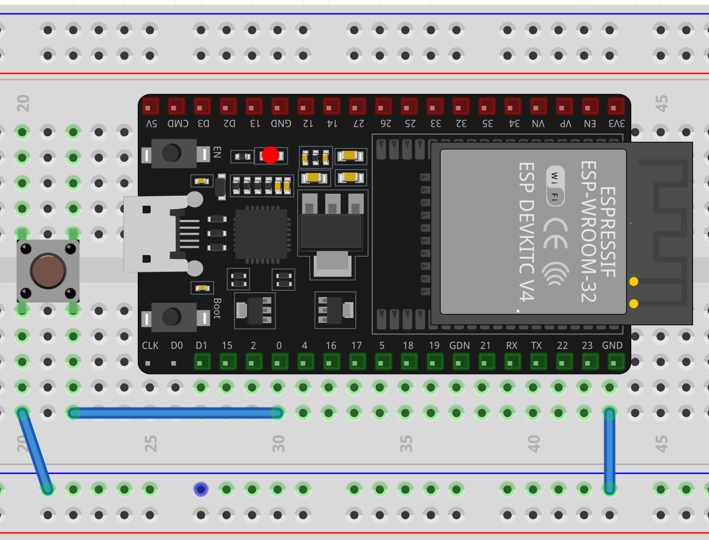
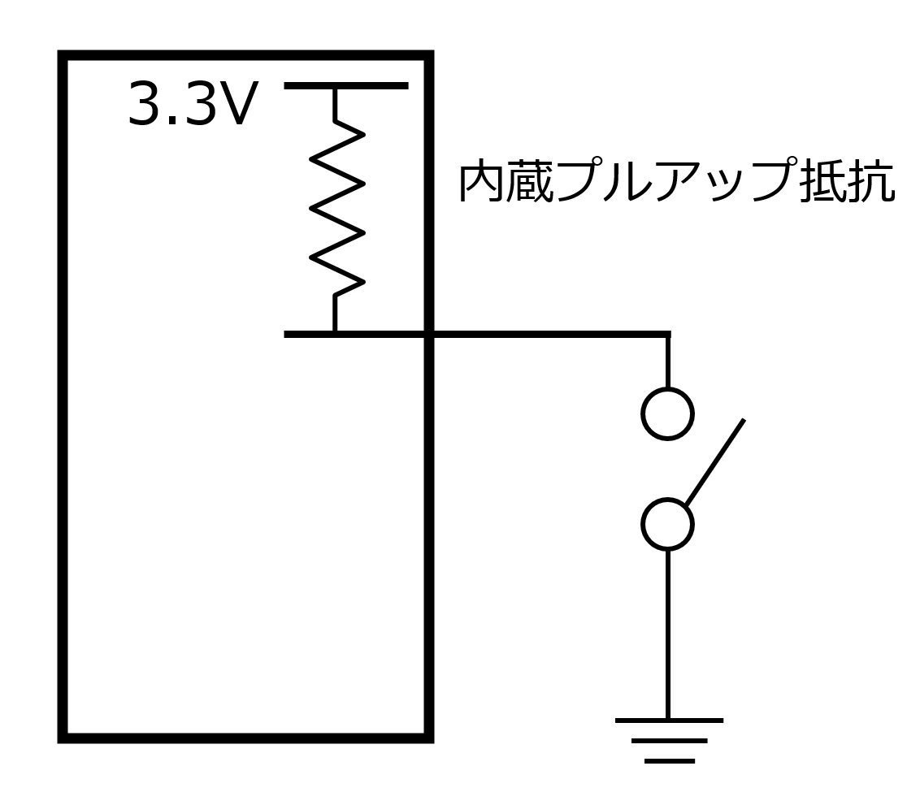

# 第2回：デジタル入力とマイコンの仕組み
## 〜PLCの「当たり前」をAD3で分解する〜

## 🎯 今日の目標

1. **物理現象の観測**: プログラムを通さず、スイッチの物理的なバタつき（チャタリング）をAD3で直接捕まえる。
2. **比較理解**: PLCの「自動スキャン」と、マイコンの「意志あるループ（while）」の違いを理解する。
3. **ノイマン型CPU**: フェッチ・デコード・実行のサイクルが、いかに高速かを学ぶ。
4. **設計力**: プルアップ抵抗の有無による「不定状態（フラフラ）」を観測し、回路の安定化手法を習得する。
5. **チャタリング** 現象を可視化し、高速すぎる CPU が直面する「現実の壁」を体感する。
6. **デジタル入力** のプログラムを書き、物理アドレス（ピン番号）を **変数（オブジェクト）** として扱う作法を学ぶ。

---

## 📘 Step 1：【比較】PLC vs マイコン（脳の切り替え）

まずは、1年生で学んだ PLC と今回のマイコンの違いを整理しましょう。
PLC は産業用コンピュータで工場の過酷な環境にも耐えられるよに作られていますが、中身もこれから扱うマイコンと以下の点が異なります。

これらか勉強を進めるにあたって、以下の点を意識してプログラミングを学習してください。  
一言でいえば、**「マイコンのほうが自由度が高い」** ということです。だからプログラミングは楽しい！

| 比較項目 | PLC（シーケンス制御） | マイコン（Python） |
| :--- | :--- | :--- |
| **実行の仕組み** | **スキャン方式**（勝手にループする） | **逐次実行**（1行ずつ進み、最後で止まる）|
| **入出力の指定** | **X0, Y0**（物理アドレス固定） | **変数（オブジェクト）**（自分で定義する） |
| **電気的安定** | 入力ユニットが勝手にプルアップ | **内部/外部プルアップ**（自分で設定する） |
| **ノイズ対策** | 数msのスキャンで自動助教 | **デバウンス（ソフト処理）**（自分でチャタリングの対策を書く） |

## PLC の「レジスタ」とマイコンで使う「レジスタ」という言葉は意味が違う

PLCで「レジスタ（Dレジスタなど）」と呼ぶ場合、それは実質的にユーザーが自由に使えるメモリ空間を指します。  

### PLC：アドレス指定できる「記憶領域」
 
* 特徴: 「D100」や「R0」のようにアドレスが決まっており、そこにセンサーの値を入れたり、タイマーの数値を書き込んだりします。
* 感覚: Excelの「セル」に近いです。「このセルに今の温度を書き込む」という使い方をします。

### マイコン：演算を爆速にする「作業台」
* 特徴: メモリ（RAM）から持ってきたデータを計算するために、一時的に置く場所です。読み書きスピードが速いのが特長です。
* 感覚: 「巨大な倉庫（メモリ）」から「作業机（レジスタ）」に書類を持ってきて、計算が終わったらまた倉庫に戻す、というイメージです。   

---

## 🛠️ Step 2：【実験1】プログラム不要の物理観測（チャタリング）

まずは ESP32 をただの「電池」として使い、スイッチの物理的な挙動をAD3で見ます。

1. **回路接続**: ESP32の `3.3V` → タクトスイッチ → LED → `GND`。

   <div align="center">
      
      <p>接続図</p>
   </div>

2. **ミッション**: スイッチを「カチッ」と押した瞬間の電圧を、AD3（Scope画面）で限界まで拡大して観察せよ。
3. **観察ポイント**: 
   * スイッチが繋がる瞬間、電圧が `0V` から `3.3V` へ「一直線」ではなく、**激しくギザギザ（バタつき）しながら立ち上がる** 様子を確認する。
   * これが **チャタリング** です。物理的な金属接点が跳ねている証拠です。

---

## 📘 Step 3：マイコンの心臓部「ノイマン型CPU」- 高速すぎる「解読サイクル」-

なぜ実験1の「ギザギザ」が問題なのか？ CPUの中身から考えます。

1. **命令実行サイクル（1セット）**:
   * **フェッチ**: メモリから命令を取ってくる。
   * **デコード**: 命令を解読する（「スイッチを読め」など）。
   * **実行**: 実際に計算したり、ピンの状態を調べたりする。

   <div align="center">
      
      <p>CPU の命令実行サイクル。コンピュータはこれを高速に繰り返している。</p>
   </div>

   * CPUはこの処理を1秒間に数千万回繰り返しています。
   * 1 秒間に何回この処理を繰り返すことができるか。それは **クロックスピード (Clock Speed)** で決まります。クロックスピードが高いほうが処理能力が高い CPU ということになります。

2. **プログラムカウンタ (PC)**:
   * CPU には「次に実行する行」を指し示すカウンタがあります。これをプログラムカウンタといい、このカウンタにしがたってプログラムは 1行ずつ進むため、**`while True:` でループを作らないと、プログラムは一瞬で終わってしまいます**。

3. **解読（デコード）の悲劇**:
   * 実験1で見た「1ミリ秒のギザギザ」の間に、CPUは数万回の命令を実行できます。
   * つまり、人間が1回押したつもりが、CPUにとっては **「スイッチが超高速で100回連打された！」** と解読されてしまうのです。
   * PLC のスキャンタイム（数ms）では見えなかった「ゴミ」を、爆速のマイコン CPU は拾ってしまいます。

> 💡エンジニアメモ CPU とは  
> CPU（Central Processing Unit）は、パソコンやスマホの「頭脳」にあたる最重要パーツのこと。すべてのソフトウェアの動作、データの計算（演算）、周辺機器の制御を一括して行う「中央演算処理装置」である。
---

## 🤖 Step 4：【実験2】デジタル入力の実装

つぎにスイッチ（外部の入力）をプログラムで読み取れるようにしてみましょう。

1. **回路作成**: ESP32 の `GPIO 0` ピンと `GND` の間にスイッチを接続します。

   <div align="center">
      
      <p>回路図</p>
   </div>

2. GPIO0 の状態を AD3 の Scope で観測します。

3. **プログラムの記述**:

   ```python
   from machine import Pin
   import utime

   # PLCの「入力割付」に相当。0番ピンを "sw" という名前（変数）で定義。
   sw = Pin(0, Pin.IN, Pin.PULL_UP)

   while True: # PLCのスキャンを自前で作る
       val = sw.value()
       print("スイッチの状態:", val)
       utime.sleep(0.1) # スキャンタイムの調整
   ```

   * **👁️ 観察**: 離すと `1`、押すと `0` になる「負論理」を確認してください。

4. **現象**:  
0V に落ちる直前に、電圧が激しくバタついている部分をスクリーンショットに撮ってください。
5. **考察**:  
 CPU が 1 秒間に数千万回命令を実行していることを考えると、この「バタつき」の間に何回「スイッチが押された！」と誤認してしまうか考えてみましょう。

## 【実験3】プルアップ抵抗のありなし有無（フラフラ観測）:
   
1. つぎに `Pin.PULL_UP` を消して実行し、AD3 の Scope 機能で入力ピンを観測します。
2. ピンに指を近づけてください。波形がフラフラとノイズを拾い、Shell の値が勝手に `0` と `1` を行き来する様子を観察します。指を近づけた時の「浮遊電圧（ノイズ）」を観測してみましょう。

   * **プルアップの有効化**:
      * 再びプルアップを設定し、電圧が **3.3V（High）にピタッと固定される** ことを AD3 で確認します。

**PLC には対策処理が自動的に含まれています。**

> 💡**エンジニア・メモ 内蔵プルアップ抵抗**  
> マイコンには内蔵されたプルアップ抵抗がある。`Pin.PULL_UP` により、その機能を有効にできる。
>
>  <div align="center">
>  
>  <p>内蔵プルアップ抵抗</p>
>  </div>

---
## 【まとめ】PLC とマイコンの根本的な違い

* 以下の比較表を完成させよ。A~F に選択肢から適切な言葉を入れよ。

| 比較項目 | PLC（シーケンス制御） | マイコン（Python / ESP32） |
| :--- | :---: | :---: |
| **プログラム実行方式** | A | B |
| **ループの仕組み** | C | D |
| **入力の安定化** | E | F |

   選択肢：
   1. **[ while True: ]** 等で自分で作る
   2. ハード/OS側で自動的に処理される
   3. **スキャン方式**（全行を高速周回）
   4. PLC が自動でループさせる
   5. **[ ソフトウェア ]**（sleep等）で自分で書く
   6. **[ 逐次実行 ]**（1行ずつ順番に進む）

-- 
## 📝 レポート作成

本日の実験結果を Word 等でレポートにまとめ、PDF で提出してください。
「物理現象（AD3での観測）」と「マイコンの処理速度」を関連付けて考察することがポイントです。

### 1. 【実験2】チャタリング：爆速すぎる CPU vs 現実のスイッチ

物理スイッチが持つ「バタつき」と、マイコンの処理速度のギャップをまとめます。

* **【証拠写真】**:
    1. **チャタリングの拡大波形**: スイッチを操作した瞬間に、電圧が激しく上下している様子を捕まえた Scope 画面。
    2. **シリアルモニタの結果**: `utime.sleep` がない時に、1回押しただけで `print` が連打されてしまった Thonny の Shell の画面。

* **【考察】**: 
    * マイコンの CPU は非常に高速にプログラムを実行している。今回のチャタリング現象を踏まえ、なぜ人間が「1回」操作したつもりが「複数回」として認識されてしまうのか説明せよ。
    * プログラムに加えた `utime.sleep(0.1)` は、この「現実の壁」に対してどのような役割を果たしているか。

### 2. 【実験3】プルアップ抵抗による「電位の安定」

GPIOピンを「何も繋がない（浮遊）状態」にした時の挙動をまとめます。

* **【証拠写真】**: 以下の2枚のスクリーンショットを比較して貼り付けること。
    1. **プルアップなし（Floating）**: 指を近づけた時に波形がフラフラとノイズを拾っている Scope 画面。
    2. **プルアップあり（Stable）**: 電圧が 3.3V にピタッと張り付いている Scope 画面。

* **【考察】**: 
    * プルアップ抵抗がない状態で「スイッチが押されていない」と判定するのが難しいのはなぜか？（浮遊電圧と判定しきい値の関係に触れること）
    * なぜ指を近づけるだけで値が変わってしまうのか、理由を推測せよ。


---

### 📥 提出について
* **形式**: PDF（Word から変換）
* **期限**: 次回講義開始まで
* **ファイル名**: `第2回レポート_学籍番号_氏名.pdf`
---
### 💡 エンジニアの知恵袋
「デジタル」の世界は 0 と 1 ですが、その境界線は「電気（アナログ）」が支えています。AD3 を使ってその境界線を観察することで、君たちはただのプログラマーではなく、ハードウェアを理解したエンジニアへと一歩近づきます！
