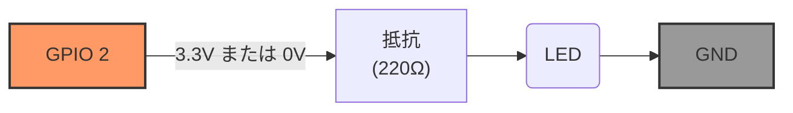
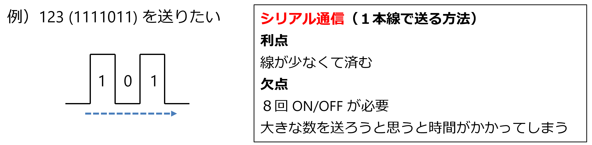
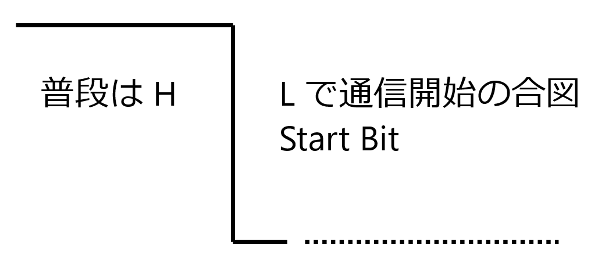

# 第３回：GPIO出力の極意とUART通信
## 〜電気信号を情報に変え、世界と対話する〜

## 🎯 今日の目標

1.  **GPIO 出力の定量的制御**: オームの法則を用い、マイコンを保護する回路設計を理解する。また LED の電流制限抵抗の計算方法を思い出す。
2.  **UART 通信の物理的解読**: 画面に表示される「文字」が、TXピンから出る「電圧変化」である瞬間をAD3で捕まえる。
3.  **MicroPython の作法**: ピンを単なるアドレス（番号）ではなく「オブジェクト（モノ）」として扱う抽象化を学ぶ。

* **実習の観測波形は、その都度スクリーンショットを撮っておきましょう。(📸) マークあり**

---

## 📘 実験１：GPIO出力と「壊さないための」回路設計

第1回で行った「Lチカ」を、今日はエンジニアの視点で「設計」します。

### 1.1 オームの法則と制限抵抗の計算

マイコンの GPIO ピンから流せる電流には限界があります（ESP32は約12〜20mA）。
これを超えると内部回路が焼き切れます。
一方、LED にも流せる電流の最大値 (定格電流) があります (前々回、抵抗なしでやって何個か LED がお亡くなりになりましたね🙏)。

* **ESP32の電源電圧 ($V_{cc}$)** : 3.3V
* **LEDの順方向電圧 ($V_f$)**: 赤色なら約 2.0V
* **流したい電流 ($I$)**: 10mA (0.01A) 程度が安全かつ十分な明るさ。
* **計算式**: $R = \frac{V_{cc} - V_f}{I} = \frac{3.3 - 2.0}{0.01} = 130 \Omega$
* **現場の判断**: 安全マージンと入手性を考え、本実習では **220 $\Omega$** を使用します。

> 💡エンジニアメモ：
> 1. LED の電流制限抵抗を求めるときには **$V_f$** に着目せよ。
> 2. 電源ピン (3.3V, 5V) はもともと電源用途を想定しているので GPIO より大きい電流が流せます。GPIO の 10倍の約 200~300 mA 使えます。Oh! パワフル！(だから LED が壊れたｗ)

### 1.2 【実習】電圧降下の実測

1.  LED回路（ESP32 → 220Ω抵抗 → LED → GND）を組む。GPIO 2 を使用する。



<div align="center">
 
 <p>第１回の回路図</p>
</div>

2. プログラム
    ```python
    from machine import Pin
    led = Pin(2, Pin.OUT)
    led.value(1)
    ```

2.  AD3 のScope機能を使い、**「抵抗の両端」** の電圧差を測定せよ。(スクショ推奨📸)  
    **⚠ GND が基準ではない！今回はあくまで抵抗の両端。**
3.  2. の測定値から、$I = V / R$ に基づき、実際に流れている電流値を計算せよ

---

## 📘実験２：マイコンと PC の通信 (UART通信) 〜「文字」の正体〜

マイコンと PC が通信するシリアル通信の仕組み **UART (Universal Asynchronous Receiver-Transmitter)** を解剖します。

* **シリアル通信とは**：  
 
複数の信号線を使って同時にデータを送る「パラレル通信」に対し、1本の信号線の上でデータを1ビットずつ順番に（直列に）送る方式です。マイコンとPC間の通信（ThonnyのShellなど）で標準的に使われます。

<div align="center">

<p>シリアル通信</p>
</div>

> 💡エンジニアメモ：ちなみに USB も `Universal Serial Bus` の頭文字。シリアルなので、通信用の線は行きと帰りそれぞれ１本です。

### 2.1 UART (非同期通信) の約束事

**非同期** というのは、通信相手とタイミングを合わせる仕掛けがない、ということです。

そのため、お互いが「この通信速度で話しましょう」と設定を事前に合わせておく必要があります。これを **「ボーレート」** とも言います。

**物理信号の約束事:** UARTの信号線（TX/RX）は、通信をしていない時は常に電圧が高い「High (3.3V)」の状態（アイドル状態）です。電圧が High から Low へ立ち下がる瞬間が、信号の開始を示す **スタートビット** になります。スタートビットを合図にデータの読み取りを開始します。

<div align="center">

<p>スタートビット</p>
</div>

* **シリアル通信**: 1本の信号線でデータを1ビットずつ順番に送る。
* **アイドル状態**: 信号がない時は常に **High (3.3V)**。
* **スタートビット**: 電圧が High → Low に落ちる瞬間が「データの開始」の合図。
* **文字コード (ASCII)**: 文字 'A' は `0x41` (2進数: `0100 0001`) という数字。

### 2.1.1 文字コードとは？（ASCIIコード）

コンピュータの脳（CPU）は、「A」という形や「あ」という音を直接理解することはできません。彼らが理解できるのは「電圧が高い(1)か低い(0)か」、つまり　**数字だけ**　です。
そこで、世界中の人が困らないように　**「この数字が来たら、この文字を表示しよう」**　という共通のルールを決めました。これが　**文字コード**　です。

#### ASCII（アスキー）コード：すべての基本

最も基本となるのが、半角の英数字や記号を割り当てた「ASCIIコード」です。

* **'A'** という文字を送りたければ、マイコンは **`65`**（16進数で `0x41`）という数字を送ります。
* 相手がそれを受け取って、自分のルールブック（ASCII表）を引くと、「あ、これは A だな」とわかる仕組みです。

> **例：**
> `print("ABC")` と書くと、通信線の上を走るのは `65`, `66`, `67` という数字の列です。

---

### 2.1.2 UTF-8（ユーティーエフ・エイト）とは？

ASCIIコードは非常にシンプルですが、最大で128種類（7〜8ビット分）の文字しか登録できませんでした。これでは、漢字やひらがな、絵文字を表示するには全く足りません。

そこで登場したのが **UTF-8** です。

* **世界中の文字を網羅**: 日本語、中国語、アラビア語、さらには「🍣」のような絵文字まで、一つのルールブックにまとめました。
* **賢い可変長**: 
    * 英語（ABC...）を送るときは、ASCIIと同じ **1バイト（8ビット）** でコンパクトに。
    * 日本語（あいう...）を送るときは、**3バイト（24ビット）** を使って複雑な形を表現。
    * **「よく使うものは短く、複雑なものは長く」** することで、通信の効率と表現力を両立させています。

### 2.2 【実習】確認してみよう。`print("A")` を「盗聴」せよ

1.  ESP32の **TXピン** に AD3 の Ch1 を接続する。  
    TX ピンは USB の送信線 (ESP32 => PC) の信号が観測できます。

2.  Thonnyで以下のコードを実行する。
    ```python
    import utime
    while True:
        print("A")
        utime.sleep(1)
    ```

3.  **AD3設定**: **Scope** を立ち上げ、Triggerを **「Falling（立ち下がり）」** に設定し、一瞬の波形をキャッチせよ。(📸) 

    **Trigger** というのは、その現象（この場合 Falling（立ち下がり））を検出したタイミングの波形を取得する、という機能です。**Falling** のほか、**Rising (立ち上がり)**, **Either (両方)** などいろいろなタイミングの指定方法があります。

4.  **解析**: 捉えた波形を右から読み（LSBファースト）、`0100 0001` が隠れていることを目視で確認せよ。

    **⚠注意１！**: 負論理です。つまり High (3.3V) が `0`, Low (0V) が `1` です。  
    **⚠注意２！**: LSB ファーストです。0xF0(0b11110000) だったら、右側（後ろ側）から `H, H, H, H, L, L, L, L` と通信路を流れていきます。
    
    >💡エンジニアメモ：  
    > LSB (Least Siginificant Bit) 一番下の桁 ($2^0$) から先に送るルール  
    > MSB (Most Siginificant Bit) 一番上の桁 ($2^n$) から先に送るルール

---

## 📘 実験３：ロジックアナライザと通信エラー

波形を目で追っていちいち 'A' かな？と確認するのは大変です。 AD3 の Wavegen, Scope につづく第３の機能**「ロジックアナライザ」** 通称 **「ロジアナ」** を使ってみましょう。

### 3.1 WaveFormsの「Logic」機能

ロジアナはいままでと違う線を使います。

1. AD3 の接続を `W1`, `-W1` の組み合わせから、`0`, `GND` の組み合わせに変更する。
2. WaveFormsの左メニューから **「Logic」** を選択。
3. UART の設定を `1152k` にして 2.2 のプログラムを実行。
4. AD3 が波形を自動的に「文字」へ復元（デコード）する様子を観察せよ。(スクショ📸) 

### 3.2 print 文の秘密

1. `print("A")` を `print("A", end="")` に変えてみよう。何が起こるだろうか。（スクショ📸）

### 3.3 自分の名前の復元

1. うまくできたら、自分の名前 (ローマ字) を出力するようにして、うまく復元できるか確認してみよう。（スクショ📸）

### 3.4 【トラブル演習】ボーレートの不一致（文字化けの再現）

1. マイコン側はそのまま実行し、WaveForms（ロジアナ）の設定画面（歯車アイコン）を開け。
    UARTの Baud rate をわざと 9600 に変更せよ。
    波形の見え方や、デコードされた文字（A だった場所）がどう変化するか観察せよ。
2.  **現象**: AD3 上に化けた文字が表示されることを確認。（スクショ📸）
3.  **考察**: AD3 で観測した「1ビットあたりの時間の長さ（幅）」を、115200bpsと9600bpsで比較し、なぜ読み取れないのか考察せよ。(ちょっと難しい)

---

## 📘 実験４：総合演習・対話型システムの構築【チャレンジ課題】

「入力」と「出力」を統合し、MicroPythonらしい「オブジェクト指向」の書き方を学びます。

### 4.1 MicroPython の作法

PLCでは「Y0」というアドレスを叩いていましたが、Pythonではピンを一つの **「モノ（オブジェクト）」** として定義します。

```python
from machine import Pin # Pin という型（オブジェクト）を使う。

# 2 番ピンを「led」という名前のオブジェクトを作る
# このピンは出力ピン
led = Pin(2, Pin.OUT)       

# 25 番ピンを「sw」という名前のオブジェクトを作る（プルアップは有効）
# このピンは入力ピン
sw = Pin(25, Pin.IN, Pin.PULL_UP) 
```

> **💡エンジニアメモ**: こうすることで、将来ピン番号が 25 から 26 とか 3 に変わっても、最初の一行を変えるだけで、`led.on()` というコードは修正せずに済みます（保守性の向上）。

### 4.2 演習課題：マイコンとPCを「対話」させる

これまではマイコンからの一方通行（`print`）でしたが、次はPCからマイコンへ命令を送ってみましょう。

#### 4.2.1. 【基本】1文字だけ読み取って表示する（1回きり）

まずは、ループを使わずに「プログラムを実行→キーを打つ→表示して終了」という流れを確認します。

```python
import sys

print("キーボードで何か1文字打って、Enterを押してください...")

# PC（ThonnyのShell）からの入力を1文字だけ読み取る
char = sys.stdin.read(1)

print("あなたが打った文字はこれです：", char)
```

**解説：**
* **`sys.stdin.read(1)`**: PC側のキーボード入力を「1文字分」だけ取ってくる命令です。
---

#### 4.2.2 打った文字でLEDを操る

入力文字に対応して LED が変化するようにプログラムを改造してみましょう。

* **ミッション**: 'H' を送ったら LED点灯、'L' を送ったら 消灯。

* **ヒント1**: ずっと入力を待ち受けるために `while True:` ループで囲む必要があります。
* **ヒント2**: もし `char` が `'H'` だったら `led.value(1)`、`'L'` だったら `led.value(0)` を実行するように `if` 文を追加します。

* **ロジアナでの観測してみてよう**:
    AD3のロジックアナライザ画面で **RX（受信）側** を観測し、'Enter' を押した瞬間にどうなったか確認しよう。(スクショ📸) 

**改造後のコード構成イメージ：**

```python
import sys
from machine import Pin

led = Pin(2, Pin.OUT)

print("制御開始：Hで点灯、Lで消灯")

while True:
    char = sys.stdin.read(1)
    
    # ここから自分で考えてみよう！
    # 
```
---

## 📝 レポート作成

本日の実習結果をレポートテンプレート（Word）にまとめ、PDFで提出してください。
考察はレポートテンプレートの中に書いてあります。

* **スクリーンショット**: LED 電流制限抵抗の電圧測定画面

ロジックアナライザを使用した実験：

* **スクリーンショット**: print("A")` を実行したときの「Start Bit、データ 8 Bit, Stop Bit」がすべて収まった送信波形。
* **スクリーンショット**: print("A", end="")  を実行したときのロジアナのデコード (文字を復元した結果) の画面。
* **スクリーンショット**: ロジアナで自分の名前のデコード (文字を復元した結果) の画面。
* **スクリーンショット**: わざとボーレートをずらしたときの Framing Error または文字化けの画面。

* **考察**: 「なぜ送信側と受信側のボーレートが違うと文字化けするのか」を、計測したビット幅の時間（$\mu s$）を用いて論理的に説明すること。

4.2.2 チャレンジ課題:
* **スクリーンショット**: ロジアナで 'H' や 'L' を送っている RX ピン信号のデコード (文字を復元した結果) の画面。

---

> ### 🎓 エンジニア・メモ  
> PLCの時は「裏側」を意識しなくても動きましたが、マイコン制御では「電位がフラフラする」「通信速度が合わない」といった泥臭い物理現象との戦いになります。AD3という「目」を使って、その正体を暴き、コントロールできるようになりましょう！
