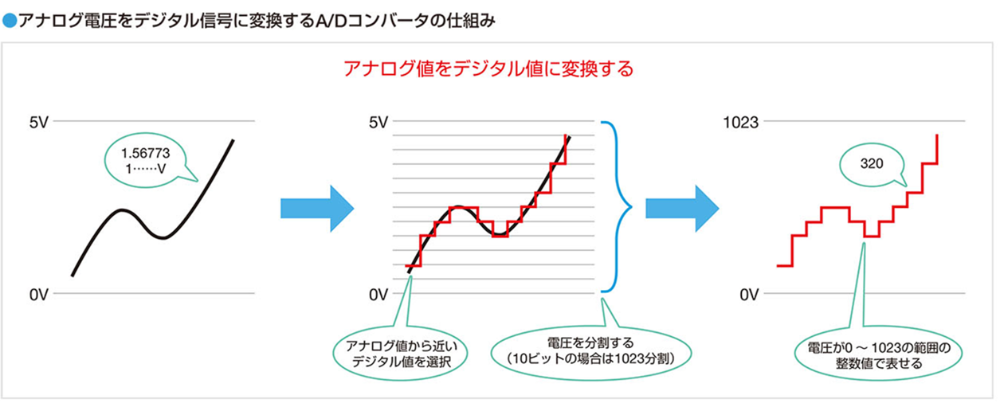
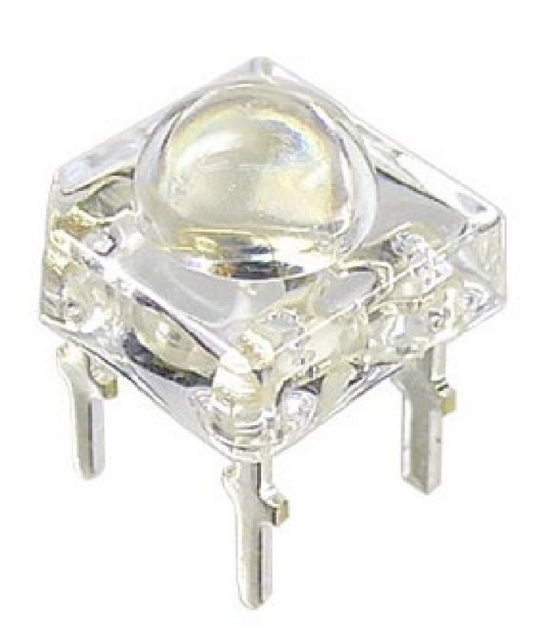
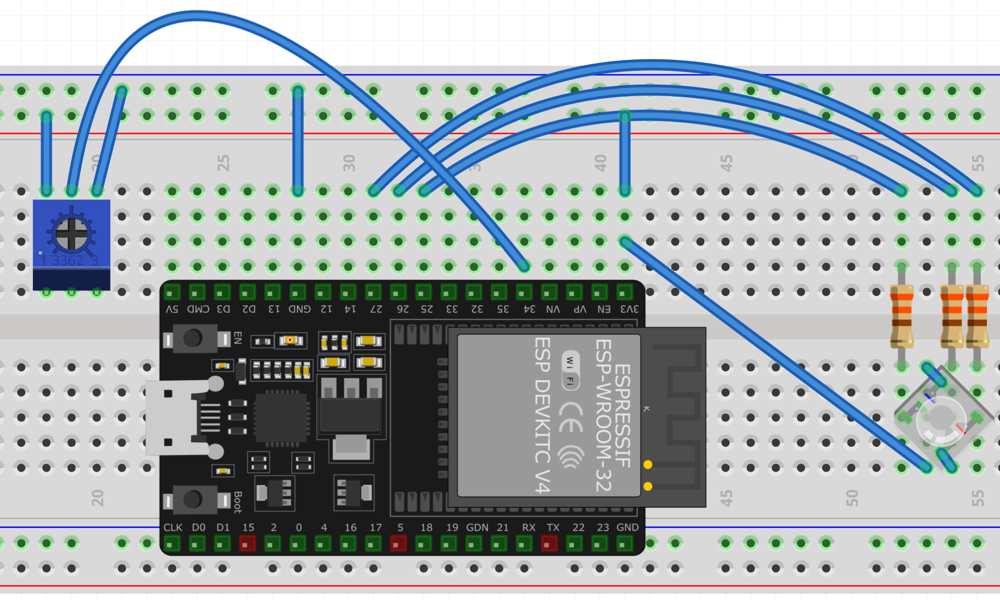

# 第４回：アナログ入力(AD コンバーター) とアナログ出力(PWM)
## 〜「割合」を共通言語にして、現実世界とマイコンを繋ぐ〜

### 🎯 本日の目標
1. **滑らかな世界を数字にする**: 0V〜3.3Vの連続した電圧変化を、0〜4095というデジタル数値に切り刻む仕組み（**AD コンバーター**）を理解する。
2. **電気の平均値を操る**: 高速なON/OFFの「割合」を変えて、LEDの明るさを自在に制御する（**PWM**）手法を習得する。
3. **エンジニアの翻訳術**: センサーの数値を「最大値に対する割合（比率）」に直し、それを別の動作の数字へ変換する「**スケーリング**」の考え方をマスターする。

---

## 📘 1. AD コンバーター（アナログ・デジタル変換）の仕組み

自然界の滑らかな変化を、コンピュータがどう読み取っているかを学びます。

### 1.1 滑らかな波を切り刻む「2つの作業」

* **サンプリング（標本化）**: 時間を細かく区切って電圧をチェックすること（動画のフレームレートのようなもの）。
* **量子化（Quantization）**: 読み取った電圧を、あらかじめ決められた「階段」の段数に当てはめること。
  * コンピュータはデジタル情報しかわからないので、アナログ情報をぶつ切りにします。そのぶつ切りの細かさを A/D コンバータの **分解能** といいます。

<div align="center">
    
</div>

### 1.2 ESP32の物差し「分解能」

* ESP32の AD コンバーターは **12ビット分解能（$2^{12} = 4096$ 段階）** です。
* 0V〜3.3Vの坂道を、4096段の階段にして評価します。
    * 0Vなら `0`、3.3Vなら `4095` という数字として処理されます。
    * 階段1段あたりの電圧： $3.3\text{V} / 4096 \approx 0.8\text{mV}$

### 1.3 【実験】ボリュームの値を「覗き見る」
* **実習**: 10kΩの可変抵抗（ボリューム）を AD コンバーターのピンに接続し、`adc.read()` でつまみの位置を数字化する。

```Python
from machine import ADC, Pin
import time

# 1. AD コンバーターピンの設定
# ここでは GPIO 34番ピンを使用します
adc = ADC(Pin(34))

# 2. 入力電圧の範囲（アッテネータ）設定
# ESP32で 0V 〜 3.3V をフルに測るための設定です
adc.atten(ADC.ATTN_11DB)

print("--- ADC計測を開始します（Ctrl+C で終了） ---")

while True:
    # 電圧をデジタル数値（0〜4095）として読み取る
    val = adc.read()
    
    # 結果を Shell に表示
    print("ADC Value:", val)
    
    # 0.1秒待機（表示が速すぎないように調整）
    time.sleep(0.1)
```

* **エンジニアの目**: つまみを止めていても、末尾の数字がわずかに変動する「ノイズ」の存在を観察せよ。
* **考察**：A/D コンバータの分解能を大きくするメリットとデメリットをあげよ。

---

## 📘 2. PWM（パルス幅変調）の正体

AD コンバーターは、マイコンがアナログ入力を取り扱う方法でした。
それではアナログ出力はどうしたらいいのでしょう。
マイコンは 0V でもない、3.3V でもない「1.5V」のような中間の電圧を直接出せません。しかし、LEDの明るさを変える魔法を使えます。

それが **Pulse Width Modulation (PWM)** です。

### 2.1 デューティ比と平均電圧

* **PWMの原理**: 超高速（1秒間に1000回など）でONとOFFを繰り返すと、LEDやモーターはそれを「平均的な電圧」として受け取ります。
* **デューティ比**: 1周期のうち、ONになっている時間の「割合」のこと。もしデューティ比が50％なら、平均電圧は元の半分（約1.65V）になります。

### 2.2 【⚠ 注意】負論理（0のとき光る）に注意

* 今回使うフルカラーLEDは、ピンの出力を 0V (L) にした時に電流が流れる回路になっています。

    * **0 を設定** $\rightarrow$ 最大輝度（全開で光る）
    * **1023 を設定** $\rightarrow$ 消灯

<div align="center">

<p>
欠けているところ：赤 (時計回りに)、電源、青、緑
</p>
</div>

### 2.3 【実験】AD3で「平均化」を証明せよ

* **実習**: MicroPythonでLEDをPWM制御し、デューティ比を変化させる。
* **計測**: AD3の Scope機能 で波形を観測し、ONの「幅」が変わる様子と、平均電圧（Average）の変化を確認せよ。

```Python
from machine import Pin, PWM

# 1. PWMを出力するピンの設定
# ここでは GPIO 25番ピンを使用します（配線に合わせて変更してください）
led_red_pin = Pin(25)
pwm_led = PWM(led_red_pin)

# 2. 周波数（Frequency）の設定
# 1秒間に何回 ON/OFF のサイクルを繰り返すか（1000Hz = 1秒間に1000回）
pwm_led.freq(1000)

# 3. デューティ比（Duty）の設定
# 0 〜 1023 の間で指定します。
# 【注意】今回のフルカラーLEDは「負論理」なので、数字が小さいほど明るくなります！

# ----- ここから下の数字を書き換えて実行してみよう -----

# 例1：約50%の明るさ（半分 3.3V, 半分 0V）📸
pwm_led.duty(512) 

# 例2：約10%の明るさ（少しだけ 0V になる）📸
# pwm_led.duty(921)

# 例3：消灯（ずっと 3.3V）📸
# pwm_led.duty(1023)

print("PWM信号を出力中... AD3のScope画面で波形とAverage（平均電圧）を確認してください。")
```

---

## 📘 3. 「正規化」のステップ「比率（0.0〜1.0）によるスケーリング」

では、可変抵抗の値に従って明るさが変わるようにしてみましょう。
ここで、一つ困ることがあります。
センサーの入力は 12bit 分解能なので **「0〜4095」** の範囲をとります。
一方、PWM の出力は 10bit 分解能なので **「0〜1023」** の範囲をとります。
センサーから取得した値をそのまま PWM に渡すことはできません。

これを解決するために、**「正規化 (normalization)」** という方法を紹介します。正規化とは **「一度 0.0 ~ 1.0 の値に直す」** という方法です。

### 3.1 正規化の２段階のプロセス

* **STEP 1（入力を比率にする）**: センサーが今「全体のどれくらいの割合」にいるか、小数（0.0〜1.0）で計算する。
    * `hiritsu = 現在のADC値 / 4095` （例：真ん中なら 0.5）

* **STEP 2（比率を出力に掛ける）**: その比率を、PWM の最大値に掛ける。
    * `duty_atai = int(hiritsu * 1023)` （例：0.5 * 1023 = 511）
    * ※ PWM は小数の指示を受け付けないため、必ず `int()` で整数に丸めます。

### 3.2 便利な「翻訳ツール（関数）」を作る

これを毎回計算するのは大変なので、`def` 文を使って自分専用の関数を定義します。

```python
def get_duty(adc_val):
    # ステップ1: センサー値を比率(0.0~1.0)に変換
    hiritsu = adc_val / 4095
    
    # ステップ2: 比率を出力値(0~1023)に変換し、整数にする
    duty = int(hiritsu * 1023)
    return duty

# 使い方： 読み取った AD コンバーターの値を渡すだけで、PWM用の数字が返ってくる
output = get_duty(2000)
```

---

## 📘４ 演習 LED カラー調光器 (むずいぜ！)

以下のような LED カラー調光器を作れ：

* **仕様**:
    1. 1つの AD コンバーターでボリュームの値を読み取る。
    2. ESP32基板上の「BOOTボタン（これは 0番ピンにつながっている）」が押されるたびに、変えたい色（R $\rightarrow$ G $\rightarrow$ B）を切り替える。
    3. 自作した関数（正規化のロジック）を使い、ボリュームの値を PWM の範囲（0〜1023）に変換する。
    4. 選択中の色の明るさをリアルタイムで更新し、フルカラー LED を制御する。

<div align="center">

<p>回路図</p>
</div>

---

| 作りたい色 | (赤) | (緑) | (青) |
| :--- | :--- | :--- | :--- |
| 真っ赤 | 0 | 1023 | 1023 |
| 緑 | 1023 | 0 | 1023 |
| 青 | 1023 | 1023 | 0 |
| 黄色(赤＋緑) | 0 | 0 | 1023 |
| 紫(赤＋青) | 0 | 1203 | 0 |
| 水色(緑＋青) | 1023 | 0 | 0 |
| 白 | 0 | 0 | 0 |
| 消灯 | 1023 | 1023 | 1023 |


---


* **課題**:  

 以下のプログラムの「■■■」を埋めて完成させ、1つのボリュームとボタンを駆使して「自分の推し色」を調合しよう！

```python
from machine import ADC, Pin, PWM
import time

# --- 1. 入力・出力の設定 ---
# ボリューム（AD コンバーター）
adc = ADC(Pin(34))
adc.atten(ADC.ATTN_11DB)

# 【Q1】基板上のBOOTボタン（GPIO 0番）を入力として設定しよう
btn = Pin( ■■■, Pin.IN, Pin.PULL_UP)

# フルカラーLED（PWM出力）
pwm_r = PWM(Pin(25))
# 【Q2】G（緑）とB（青）のLEDをつなぐ PWM ピンを設定しよう
pwm_g = PWM(Pin( ■■■ ))
pwm_b = PWM(Pin( ■■■ ))

# PWM の周波数は 1KHz
pwm_r.freq(1000)
pwm_g.freq(1000)
pwm_b.freq(1000)

# --- 2. 翻訳関数（正規化） ---
def get_duty(adc_val):
    # 【Q3】AD コンバーターの最大値（12bit）で割って、0.0〜1.0の比率にする
    hiritsu = adc_val / ■■■■
    
    # 【Q4】比率を PWM の最大値（10bit）に掛け、さらに「整数」に丸める
    duty = ■■■(hiritsu * ■■■■)
    return duty
# --- ここまで get_duty() 関数の定義 ---

# 現在の明るさを記憶する変数
duty_r = 1023
duty_g = 1023
duty_b = 1023
target_color = 0 # 現在操作している色 (0:Red, 1:Green, 2:Blue)

print("--- カラーパレット起動（BOOTボタンで色切替） ---")

# --- 3. メインループ ---
while True:
    # 【Q5】BOOTボタンが押されたか（値が 0 になったか）読み取るコマンドを入れよう
    if btn.■■■■() == 0:
        target_color = (target_color + 1) % 3  # 0, 1, 2 と切り替わる
        print("色切替！ ->", ["Red", "Green", "Blue"][target_color])
        time.sleep(0.3) # チャタリング（連続押し）防止
    
    # ボリュームの値を読み取る
    val = adc.read()
    
    # 翻訳関数を使って、0〜1023の PWM 値に変換
    duty = get_duty(val)
    
    # 選択中の色だけ、可変抵抗に反応する
    if target_color == 0:
        duty_r = duty
    elif target_color == 1:
        duty_g = duty
    elif target_color == 2:
        duty_b = duty
        
    # 【Q6】LEDに明るさ（デューティ比）を指示する
    pwm_r.■■■■(duty_r)
    pwm_g.■■■■(duty_g)
    pwm_b.■■■■(duty_b)

    # 現在の各色のPWM値を表示（デバッグ用）
    print(f"R:{duty_r:4d} | G:{duty_g:4d} | B:{duty_b:4d}")
    
    time.sleep(0.1)
```

---

### 💡 エンジニアの知恵袋
PLCでは「このデバイスにはこの数字を直接入れる」という固定的な作業が多かったかもしれません。しかしマイコンプログラミングでは、**「比率（0.0〜1.0）」という共通言語**を作ることで、10bitでも16bitでも、異なる規格のハードウェア同士を自由自在に繋ぐことができます。これが、複雑なシステムを設計するための第一歩です！
