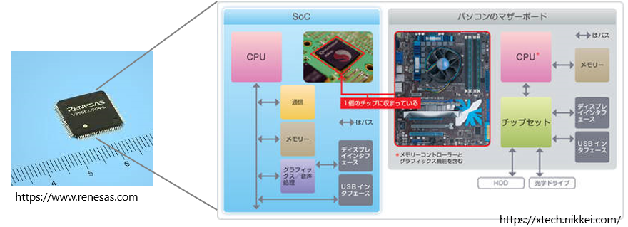
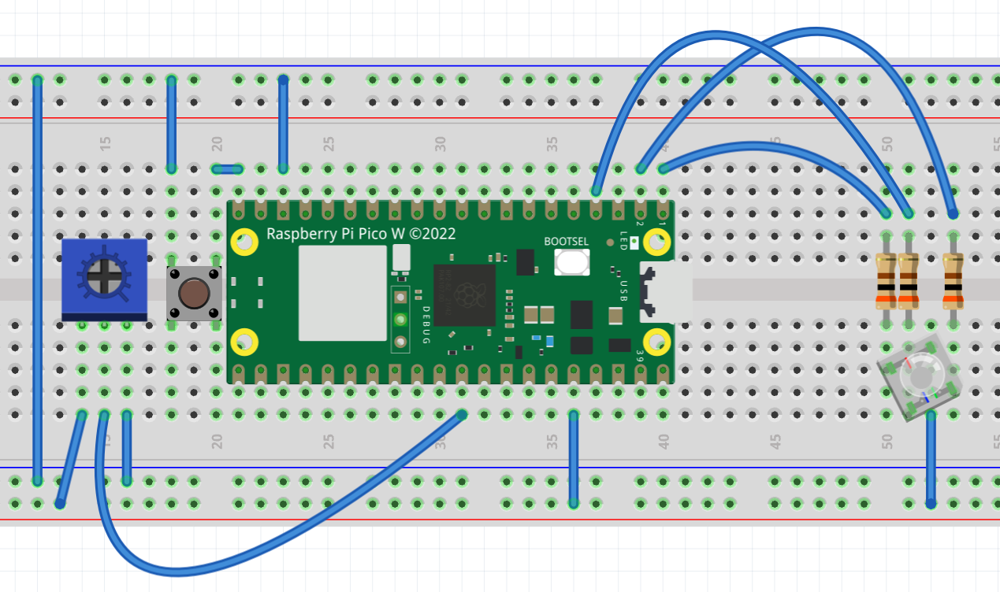

# 第５回：Pico 2 への移行と SoC アーキテクチャの比較
## 〜ハードが変わっても、Python（技術）は裏切らない〜

### 🎯 本日の目標
1.  **世界標準を知る**: スマホの心臓部「ARM」の設計思想とビジネスモデルを学ぶ。
2.  **SoC の概念を理解する**: 1枚のチップにすべてを詰め込む現代の集積回路を知る。
3.  **ファームウェアの導入**: マイコンに「魂（通訳さん）」を吹き込む仕組みを理解する。
4.  **ポータビリティの証明**: 最小限の修正でコードを移植し、汎用的な設計の価値を体感する。

---

## 📘 1. 理論のスパイス：脳みその設計図「ARM」と SoC

### 1.1 ARM社：工場を持たない最強の頭脳集団
* **設計図を売るビジネス**: 英国ARM社はチップを1枚も焼きません。工場すら持っていないのですから。売っているのは「設計図（IPライセンス）」だけです。
* **スマホの標準**: Qualcomm や MediaTek という IC メーカーはこの設計図を買い、自社の工夫を加えてチップを製造しています。君たちの **Androidスマホ** の脳みそ (SnapDragon など) も、このARM系統です。
* **数奇な運命**: かつてソフトバンクが約3.3兆円で買収し、現在は米国で再上場。世界中のメーカーが使う「中立な標準」です。

### 1.2 SoC (System on Chip) とは何か？
Pico 2 の中心にある黒いチップ（**RP2350**）は、**SoC** と呼ばれます。
CPU（脳）、メモリ（机）、ADC（物差し）、通信機能など、必要な機能を 1 枚のシリコンチップ上にすべて集積したものを **System on Chip (SoC)** と呼びます。

* **メリット**: 
    * **小型化**: 昔は大きな基板が必要だった機能が、数ミリ角に収まる。
    * **低消費電力**: 部品間の距離が短いため、電力を食わない。
* **Pico 2 (RP2350) の強み**: スリムな形状でブレッドボードが使いやすく、2つの脳（デュアルコア）で最大150MHzの高速処理が可能です。

<div align="center">

<p>System on Chip</p>
</div>

---
## 📘 2. 実習に最適化された Pico 2 の圧倒的スペック

これまでの授業で使用した ESP32 DevKit と比較しながら、なぜ今 Pico 2 (RP2350) を使うのか、その理由を確認します。

### 2.1 ブレッドボードに「優しい」スリムな形状

ESP32 の悩み: 前回の ESP32 DevKit は幅が広く、ブレッドボードに刺すと両脇の穴がほとんど埋まってしまい、ジャンパ線が非常に刺しにくいのが難点でした。

Pico 2 の優位性: 非常にスリムな設計のため、ブレッドボードに刺しても左右の穴がしっかりと空きます。これからロジックICを並べて配線していく実習において、この「指しやすさ」は大きな武器になります。

### 2.2 豊富な GPIO と PIO

GPIO（入出力ピン）の多さ: シンプルな見た目に反して、利用可能な GPIO ピンが非常に豊富です。

PIO (Programmable I/O): Pico シリーズ独自の機能です。CPU とは別に「通信専用の小さな脳」を持っており、タイミングに厳しい信号制御（パラレル通信など）を CPU に負荷をかけずに実行できます。

### 2.3 「2つの脳」デュアルコア

並列処理: Pico 2 は最新の ARM Cortex-M33 コアを 2つ搭載（デュアルコア） しています。片方の脳でセンサーの読み取りを行いながら、もう片方の脳で計算や複雑な表示を行うといった「本物の並列処理」が体験できます。


## 📘 3. 実行方式の正体：ファームウェアと Python

SoC（ハードウェア）を買った直後は、ただの「板」です。そこに「魂」を吹き込むのが **ファームウェア** です。

### 3.1 ファームウェア ＝ 通訳さんのインストール
本来、SoCは「0 と 1（マシン語）」しか理解できません。我々（人間）は Python を使って楽にプログラミングしたい。この２つの間を取り持つのが **ファームウェア (Firmware)** です。

* **MicroPythonファームウェア**: 実はこれ自体が、マイコンの中に住む **「通訳さん（インタープリタ）」** です。

* **仕組み**: 君たちが書いた Python コードを、この通訳さんが 1 行ずつ読み取って SoC に命令を下します。
* **メリット**: 修正してすぐに動かせる「試行錯誤の速さ」が、エンジニアの最強の武器になります。
<br/>
<br/>
<div align="center">

<p>インタープリタ（ファームウェア）の位置づけ</p>
</div>

---

## 📘 4. 実習：Pico 2 への「通訳さん」導入手順

それでは Pico 2 に MicroPython ファームウェアをインストールしてみましょう。

### 4.1 ファームウェアのダウンロード
1.  `Pico2 Micropython uf2` といったキーワードで検索する。
2.  [micropython.org/download/RPI_PICO2/](https://micropython.org/download/RPI_PICO2/) を表示。
3.  ページ中ほどにある「Firmware」から最新の `.uf2` ファイルをダウンロードする。

### 4.2 物理的な接続（BOOTSEL モード）
1.  USBケーブルの片側だけをPCに挿しておく。
2.  Pico 2 の**白いボタン（BOOTSEL）を押し続ける**。
3.  **押したまま** USBを接続し、PCが「USBメモリ（RPI-RP2）」として認識したらボタンを離す。

### 4.3 インストール
1.  3.1 でダウンロードしたファイル（`.uf2`）を「RPI-RP2」ドライブへドラッグ＆ドロップ。
2.  コピー完了後、ドライブが勝手に閉じれば成功です。

### 4.4 疎通確認：マイコンと「対話」してみよう
1.  Thonny 右下の設定を **「MicroPython (Raspberry Pi Pico)」** に変更。
2.  下の **Shell（シェル）** に `>>>` と表示されたら、計算をさせてみる。
    ```python
    >>> 1 + 1
    2
    ```
    こうなればインストール完了です。

---

## 📘 5. 移行確認：Shell から LED を「直接」操る

プログラムでなにかする前に、対話モード (Shell) を使って SoC のピンをリアルタイムで操作してみましょう。

### 5.1 準備：オンボードLED を点灯
```python
>>> from machine import Pin
>>> led = Pin("LED", Pin.OUT)
```

### 5.2 実践：自分の手で光らせる
```python
>>> led.value(1)    # 点灯！
>>> led.value(0)    # 消灯！
>>> led.on()        # 点灯 led.value(1) とおなじ
>>> led.off()       # 点灯 led.value(0) とおなじ
>>> led.toggle()    # 状態反転
```
> **💡 エンジニアの視点**
> 「今、君たちのタイピング一つで、SoC 内の電子回路が物理的に切り替わった。これが『制御』の原点だ。」

---

## 📘 6. 演習：ADC コードの移植（ポーティング）

※ iPhone アプリを Android でも動くようにするなど、あるソフトウェアを違うハードウェアでも動作するように変更することを、**移植（ポーティング）** といいます。

**【ミッション】**
第4回（ESP32）の課題プログラムを Pico 2 用に改造せよ。

## 6.1 課題再掲 LED カラー調光器

以下のような LED カラー調光器を作れ：

* **仕様**:
    1. スイッチを１回押すたびに、変えたい色（R $\rightarrow$ G $\rightarrow$ B）を切り替える。
    2. AD コンバーターでボリューム (可変抵抗) の値を読み取る。
    3. 自作した関数（正規化のロジック）を使い、ボリュームの値を PWM の範囲（0〜65535）に変換する。
    4. 選択中の色の明るさをリアルタイムで更新し、フルカラー LED を制御する。

* **Pico 2 仕様への書き換え（ソフトウェア）**: 
    MicroPythonの標準仕様（16bit抽象化）に従い、以下の関数を使います。
    * **入力**: `adc.read_u16()` (0〜65535)
    * **出力**: `pwm.duty_u16()` (0〜65535)

<div align="center">

<p>回路図</p>
</div>

---

| 作りたい色 | (赤) | (緑) | (青) |
| :--- | :--- | :--- | :--- |
| 真っ赤 | 0 | 65535 | 65535 |
| 緑 | 65535 | 0 | 65535 |
| 青 | 65535 | 65535 | 0 |
| 黄色(赤＋緑) | 0 | 0 | 65535 |
| 紫(赤＋青) | 0 | 65535 | 0 |
| 水色(緑＋青) | 65535 | 0 | 0 |
| 白 | 0 | 0 | 0 |
| 消灯 | 65535 | 65535 | 65535 |

---

### 🚨 計算式の微調整

デューティ比 $Duty$ を求める計算式において、分母を 16bit の最大値に変更します。

$$
Duty = \text{int} \left( \frac{\text{adc\_val}}{65535} \times 65535 \right)
$$

※実際には `duty = adc_val` で動きますが、「なぜそうなるのか（比率の考え方）」を意識して記述してください。

### ❓ AD コンバーターの分解能
`adc.read_u16()` ということは、Pico 2 の AD コンバーターは何ビット分解能か (レポートに同じ問いあり)。

---
### 💡 エンジニアの知恵袋
「Androidスマホも、このPico 2も、根っこは同じARM。そしてどちらも Python が動く。エンジニアの仕事は『特定の機械の操作』を暗記することではなく、**『比率や正規化』のような共通する考え方**を身につけて、新しい道具に素早く適応することなんだよ。」
