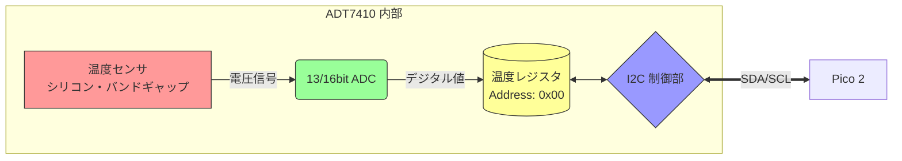

# 第６回：デジタル通信とビットの魔法

## 〜センサーの「言葉」を解読し、温度計を自作する〜

### 🎯 本日の目標

1. **I2C 通信の仕組みを理解する**: 「2本の線」で複数のデバイスを操るバス接続を学ぶ。
2. **I2C スキャンの活用**: デバイスの「住所（アドレス）」を自動検出し、配線ミスを特定する。
3. **AD3 によるプロトコル解析**: 通信波形を実測し、デジタルデータの正体を可視化する。
4. **ビット演算の実践**: センサーデータを **シフト演算** と **論理和** で復元する（穴埋め演習）。

---

## 📘 1. デジタル通信のスタンダード：I2C

これまで学んだアナログ信号（ADC）は電圧の「高さ」で情報を伝えましたが、今回は数値データを 0 と 1 の羅列（シリアル信号）として送受信する **I2C（アイ・ツー・シー）** を学びます。

### 1.1 マスターとスレーブ

I2C 通信は、指示を出す **「マスター（Pico 2）」** と、それに従う **「スレーブ（センサー等）」** の間で行われます。かならず通信はマスターから始めます。

* **SDA (Serial Data)**: データを送受信する信号線。
* **SCL (Serial Clock)**: 通信のタイミングを制御するクロック信号線。

### 1.2 バス接続（2本の線があれば事足りる）

I2C の最大の特徴は、**「複数の装置間で一本の回線を共有して使用する」** ことです。これを **バス接続** と呼びます。デバイスごとに固有の「アドレス（住所）」があるため、同じ線に繋がっていても混信しません。

---

## 📘 2. 【実習】I2C スキャナーで「生存確認」

配線が正しいか、デバイスの「住所」を確認しましょう。

**【配線】**

* **VCC/GND** $\rightarrow$ 3.3V / GND
* **SDA** $\rightarrow$ **GP16** (21番ピン)
* **SCL** $\rightarrow$ **GP17** (22番ピン)

```python
from machine import I2C, Pin
# I2C 0番ユニットを使用。SDA=GP16, SCL=GP17
i2c = I2C(0, sda=Pin(16), scl=Pin(17), freq=400000)

print("Scanning I2C bus...")
devices = i2c.scan() 

if not devices:
    print("デバイスが見つかりません。配線を確認してください。")
else:
    for d in devices:
        print(f"Device found at: {hex(d)}")

```

**【確認】** `0x3c` (ディスプレイ) と `0x48` (センサー) が表示されるか？
**【AD3 実習】** スキャン実行時の波形を Logic Analyzer でキャプチャし、アドレスを順に「ノック」している様子を観察せよ。

---

ADT7410の内部構造を視覚化するために、Mermaidによるブロック図を作成しました。
センサー、ADC、レジスタ、I2Cインターフェースの関係性が一目でわかる構成にしています。

これを MD ファイルの **「📘 3. センサーの正体」** のセクションに差し込んでください。

---

### 📘 3. センサーの正体：ADT7410 とは？

今回使用する **ADT7410** は、チップの中に「温度を測る仕組み」と「計算機（ADC）」がセットで入っているハイテクなセンサーです。

#### 3.1 内部ブロック図

センサー内部では、熱が電気信号に変わり、それがデジタル化されて「棚（レジスタ）」に保管されるまでが自動で行われています。



#### 3.2 内部で何が起きているのか

1. **温度を感知**: チップ内のシリコンの性質を利用して、周囲の温度を電圧に変換します。
2. **デジタル変換**: その電圧を **ADC（アナログ・デジタル・コンバータ）** で 13 ビット（または 16 ビット）の数字に変換します。
3. **レジスタ（棚）に保管**: 変換された数字は、チップ内の **「レジスタ」** と呼ばれるデータ保管箱（住所 0x00 番地）に格納されます。
4. **I2C で発送**: Pico から「0x00 番地のデータをください」と言われると、I2C の線を通ってデータを送り出します。

---

### 3.3 データの届き方

センサーから届く 16 ビットの構造は以下の通りです：

* **上位バイト**: 温度データの大きな桁
* **下位バイト**: 温度データの小さな桁 ＋ フラグ（おまけデータ）

これを Pico 側で正しく「繋ぎ合わせる」ために、ビット演算が必要になります。

---

## 📘 4. 【Step 1】Hello World! を表示する

まずは表示の練習です。秋月の OLED ディスプレイは、専用の命令（バイト列）を直接送る必要があります。

```python
from machine import I2C, Pin
import time

i2c = I2C(0, sda=Pin(16), scl=Pin(17))
OLED_ADDR = 0x3c

def oled_cmd(cmd):
    # b"\x00" は「これからコマンド（命令）を送るよ」という合図
    i2c.writeto(OLED_ADDR, b"\x00" + bytes([cmd]))

def oled_data(char):
    # b"\x40" は「これから文字データを送るよ」という合図
    i2c.writeto(OLED_ADDR, b"\x40" + char.encode())

# --- ディスプレイの初期化 ---
time.sleep_ms(100)
for c in [0x38, 0x0C, 0x01]: 
    oled_cmd(c)
    time.sleep_ms(2)

# --- メッセージ表示 ---
msg = "Hello Pico 2!"
for char in msg:
    oled_data(char)
```

### 4.1 練習
プログラムを自分の名前を出力するように修正してみよう。
（がんれば）半角カタカナを表示することもできる。

---

## 📘 5. 【Step 2】温度計を完成させる（穴埋め演習）

センサーから届く 2 バイトのデータを復元しましょう。以下の **[ A ] 〜 [ C ]** を埋めてください。

**【復元のヒント】**

1. 届いた `d[0]` (上位) を 8 ビット左にずらして、`d[1]` (下位) と合体させる。
2. 有効な温度データは上位 13 ビットのみ。右に 3 ビットずらして、おまけの 3 ビットを捨てる。
3. 最後に分解能（1ビットあたりの温度）を掛ける。

```python
TEMP_ADDR = 0x48

def get_temp():
    # センサーから2バイト読み出し
    d = i2c.readfrom_mem(TEMP_ADDR, 0x00, 2)
    
    # --------------------------------------------------
    # 【ワーク】ビット演算でデータを復元せよ
    # 1. 2つのバイトを合体（d[0]を8ビット左へシフト）
    val = (d[0] [   A   ]) | d[1]
    
    # 2. 不要な下位3ビットを右シフトで捨てる
    val = val [   B   ]
    # --------------------------------------------------
    
    # 負の数処理（13bit目が1ならマイナス）
    if val >= 4096:
        val -= 8192
    
    # 3. 度数に変換（データシートより係数を掛ける）
    return val * [   C   ]

# メインループ
while True:
    t = get_temp()
    oled_cmd(0x80) # カーソルを先頭（左上）に戻す
    
    msg = f"Temp: {t:.2f}C"
    for char in msg:
        oled_data(char)
        
    print(f"測定値: {t:.2f} C")
    time.sleep(1)
```

---

## 💡 エンジニアの記録

1. **データシートの解読**: データシート（AE-ADT7410）の 1 ページ目を見て、このセンサーの「測定範囲」と「精度」を抜き出せ。
2. **穴埋めの解説**: ワークの **[ A ] 〜 [ C ]** に何を記入したか。10進数での計算（256倍など）と比較して、なぜビット演算を使うのか考察せよ。
3. **AD3 観測**: ディスプレイに文字を送っている時の波形をキャプチャし、特定の文字が送られている瞬間を特定せよ。

---
