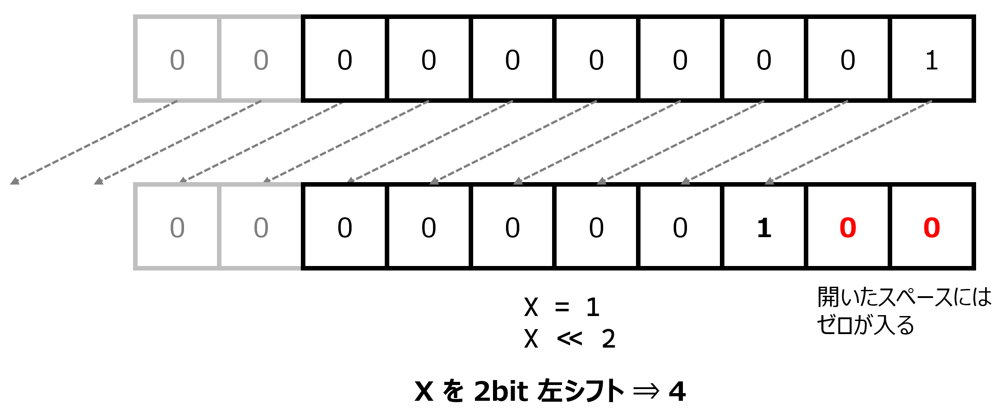
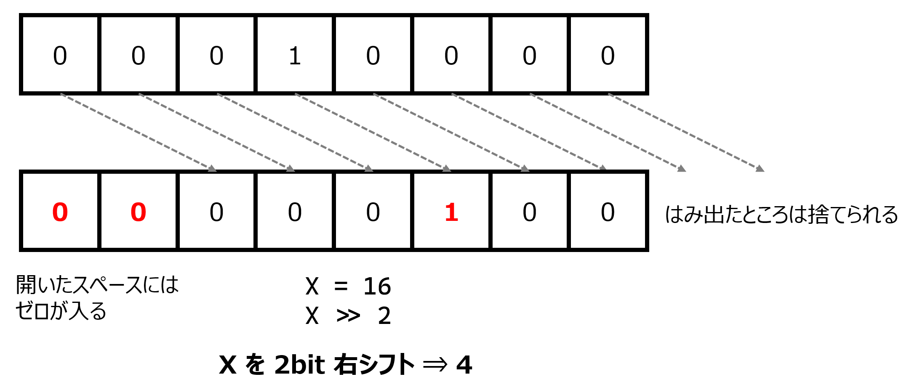

# 第６回：計算の裏側とビットの魔法
## 〜「作業のショートカット(関数)」と「センサーデータの解読(ビット演算)」〜

### 🎯 本日の目標
1.  **関数の書き方 (`def`)**: よく使う手順をひとまとめにする。
2.  **マルチな数値表現**: 10進数・16進数・2進数の使い分け。
3.  **ビット演算の実践**: センサーから届く「バラバラのデータ」を合体させて、温度を復元する。
4.  **負の数の正体**: 氷点下の温度がどう表されるか（2の補数）を理解する。

---

## 📘 1. 楽をする技術：関数 (Function)

「LEDを点けて、待って、消して、待って…」というプログラムを何度も書くのは面倒ですよね。
その一連の動きを **`pika()`** という名前で登録し、1行で呼び出せるようにしましょう。

### 1.1 `def` の書き方（作業のショートカット登録）
```python
# 1. ここで「pika」という名前で動きを登録（定義）
def pika():
    led.value(1)
    time.sleep(0.1)
    led.value(0)
    time.sleep(0.1)

# 2. 使うときは、名前を呼ぶだけ（実行）
pika()
pika()
```

* **ルール**: `def` の中身は必ず **「右にずらして（インデント）」** 書きます。これで「ここからここまでがセットだ」と認識されます。

### 1.2 入力端子と出力端子（引数と return）

関数は、**「材料（入力）」**を受け取って、加工した**「結果（出力）」**を返すこともできます。
結果を外に返すための出力端子が **`return` (戻り値)** です。

```python
# adc_val という「材料（入力）」を受け取る
def get_duty(adc_val):
    duty = int((adc_val / 65535) * 65535)
    return duty  # 計算した結果を「出力」として外へ返す！

# 使うとき
result = get_duty(32768)  # 返ってきた結果を result という箱に入れる
```

* **引数と戻り値**: 材料（入力）を加工して、結果（出力）を返す。これがセンサーデータの変換に不可欠です。

---

## 📘 2. 数字の正体：10進数・16進数・2進数

コンピュータの世界では、同じ「数」を 3 通りの呼び方で使い分けます。
Thonny の Shell（下の画面）で、色々な書き方を試してみましょう。

| 表現方法 | 書き方（例） | 特徴 |
| :--- | :--- | :--- |
| **10進数** | `34` | 人間が普段使う数。 |
| **16進数** | `0x22` | **0x** で始まる。色やメモリ番地でよく使う。|
| **2進数** | `0b100010` | **0b** で始まる。**スイッチの ON/OFF そのもの。** |

**【Shell で確認】**
```python
>>> bin(34)     # 10進数 34 の2進数（スイッチの状態）を見せて！
'0b100010'      # 2番目と6番目のスイッチが ON ということ
>>> bin(0xCA)   # 16進数「CA」の正体は？
'0b11001010'    # これがコンピュータが見ている「本当の姿」
```

### 2.2 ビット演算とシフト演算（スイッチのまとめて操作）
これらのスイッチ（ビット）を直接操作するための記号を「ビット演算子」と呼びます。

**① シフト演算（桁ずらし）**
* **左シフト (`<<`)**：左へずらす。
    * **例**: `1 << 2` と書くと、`0b0001` (1) が左に2個ずれて `0b0100` (4) になる。特定のピンを指定する際によく使う。
* **右シフト (`>>`)**：右へずらす。

<div align="center">

<p> 2bit 左シフト</p>
</div>

<div align="center">

<p> 2bit 右シフト</p>
</div>

**② 論理演算（ON/OFFの判定や強制）**
* **AND (`&`)**：両方 1 なら 1。特定のスイッチが「今 ON かどうか」を調べる検電器として使う。

  ```python
  print(0b11110000 & 0x3f)    ## 上位 4 ビットだけ取り出す ⇒ 0x30 になる
  ```

* **OR (`|`)**：どちらかが 1 なら 1。特定のスイッチを「強制的に ON」にするために使う。

  ```python
  print(0b11110000 | 0x3f)    ## 上位 4 ビットを無条件に 1 にする ⇒ 0xff になる
  ```

** スイッチの判定：数字から ON/OFF を読み取る関数を作れ**

「34」（2進数で `100010`）という数字を受け取って、指定した場所のスイッチが ON か OFF かを判定し、その結果を出力端子 (`return`) から返す関数を作ってみよう。

```python
# 10進数の 34（2 進数では 0b100010）
status = 34 

# スイッチの状態をチェックして「返す」関数
def is_on(pos):
    # 1 を左に pos 回ずらして、AND演算（&）で重なるか調べる
    if status & (1 << pos):
        return True   # ONなら「真」を返す
    else:
        return False  # OFFなら「偽」を返す

# 関数の結果（出力）を使って、どうするかを決める
if is_on(1) == True:
    print("1番のスイッチは ON です！")
else:
    print("1番のスイッチは OFF です")
```

---

## 📘 3. 数学のトリック：負の数と「2の補数」

コンピュータには「マイナス記号」という部品はありません。あるのは「桁溢れ」だけです。

### 3.1 復習：ビットって何だっけ？

* **1ビット (bit)**：スイッチ 1 コ。「0 (OFF)」か「1 (ON)」の2通り。
* **8ビット = 1バイト (byte)**：スイッチが 8 個並んだ状態。2の8乗で **256通り** (0 〜 255) の数字が表現できる箱。

### 3.2 「255 + 1 = 0」の怪奇現象

8個のスイッチが並んだ箱を想像してください。

* スイッチが全部 ON になった最大値は `255` (0xFF) です。
* これに `1` を足すと、箱には 8 個しか入らないので、はみ出した分は消えて表示は **`0` (0b00000000)** に戻ってしまいます。
* **「1 足すと 0 になる数」** ……数学の世界では、これを **「-1」** と見なします。
* 8ビットの世界では `255` (0xFF) という数字が `-1` の役割を演じているのです。これを **「2の補数」** と呼びます。

---


## 📘 4. 【実習】温度センサー ADT7410 を動かしてみよう

ここからは、実際に温度センサーを Pico 2 に繋いで、データを「受信」してみます。
通信の細かいルール（I2Cなど）は次回たっぷりやりますので、今日は**「魔法の呪文」**を使ってセンサーから数字を引っ張り出すことに集中しましょう。

### 4.1 配線（Pico 2 とセンサーを繋ぐ）
センサーのピンを、以下の通り Pico 2 のピンに接続してください。
* **VCC** $\rightarrow$ 3.3V (36番ピン)
* **GND** $\rightarrow$ GND (38番ピンなど)
* **SCL** $\rightarrow$ GP17 (22番ピン)
* **SDA** $\rightarrow$ GP16 (21番ピン)

### 4.2 センサーから「生のデータ」を引っ張り出す

まずは以下のコードを Thonny で実行してください。
このコードは「センサーから 8ビットずつの塊（MSBとLSB）を 2つ持ってくる」という動きをします。

```python
from machine import I2C, Pin
import time

# I2Cの準備（今は「通信の呪文」だと思ってOK！）
i2c = I2C(0, scl=Pin(17), sda=Pin(16), freq=400000)
addr = 0x48 # ADT7410の住所

while True:
    # センサーから 2バイト（16ビット分）のデータを読み取る
    data = i2c.readfrom_mem(addr, 0x00, 2)
    msb = data[0] # 上位の箱
    lsb = data[1] # 下位の箱
    
    # 生のデータを表示
    print(f"受信データ(16進数): MSB=0x{msb:02X}, LSB=0x{lsb:02X}")
    print(f"受信データ( 2進数): MSB={bin(msb)}, LSB={bin(lsb)}")
    
    time.sleep(1.0)
```

**【考察】**

今の部屋の温度に対して、どんな 16進数が届いていますか？
センサーを指で温めると、これらの数字はどう変化しますか？

---

## 📘 5. 【演習】届いたデータを「解読」せよ

センサーから届いた `MSB` と `LSB` は、そのままでは温度として読めません。
仕様書によると、以下の加工が必要です。

1.  **合体**: `MSB` を左に 8つずらし、`LSB` と合体させて 1つの 16ビットの数にする。
2.  **補正**: ADT7410の仕様により、合体させた後に右へ 3ビットずらす（または 128 で割る）必要がある。
3.  **氷点下判定**: 2の補数の考え方を使い、マイナスの温度を正しく計算する。

**【ミッション：解読関数を完成させて、温度を表示せよ】**

以下の「■■■」の部分を埋めて、プログラムを完成させてください。

```python
def get_temperature(msb, lsb):
    # 1. 上の箱を左に 8つずらして、下の箱と OR(|) で合体！
    # ※ lsb はそのまま足すと精度に影響するため、まずは合体させます
    val = (msb << ■■■) | lsb
    
    # 2. 右に 3ビットずらして、不要なデータを取り除く（センサーの仕様）
    val = val >> ■■■
    
    # 3. マイナス温度の判定（13ビット目が 1 ならマイナス）
    # ※ 今回は 13bit モードなので 2の12乗(4096)以上ならマイナスとみなす
    if val >= 4096:
        val = val - 8192 # 2の補数で引き算
    
    # 4. 0.0625 倍（または 16 で割る）して温度(℃)にする
    temp = val * 0.0625
    return temp

# --- メインループに組み込む ---
# (4.2 のループの中で、この関数を呼び出して print しよう！)
# temp_c = get_temperature(msb, lsb)
# print(f"現在の温度: {temp_c:.2f} ℃")
```

---

## 📘 6. 【コラム】半年前のマジックと「CDのキズ」の正体

半年ほど前の電子工学の授業で、**「数字当てマジック」** をやったのを覚えていますか？あのマジックの仕掛けこそが「2進数（ビットの重み）」でした。

そして当時、「この技術が CD や DVD のキズを補う（エラー訂正）技術に繋がっている」という話をしたはずです。

今日は、その **「エラー検出」** の仕組みをプログラムで証明してみましょう。ここで活躍するのが、**EXOR (`^` : 排他的論理和)** です。これには「同じ値を2回ぶつけると `0` になる」という不思議な性質があります。

**【ミッション：通信ノイズを見破れ！】**

インターネットや次回のI2C通信でも、通信経路の途中でノイズが入って `1` と `0` が化けてしまうことがあります。マイコンはどうやって「データが壊れた」ことに気づくのでしょうか？

２つの 4bit データを送ることを考えます。そのときに確認用データもいっしょに送るのです。

```python
# --- 送信する人（CDの書き込み） ---
data1 = 0b1010  # 送りたいデータその1
data2 = 0b1100  # 送りたいデータその2

# 2つのデータを EXOR(^) で混ぜて「確認用データ（パリティ）」を作る
check_digit = data1 ^ data2  

print(f"一緒に送る確認データ: {bin(check_digit)}") 
# data1, data2, check_digit の3つをセットで送る！

# ---------------------------------------------

# --- 受信する人（CDの読み込み） ---
# もし通信が完璧で、無事に3つとも届いたら…
recv_data1 = 0b1010
recv_data2 = 0b1100
recv_check = 0b0110

# 届いた3つを、全部 EXOR(^) で足し合わせてみる
result = recv_data1 ^ recv_data2 ^ recv_check

if result == 0:
    print("データは完璧です！壊れていません。")
else:
    print("エラー！途中でデータが化けました！")
```

届いた `recv_data1 ^ recv_data2` の結果は、送信側で作った `check_digit` と全く同じはずです。
同じもの同士を EXOR すると「互いに打ち消し合って `0` になる」ため、**結果が `0` ならば「途中で1ビットも化けていない」と自信を持って言える** のです。
半年前に聞いた不思議な話は、実はこんなシンプルなビット演算で動いていたんですね。

### 💡 エンジニアの知恵袋
センサーから届くデータは、いつも人間に優しい「25.0」という形をしているわけではありません。
機械同士の効率を考えて、バラバラのビットとして送られてきます。
それを「関数」という道具に閉じ込め、「ビット演算」という魔法で解く。
これができるようになると、世界中のどんなセンサーも君たちの手足になります！
