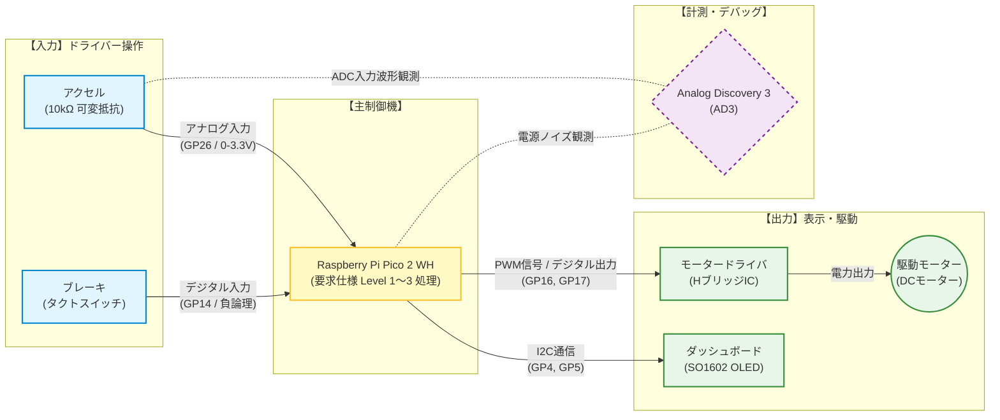

# 【要求仕様書】EVダッシュボード・ロガーシステム プロトタイプ開発

## 1. プロジェクト概要

本プロジェクトは、次期エコランEV（電気自動車）競技車両への搭載を想定した「駆動制御および状態監視ロガーシステム」のプロトタイプを開発するものである。
ドライバーによるアクセル操作（可変抵抗器によるPWM制御）およびブレーキ操作（タクトスイッチ）をリアルタイムに検出し、駆動モーターを安全に制御しながら、車両状態をダッシュボード画面（I2C接続OLED）に正確に表示するシステムを構築する。

 

  
   
  システム概要

 

## 2. ハードウェア構成およびピン配置

開発者は、支給された機材を用いて以下の通りブレッドボード上に回路を構築すること。各ピンの配置は変更してはならない。

| 構成要素 | デバイス名 | マイコン側接続ピン | 信号タイプ | 仕様・備考 |
| --- | --- | --- | --- | --- |
| **主制御機** | Raspberry Pi Pico 2 WH | - | - | システム全体の制御 |
| **スロットルセンサー** | 可変抵抗器 (10kΩ) | **GP26 (ADC0)** | アナログ入力 | 車両のアクセル開度を入力 (0〜3.3V) |
| **ブレーキスイッチ** | タクトスイッチ | **GP14** | デジタル入力 | 押すとブレーキON (内部プルアップ・負論理) |
| **ダッシュボード画面** | SO1602 (秋月 OLED) | **GP4(SDA) / GP5(SCL)** | I2C通信 (I2C0) | 車両ステータスのリアルタイム表示 |
| **モータードライバ** | HブリッジIC | **GP16 (IN1) / GP17 (IN2)** | PWM / デジタル | モーターの回転速度・方向を制御 |
| **駆動部** | DCモーター | モータードライバ出力 | 電力出力 | 車両の主機モーター |
| **計測・デバッグ器** | Analog Discovery 3 (AD3) | 各種観測ポイント | 測定 | 波形観測およびノイズ解析に使用 |

---

## 3. 機能要求 (Functional Requirements)

本開発では、開発者の技術習得度に応じて3つの達成レベル（Level 1〜3）を定義する。自身の目標とするレベルの要件を満たすシステムを実装すること。

### 【Level 1】 基礎統合フェーズ（合格必須要件）

**「単一ループ内での逐次処理による、駆動・表示機能の実現」**

* **FR1.1：スロットル入力およびPWM変換**
* GP26から可変抵抗器のアナログ値（0〜65535）を読み取ること。
* 読み取ったアナログ値に比例して、モーターのPWM Duty比（0〜65535）が無段階で変化すること（可変抵抗を回すとモーターの速度が変わること）。

* **FR1.2：セーフティ・ブレーキ機能**
* ブレーキスイッチ（GP14）が押された（値が `0` になった）瞬間、可変抵抗器がどの位置にあっても、モーター出力を強制的に `0`（完全停止）にすること。

* **FR1.3：ダッシュボード基本表示**
* OLEDディスプレイの仕様（コントロールバイト `0x80`、2行目移動 `0xC0`）を正しく実装すること。
* **1行目の表示：** アクセル開度を0〜100%に換算して表示（例：`THR:  75 %`）。
* **2行目の表示：** ブレーキの状態を表示（通常時：`BRK: READY` / ブレーキ押下時：`BRK: STOP!!`）。

* **制約条件：** `while True:` ループの末尾に `time.sleep_ms(200)` 等の固定ディレイを入れて動作させてよい。

---

### 【Level 2】 高信頼性フェーズ（中級推奨要件）

**「実車環境を想定した、ソフトウェア・ハードウェア双方によるノイズ対策の実施」**

* **FR2.1：スロットルデータの安定化（移動平均フィルタ）**
* モーター駆動時に電源電圧が変動し、ADC（可変抵抗器）の値が細かくブレる（OLEDの％表示がパチパチとチラつく）現象を抑制すること。
* センサー値を1回だけ読むのではなく、「過去10回の測定値の平均（移動平均）」を算出するロジックを関数として実装し、表示数値を安定させること。

* **FR2.2：AD3による電気的ノイズの測定とパスコン対策**
* モーター稼働中に、AD3のScope機能を用いて「Picoの電源ライン」および「ADC入力ピン（GP26）」の電圧波形を観測すること。
* モーターから発生するスパイクノイズをキャプチャし、そのノイズ振幅（Vpp）を記録すること。
* 回路にセラミックコンデンサ（0.1μF程度）を挿入し、ノイズがどれだけ低減したかをAD3で再計測・実証すること。

---

### 【Level 3】 リアルタイム制御フェーズ（上級挑戦要件）

**「長すぎるsleepを排除し、これまでに習った基本構文のみで『応答性』と『画面更新』を両立する」**

* **背景にある課題：**
* Level 1〜2のようにループの末尾に `time.sleep_ms(200)` を入れると、画面のチラつきは抑えられるが、「sleepしている200msの間はマイコンが完全に思考停止する」ため、ブレーキスイッチを押しても最大0.2秒間も反応しない（＝レース中なら制動が遅れて大事故になる）という致命的な欠陥が生じる。

* **FR3.1：高速ループとカウンターによる画面更新レート制御**
* 制御の遅延を無くすため、メインループの末尾は **`time.sleep_ms(10)`** （10ミリ秒という超高速周期）に変更すること。これにより、ブレーキは常に10ms以内の超高レスポンスで検知可能となる。
* ただし、そのままではOLEDへのI2C通信も10ms周期で実行されてしまい、通信のオーバーヘッドでマイコンの処理が重くなる。
* そこで、**これまでに習った「変数」と「if文」だけを組み合わせ**、「ループが50回まわる度（10ms × 50回 ＝ 500ms間隔）に1回だけOLEDの表示更新処理を行う」という**カウント式の疑似マルチタスク(*)**を自力でアルゴリズムを考えて実装しなさい。

* マルチタスク: 複数の仕事 (タスク) を並行して（同時に）実行すること

---

## 4. 非機能要求・安全制約

* **NFR1. フェールセーフ（起動時）：** プログラムの起動時（Mainループに入る前）は、必ずモーターのPWM出力を `0`（停止状態）に初期化し、電源を入れた瞬間に車体が暴走することを防ぐこと。
* **NFR2. コードの可読性：** 各自が選択したLevelの工夫（特にLevel 2の平均化処理、Level 3のカウント処理）が分かるよう、該当する行には必ず日本語でコメントを記述すること。

---

## 5. 成果物（技術レポート要件）

1. **開発達成レベルの宣言とソースコード全容**
* 自身がクリアした最高レベル（Level 1 / 2 / 3）を明記し、動作確認済みのMicroPythonコードを貼り付けること。

2. **AD3による工学的検証結果**
* コンデンサを追加する前の「ノイズ波形」と、追加した後の「対策後の波形」のAD3スクリーンショットを並べて掲載すること。それぞれのノイズの振幅（V）を読み取り、パスコンの効果を説明すること。

3. **エネワン実戦投入へ向けたロガー設計の考察**
* 実際の競技では、データを画面に出すだけでなくPC等に送信して「記録（ロギング）」する必要がある。
* もしこのシステムにデータ送信機能を追加する場合、なぜLevel 3で求めた「制御（ブレーキ）を止めずに、一定周期で通信（表示や送信）を行う」という考え方が絶対に必要不可欠になるのか、安全性の観点から論じなさい。
