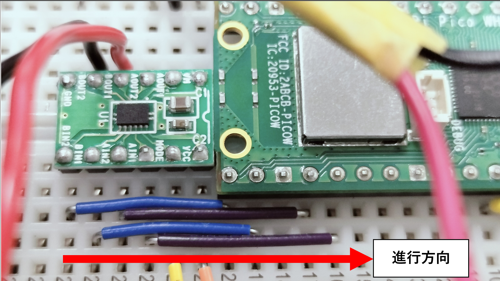

# ライントレーサー実習：ハードウェアの統合とプログラム制御

これまでの実習で、3.3Vレギュレータ基板の作成と、Raspberry Pi Pico のブレッドボードへの引っ越しが完了しました。
今回からはいよいよ、センサーとモータードライバをマイコンに接続し、プログラムで車体を思い通りに操る「制御」のフェーズに入ります。

## Step 1: ブレッドボード上の結線

まずは、Pico とセンサー、モータードライバをジャンパーワイヤで接続します。
配線ミスはマイコンやセンサーの破損につながるため、以下のピン配置をよく確認しながら結線してください。

**【ピン配置一覧】**

* **右センサー (RPR220)**： `Pin(26)` (ADC0) に接続
* **左センサー (RPR220)**： `Pin(27)` (ADC1) に接続
* **左モーター (AIN側)**：
    * AIN1： `Pin(19)`
    * AIN2： `Pin(18)`


* **右モーター (BIN側)**：
    * BIN1： `Pin(17)`
    * BIN2： `Pin(16)`


<div align="center">

</div>

---

## Step 2: 動作確認（ON/OFF制御）

結線が終わったら、ハードウェアが正しく動くかを確認するためのテストプログラム `linetracer_ver1.py` を実行します。

**【重要な注意：モーターの回転方向について】**

ギアボックスの構造や、左右のモーターが鏡合わせ（左右対称）に配置されている都合上、モーター単体に電気を流したときの「正転」が、必ずしも「車体の前進」とは一致しません。
したがって、プログラム内の `left_motor_forward()` や `right_motor_forward()` といった関数は、モーターの仕様に合わせるのではなく、「車体が前進するように（車の前進を表すものとして）」作成します。もしテストしてタイヤが逆回転する場合は、プログラム内の `1` と `0` の値を入れ替えて、前進するように修正してください。

**【確認すること】**

1. センサーの値は正しく変化するか？（白と黒の上で値が変わるか）
2. モーターの回転方向は正しいか？（関数を実行した際、車体が前進する方向に回るか）
3. USB接続時、`Ctrl + C` で安全に停止するか？

```python
# 接続状態確認プログラム -- linetracer_ver1.py --
from machine import Pin, ADC
import time

# アナログ入力を取得（0 〜 65535 の値が返る）
sensor_right = ADC(Pin(26))
sensor_left  = ADC(Pin(27))

# 左モーター
left_in1 = Pin(19, Pin.OUT)
left_in2 = Pin(18, Pin.OUT)

# 右モーター
right_in3 = Pin(17, Pin.OUT)
right_in4 = Pin(16, Pin.OUT)

def left_motor_forward():
    left_in1.value(1)
    left_in2.value(0)

def left_motor_stop():
    left_in1.value(0)
    left_in2.value(0)

def right_motor_forward():
    right_in3.value(0)
    right_in4.value(1)

def right_motor_stop():
    right_in3.value(0)
    right_in4.value(0)

try:
    while True:
        right_motor_forward()
        left_motor_forward()
        print("L:", sensor_left.read_u16(), "R:", sensor_right.read_u16())
        time.sleep(1)
except KeyboardInterrupt:
    right_motor_stop()
    left_motor_stop()
```

---

## Step 3: PWM制御と「信地旋回」の導入

Step 2のON/OFF制御（常に100%のパワー）では速すぎてコースを曲がりきれません。
そこで、モーターのパワーを調整できる **PWM（Pulse Width Modulation）制御** を導入します。

以下の `linetracer_ver2.py` を完成させてください。ここでは、カーブを曲がる際に片方のタイヤを停止させる「信地旋回（しんちせんかい）」を使います。

**【課題】 `[ ？？？ ]` の部分を適切なコードで埋めてください。**

```python
# 接続状態確認プログラム -- linetracer_ver2.py --
from machine import Pin, ADC, [ ？？？ ] # PWMを使えるようにする
import time

sensor_right = ADC(Pin(26))
sensor_left  = ADC(Pin(27))

# PWM出力としてピンを設定する
left_in1 = PWM(Pin(19))
left_in2 = PWM(Pin(18))
right_in3 = PWM(Pin(17))
right_in4 = PWM(Pin(16))

BORDER_VALUE = 30000 

# すべてのピンの周波数を 2000Hz に統一
for pin in [left_in1, left_in2, right_in3, right_in4]:
    pin.[ ？？？ ](2000) # 周波数を設定する関数

# 速度の設定 (Max 65535)
DRIVE_SPEED = 26000

def left_motor_forward():
    left_in1.[ ？？？ ](DRIVE_SPEED) # 出力比(Duty)を設定する関数
    left_in2.[ ？？？ ](0)

def left_motor_stop():
    left_in1.duty_u16(0)
    left_in2.duty_u16(0)

def right_motor_forward():
    right_in3.duty_u16(0)
    right_in4.duty_u16(DRIVE_SPEED)

def right_motor_stop():
    right_in3.duty_u16(0)
    right_in4.duty_u16(0)

def stop_all():
    left_motor_stop()
    right_motor_stop()

def move_forward():
    left_motor_forward()
    right_motor_forward()
    
def turn_left():
    """左に曲がる（左モーターを止めて、右モーターだけ回す）"""
    [ ？？？ ] # 左を止める関数
    [ ？？？ ] # 右を前進させる関数

def turn_right():
    """右に曲がる（右モーターを止めて、左モーターだけ回す）"""
    [ ？？？ ] # 左を前進させる関数
    [ ？？？ ] # 右を止める関数

print("ライントレーサー Ver.2 始動します。")
stop_all()
time.sleep(1.0)

try:
    while True:
        val_right = sensor_right.read_u16()
        val_left  = sensor_left.read_u16()
        
        is_right_black = (val_right > BORDER_VALUE)
        is_left_black  = (val_left > BORDER_VALUE)
        
        # --- 2値判定による進行方向の決定 ---
        if (not is_left_black) and (not is_right_black):
            move_forward()            
        elif is_left_black and (not is_right_black):
            turn_left()            
        elif (not is_left_black) and is_right_black:
            turn_right()
        else:
            stop_all()
            
        time.sleep(0.01)

except KeyboardInterrupt:
    stop_all()
    print("プログラムを安全に停止しました。")

```

---

## Step 4: 「両方黒」の罠を突破せよ！（論理回路の修正）

Step 3 のコードを完成させてコースを走らせると、**第一コーナーでマシンがピタッと止まってしまう** はずです。

なぜ止まってしまうのでしょうか？

メインループのIF文をよく見てください。
「両方が白」「左だけ黒」「右だけ黒」の条件を満たさない場合（つまり「両方が黒」になった場合）、プログラムは `else: stop_all()` を実行してしまいます。

**【課題】**

十字路などで「両方が黒」を検知したとき、マシンが止まらずにコースに復帰できるよう、Step 3 のIF文のロジックを各自で修正してください。
（ヒント：両方黒のときは、どう動けばラインを抜けられるでしょうか？）

---

## Step 5: 急カーブを攻略せよ！（超信地旋回とチューニング）

「両方黒」の問題をクリアしても、Ver.2 の「片輪停止（信地旋回）」では回転半径が大きすぎて、コースの「急カーブ」は曲がりきれないはずです。
そこで、**止めているタイヤを「逆回転」させて、その場でコマのように回る**「超信地旋回（ちょうしんちせんかい）」にプログラムを進化させます。

しかし、単純に逆回転させるだけでは、パワーが強すぎて緩いカーブでガタガタと暴れてしまいます。
ここからがエンジニアとしての腕の見せ所です。**定数（パラメータ）を微調整して、自分のマシンの物理的な特性をねじ伏せてください。**

**【課題】 以下の `linetracer_ver3.py` を完成させ、コースを100%完走できるようにパラメータを調整せよ。**

```python
# 接続状態確認プログラム -- linetracer_ver3.py --
from machine import Pin, ADC, PWM
import time

sensor_right = ADC(Pin(26))
sensor_left  = ADC(Pin(27))
left_in1 = PWM(Pin(19))
left_in2 = PWM(Pin(18))
right_in3 = PWM(Pin(17))
right_in4 = PWM(Pin(16))

# 【チューニングポイント①：しきい値】
BORDER_VALUE = [ ？？？ ] # 少し厳しめ（高め）にすると直線が安定するかも？

# 【チューニングポイント②：周波数（トルク）】
for pin in [left_in1, left_in2, right_in3, right_in4]:
    pin.freq([ ？？？ ]) # 1000Hz前後に下げると、低速で踏ん張る力（トルク）が出ます

# 【チューニングポイント③：速度】
DRIVE_SPEED = [ ？？？ ] # 直進時のスピード（速すぎるとカーブで飛び出します）
TURN_SPEED = [ ？？？ ]  # 旋回時専用のスピード

def move_forward():
    left_in1.duty_u16(DRIVE_SPEED)
    left_in2.duty_u16(0)
    right_in3.duty_u16(0)
    right_in4.duty_u16(DRIVE_SPEED)

def stop_all():
    left_in1.duty_u16(0)
    left_in2.duty_u16(0)
    right_in3.duty_u16(0)
    right_in4.duty_u16(0)

def turn_left():
    """左に曲がる（左モーターを少し逆回転、右モーターを回す）"""
    # 【チューニングポイント④：超信地旋回のパワーバランス】
    # 逆回転側のパワーを何倍（0.0 〜 1.0）にするかを探り出せ！
    REVERSE_POWER = [ ？？？ ] 
    
    left_in1.duty_u16(0)
    left_in2.duty_u16(int(TURN_SPEED * REVERSE_POWER)) # 左はバック
    right_in3.duty_u16(0)
    right_in4.duty_u16(TURN_SPEED) # 右は前進

def turn_right():
    """右に曲がる（右モーターを少し逆回転、左モーターを回す）"""
    REVERSE_POWER = [ ？？？ ] # 左旋回と同じ値を設定する
    
    left_in1.duty_u16(TURN_SPEED)
    left_in2.duty_u16(0)
    right_in3.duty_u16(int(TURN_SPEED * REVERSE_POWER))
    right_in4.duty_u16(0)

print("ライントレーサー Ver.3 始動します。")
stop_all()
time.sleep(1.0)

try:
    while True:
        val_right = sensor_right.read_u16()
        val_left  = sensor_left.read_u16()
        
        is_right_black = (val_right > BORDER_VALUE)
        is_left_black  = (val_left > BORDER_VALUE)
        
        # --- 2値判定による進行方向の決定 ---
        # Step 4で修正した「両方黒」の対策ロジックをここに組み込むこと！
        if (not is_left_black) and (not is_right_black):
            move_forward()            
        elif is_left_black and (not is_right_black):
            turn_left()            
        elif (not is_left_black) and is_right_black:
            turn_right()
        [ ？？？ ] # 両方黒の場合の処理を追加

        # 【チューニングポイント⑤：サンプリングレート】
        # マイコンがセンサーを見る頻度。短いほど素早く反応する。
        time.sleep([ ？？？ ]) 

except KeyboardInterrupt:
    stop_all()
    print("プログラムを安全に停止しました。")
```

---

## 💡 100%完走を目指すための「職人のヒント集」

もしマシンが安定しない（急カーブで飛び出す、直線でガタガタする）場合は、以下のポイントを見直してください。**プログラムのIF文を複雑にするのではなく、パラメータとハードウェアの調整で物理をねじ伏せる** のが、優れたエンジニアのアプローチです。

1. **「ホイールベースは短く、センサーは先端へ」の黄金配置（ハードの調整）**  
    * **ホイールベース（前輪と後輪の距離）：** 前輪（キャスター）と後輪（駆動輪）の距離は「なるべく短く」するのが鉄則です。ここが長いと、旋回時に車体が横滑りする抵抗が大きくなり、機敏に回れません。
    * **センサーの位置：** 逆に、センサーは駆動輪から「なるべく遠く（先端）」に配置します。これにより、カーブを「先読み」できるようになり、少ない回転角度でラインに復帰できるようになります。


2. **白黒判定の「しきい値」に遊びを作る**  
白と黒の中間値よりも「少し高め（黒に厳しめ）」に設定すると、直線で少しラインを踏んだくらいでは過剰反応しなくなり、走りが滑らかになります。

3. **超信地旋回の「パワーバランス」**  
`TURN_SPEED` に対して、逆回転側のパワーを 1.0 (100%) にするとその場でコマ回りしてしまい、前に進みません。`0.8` 前後に落として、「弧を描きながら力強く曲がる」スイートスポットを探してください。

4. **マイコンの動体視力を上げる（sleepの短縮）**  
スピードが速いのに `time.sleep()` が長いと、マイコンがよそ見をしている間にラインを通り過ぎてしまいます。待機時間を短く（例：`0.01` → `0.005`）して、監視頻度を上げましょう。

5. **最大の魔物：「電池の消耗」に注意！**  
プログラムは一切変えていないのに、急にカーブを曲がりきれなくなった？ それは**電池の電圧降下が原因**です。トルクが落ちたら電池を交換するか、現状の電池に合わせて `DRIVE_SPEED` や `TURN_SPEED` を調整し直してください。

## Step 6: 早く完成した人へ（独自チューニングと発展課題）

100%完走できるようになったら、さらに上のレベルを目指して独自の改良を加えてみましょう。

### 【⚠️ 超重要：改造前のバックアップ（バージョン管理）】

せっかく完走できるようになったプログラムを改造して「動かなくなり、元の数字も分からなくなった…」となるのが一番悲惨です。
独自の改造を始める前に、必ず、現在完璧に動いているプログラムを linetracer_stable.py などの別名で保存（バックアップ）しておいてください。エンジニアの鉄則です。

### 【発展課題のアイデア】

1. **タイムアタック（限界速度への挑戦）：**  
コースアウトしないギリギリのラインまで `DRIVE_SPEED` と `TURN_SPEED` を上げて、クラス最速タイムを目指せ。

2. **直線番長モード（動的スピード制御の導入）：**  
「直線は全力で飛ばし、カーブに入った瞬間だけ減速する」という賢い走りはできないだろうか？  
（ヒント：両方「白」のときの `move_forward` のスピードと、片方「黒」になったときのスピードを変えるには、プログラムをどう書き換えればいい？）

3. **ハードウェアの極み（外乱光対策）：**  
教室の照明や、自分の体の影がセンサーのノイズになることがあります。センサーの周りに黒いテープや厚紙で「スカート」を作り、外からの光を完全にシャットアウトする「プロ仕様のセンサーガード」を作ってみよう。