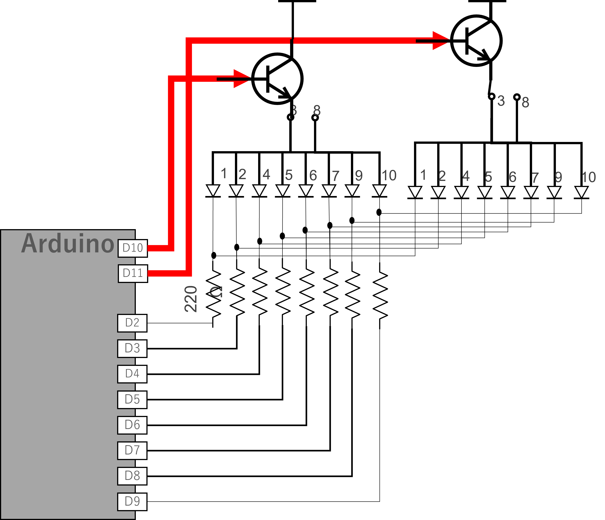

# 7 セグ LED とトランジスタのダイナミック点灯

I2C のディスプレイのような高機能なものではなく単純な 8 個の LED で数字やアルファベットの表示をする 7 セグ LED について説明する。

あわせて、複数の 7 セグ LED を同時に点灯させる **ダイナミック点灯** についても説明する。

## 7セグメントLED

7セグメントLEDは、数字や記号を表示するために使われるLEDディスプレイである。
7つの発光セグメントと1つのドットポイントで構成されており、それぞれのセグメントを点灯・消灯させることで、0から9までの数字や、AからFまでの英字、その他様々な記号を表示することができる。

- [LN516RA データシート](https://wakamatsu.co.jp/waka/LN516RA.pdf)

<div style="text-align: center;">
  <br/>
  7 セグメント LED (7 セグ)
</div>

### 構造

7セグメントLEDは、以下の部品で構成されている。

* **発光セグメント（a～g）**: 数字や記号の形状を表現するために配置された7つのLEDのこと。それぞれa～gとアルファベットで呼ばれる。
* **ドットポイント（D.P）**: 小数点やコロンなどを表示するためのLEDである。
* **デジット**: a～gの7つのセグメントの総称。1桁分の数字や記号を表示する単位となる。

<div style="text-align: center;">
  <br/>
  7 セグ構造
</div>

### 表示方法

数字や記号を表示するには、それぞれのセグメントを適切な組み合わせで点灯させる。例えば、数字 "0" を表示するには、a、b、c、d、e、fの6つのセグメントを点灯させ、gセグメントは消灯させる。
各 LED ごとに電流制限抵抗は必要である。

### 種類

7セグメント LED には、アノードコモンとカソードコモンの2種類がある。

* **アノードコモン**: すべてのセグメントのアノードが共通接続されている。
* **カソードコモン**: すべてのセグメントのカソードが共通接続されている。

また、表示桁数や文字サイズ、色なども様々な種類がある。

<div style="text-align: center;">
  <br/>
  <strong>これはアノードコモン、３番と８番はつながっている (どちらを使ってもよい)</strong>
</div>

## 質問

アノードコモンのとき、接続状態は下のようになる。このとき GPIO ピンから 1 を出力すると LED はどうなるか。

<div style="text-align: center;">
  <br/>
  <strong>GPIO から 1 を出力すると？</strong>
</div>

**負論理 (L のとき「点灯」する) に注意する**

### 利点

7セグメントLEDには、以下のような利点がある。

* **視認性が高い**: 明るいLEDを使用しているため、視認性に優れる。
* **低価格**: 比較的安価な部品。
* **省電力**: 消費電力が低いため、省電力設計に適している。
* **小型**: 小型のパッケージで実装できるため、スペースを節約できる。
* **汎用性が高い**: 様々な用途に使用できる。

### 用途

7セグメントLEDは、以下のような様々な用途に使用されている。

* **家電製品**: 時計、エアコン、ラジオ、電子レンジなど
* **計測器**: 温度計、電圧計、周波数計など
* **工作物**: 電子工作、ロボット、マイコン制御など
* **その他**: 交通信号機、ゲーム機、パチンコ台など

## 回路

次のような回路を作成し、Arduino から 1 秒ごとに 0~F (16進数) まで表示するようにせよ。7 セグの a~g と dp には以下を使用する。

|7 セグ LED 1 | Arduino | 
|--------|--
 a       | D2
 b       | D3
 c       | D4
 d       | D5
 e       | D6
 f       | D7
 g       | D8
 dp      | D9

<div style="text-align: center;">
  <br/>
  <strong>回路</strong>
</div>

## プログラム
### パワープレイ

```c++
void setup(){
  int i;
  for(i=2;i<10;i++){
    pinMode(i,OUTPUT);

  }
  for(i=2;i<10;i++){
    digitalWrite(i,1);
  }
}

int num = 0;

void loop(){
    switch(num){
    case 0:
        digitalWrite(2,0);
        digitalWrite(3,0);
        digitalWrite(4,0);
        digitalWrite(5,0);
        digitalWrite(6,0);
        digitalWrite(7,0);
        digitalWrite(8,1);
        digitalWrite(9,1);
        break;

    case 1:
        digitalWrite(2,1);
        digitalWrite(3,0);
        digitalWrite(4,0);
        digitalWrite(5,1);
        digitalWrite(6,1);
        digitalWrite(7,1);
        digitalWrite(8,1);
        digitalWrite(9,1);
        break;

    case 2:
        digitalWrite(2,0);
        digitalWrite(3,0);
        digitalWrite(4,1);
        digitalWrite(5,0);
        digitalWrite(6,0);
        digitalWrite(7,1);
        digitalWrite(8,0);
        digitalWrite(9,1);
        break;

    case 3:
        digitalWrite(2,0);
        digitalWrite(3,0);
        digitalWrite(4,0);
        digitalWrite(5,0);
        digitalWrite(6,1);
        digitalWrite(7,1);
        digitalWrite(8,0);
        digitalWrite(9,1);
        break;

    case 4:
        digitalWrite(2,1);
        digitalWrite(3,0);
        digitalWrite(4,0);
        digitalWrite(5,1);
        digitalWrite(6,1);
        digitalWrite(7,0);
        digitalWrite(8,0);
        digitalWrite(9,1);
        break;

    case 5:
        digitalWrite(2,0);
        digitalWrite(3,1);
        digitalWrite(4,0);
        digitalWrite(5,0);
        digitalWrite(6,1);
        digitalWrite(7,0);
        digitalWrite(8,0);
        digitalWrite(9,1);
        break;

    case 6:
        digitalWrite(2,0);
        digitalWrite(3,1);
        digitalWrite(4,0);
        digitalWrite(5,0);
        digitalWrite(6,0);
        digitalWrite(7,0);
        digitalWrite(8,0);
        digitalWrite(9,1);
        break;

    case 7:
        digitalWrite(2,0);
        digitalWrite(3,0);
        digitalWrite(4,0);
        digitalWrite(5,1);
        digitalWrite(6,1);
        digitalWrite(7,1);
        digitalWrite(8,1);
        digitalWrite(9,1);
        break;

    case 8:
        digitalWrite(2,0);
        digitalWrite(3,0);
        digitalWrite(4,0);
        digitalWrite(5,0);
        digitalWrite(6,0);
        digitalWrite(7,0);
        digitalWrite(8,0);
        digitalWrite(9,1);
        break;

    case 9:
        digitalWrite(2,0);
        digitalWrite(3,0);
        digitalWrite(4,0);
        digitalWrite(5,0);
        digitalWrite(6,1);
        digitalWrite(7,0);
        digitalWrite(8,0);
        digitalWrite(9,1);
        break;

    case 10:
        digitalWrite(2,0);
        digitalWrite(3,0);
        digitalWrite(4,0);
        digitalWrite(5,1);
        digitalWrite(6,0);
        digitalWrite(7,0);
        digitalWrite(8,0);
        digitalWrite(9,1);
        break;

    case 11:
        digitalWrite(2,1);
        digitalWrite(3,1);
        digitalWrite(4,0);
        digitalWrite(5,0);
        digitalWrite(6,0);
        digitalWrite(7,0);
        digitalWrite(8,0);
        digitalWrite(9,1);
        break;

    case 12:
        digitalWrite(2,0);
        digitalWrite(3,1);
        digitalWrite(4,1);
        digitalWrite(5,0);
        digitalWrite(6,0);
        digitalWrite(7,0);
        digitalWrite(8,1);
        digitalWrite(9,1);
        break;

    case 13:
        digitalWrite(2,1);
        digitalWrite(3,0);
        digitalWrite(4,0);
        digitalWrite(5,0);
        digitalWrite(6,0);
        digitalWrite(7,1);
        digitalWrite(8,0);
        digitalWrite(9,1);
        break;

    case 14:
        digitalWrite(2,0);
        digitalWrite(3,1);
        digitalWrite(4,1);
        digitalWrite(5,0);
        digitalWrite(6,0);
        digitalWrite(7,0);
        digitalWrite(8,0);
        digitalWrite(9,1);
        break;

    case 15:
        digitalWrite(2,0);
        digitalWrite(3,1);
        digitalWrite(4,1);
        digitalWrite(5,1);
        digitalWrite(6,0);
        digitalWrite(7,0);
        digitalWrite(8,0);
        digitalWrite(9,1);
        break;
    }
    delay(1000);
    num++;
    if (num == 16) {
        num = 0;
    }
}
```

# ダイナミック点灯 (ダイナミックドライブ)

例えば、7 セグ LED を使って温度を表示しようと思ったら、最低でも２つの 7 セグ LED が必要になる。
２つの 7 セグ LED をそのままマイコンにつなごうとすると、7x2=14 ピン必要となる。Arduino ならなんとかつなげられそうだが、GPIO がもったいない。

そこで **高速に切り替えて、同時についているように見せる** という技を使う。これを **ダイナミック点灯 (ダイナミックドライブ)** という。

<div style="text-align: center;">
  <br/>
  <strong>GPIO から 1 を出力すると？</strong>
</div>

# 課題

以下の動作をする Arduino を使った回路とプログラムを作成し、レポートとしてワードのファイル kadai9.docx というファイル名で提出する。

**■ プログラム**

7 セグ LED をつけて２ケタにし、ダイナミック点灯方式で、1 秒ごとに 0 から 99 までカウントできるようにする。99 になったら 0 に戻るようにする。使用するピンは下の表に従う。またカウントアップはタイマー割り込みを使って実現する。

|7 セグ LED 1 および 2 | Arduino | 
|--------|--
 a       | D2
 b       | D3
 c       | D4
 d       | D5
 e       | D6
 f       | D7
 g       | D8
 dp      | D9
 CA      | NPN トランジスタ エミッタ

<div style="text-align: center;">
  <br/>
  <strong>99まで数える</strong>
</div>

## 解説 (NG パターン)

- これをやってはいけない
- ヒント： LED の GPIO ピンの電流定格

<div style="text-align: center;">
  <br/>
  <strong>こうしてはいけない</strong>
</div>

## 解説 (OK パターン)

- こうする
- **NPN トランジスタ** を使って電流を流す / 止めるを制御する

<div style="text-align: center;">
  <br/>
  <strong>こうする</strong>
</div>

**■ レポートの内容**

- レポートには
  - 表紙 (名前)
  - 回路図
  - フローチャート  
    参考：[初心者必見！標準フローチャート記号と使い方](https://www.edrawsoft.com/jp/flowchart-symbols.html)
  - プログラム  
  - 完成したシステムの外観 (写真)  
  - 考察 (気づいたこと、工夫したこと)
  
  を含める
