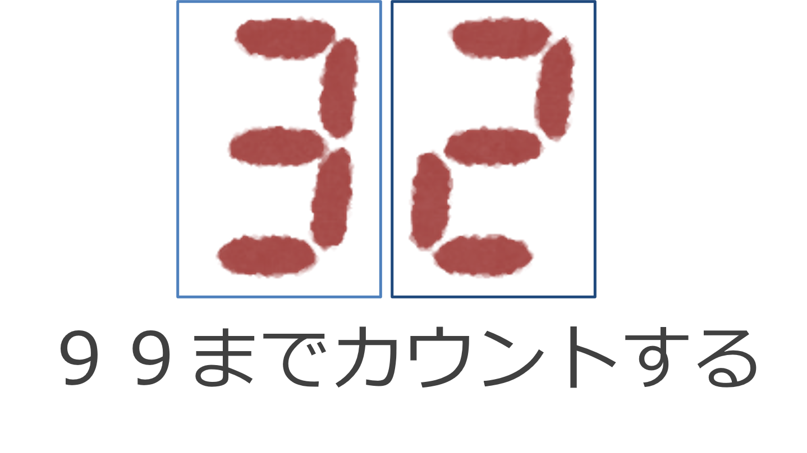

# ダイナミック点灯 つづき

**■ プログラム**

7 セグ LED をつけて２ケタにし、ダイナミック点灯方式で、異なる数字をつかった２桁の数を表示するようにする。(たとえば 10, 32, 81) ~~1 秒ごとに 0 から 99 までカウントできるようにする。99 になったら 0 に戻るようにする。~~ 使用するピンは下の表に従う。~~またカウントアップはタイマー割り込みを使って実現する。~~ タイマー割り込みを使ったカウントアップ方法は次回レクチャーする。

|7 セグ LED 1 および 2 | Arduino | 
|--------|--
 a       | D2
 b       | D3
 c       | D4
 d       | D5
 e       | D6
 f       | D7
 g       | D8
 dp      | D9
 CA      | NPN トランジスタ エミッタ

<div style="text-align: center;">
  <br/>
  <strong>99まで数える</strong>
</div>

## プログラム

以下のようなプログラムとなる。

```c++
void setup(){
  int i;
  for(i=2;i<10;i++){
    pinMode(i,OUTPUT); // D2~D9 OUTPUT モード
  }

  for(i=2;i<10;i++){
    digitalWrite(i,1); // D2~D9 は 1 (LED は消える)
  }
  pinMode(10, OUTPUT);
  pinMode(11, OUTPUT);

  digitalWrite(10, 0);  // 十の位、消灯
  digitalWrite(11, 0);  // ーの位、消灯
}

int number = 81;    // 表示したい数字

int state = 0;      // 状態 0:十の位を ON, 1:一の位を ON
int digit1;         // 十の位の数字
int digit2;         // 一の位の数字
int digit;          // 表示する数字

void loop(){
    digit1 = int(number/10.0);
    digit2 = number % 10;
    
    if (state == 0) {
        digitalWrite(10, 1);
        digitalWrite(11, 0);
        digit = digit1;
        state = 1;
    } else if (state == 1) {
        digitalWrite(10, 0);
        digitalWrite(11, 1);
        digit = digit2;
        state = 0;
    }

    switch(digit){
    case 0:
        digitalWrite(2,0);
        digitalWrite(3,0);
        digitalWrite(4,0);
        digitalWrite(5,0);
        digitalWrite(6,0);
        digitalWrite(7,0);
        digitalWrite(8,1);
        digitalWrite(9,1);
        break;

    case 1:
        digitalWrite(2,1);
        digitalWrite(3,0);
        digitalWrite(4,0);
        digitalWrite(5,1);
        digitalWrite(6,1);
        digitalWrite(7,1);
        digitalWrite(8,1);
        digitalWrite(9,1);
        break;

    case 2:
        digitalWrite(2,0);
        digitalWrite(3,0);
        digitalWrite(4,1);
        digitalWrite(5,0);
        digitalWrite(6,0);
        digitalWrite(7,1);
        digitalWrite(8,0);
        digitalWrite(9,1);
        break;

    case 3:
        digitalWrite(2,0);
        digitalWrite(3,0);
        digitalWrite(4,0);
        digitalWrite(5,0);
        digitalWrite(6,1);
        digitalWrite(7,1);
        digitalWrite(8,0);
        digitalWrite(9,1);
        break;

    case 4:
        digitalWrite(2,1);
        digitalWrite(3,0);
        digitalWrite(4,0);
        digitalWrite(5,1);
        digitalWrite(6,1);
        digitalWrite(7,0);
        digitalWrite(8,0);
        digitalWrite(9,1);
        break;

    case 5:
        digitalWrite(2,0);
        digitalWrite(3,1);
        digitalWrite(4,0);
        digitalWrite(5,0);
        digitalWrite(6,1);
        digitalWrite(7,0);
        digitalWrite(8,0);
        digitalWrite(9,1);
        break;

    case 6:
        digitalWrite(2,0);
        digitalWrite(3,1);
        digitalWrite(4,0);
        digitalWrite(5,0);
        digitalWrite(6,0);
        digitalWrite(7,0);
        digitalWrite(8,0);
        digitalWrite(9,1);
        break;

    case 7:
        digitalWrite(2,0);
        digitalWrite(3,0);
        digitalWrite(4,0);
        digitalWrite(5,1);
        digitalWrite(6,1);
        digitalWrite(7,1);
        digitalWrite(8,1);
        digitalWrite(9,1);
        break;

    case 8:
        digitalWrite(2,0);
        digitalWrite(3,0);
        digitalWrite(4,0);
        digitalWrite(5,0);
        digitalWrite(6,0);
        digitalWrite(7,0);
        digitalWrite(8,0);
        digitalWrite(9,1);
        break;

    case 9:
        digitalWrite(2,0);
        digitalWrite(3,0);
        digitalWrite(4,0);
        digitalWrite(5,0);
        digitalWrite(6,1);
        digitalWrite(7,0);
        digitalWrite(8,0);
        digitalWrite(9,1);
        break;

    case 10:
        digitalWrite(2,0);
        digitalWrite(3,0);
        digitalWrite(4,0);
        digitalWrite(5,1);
        digitalWrite(6,0);
        digitalWrite(7,0);
        digitalWrite(8,0);
        digitalWrite(9,1);
        break;

    case 11:
        digitalWrite(2,1);
        digitalWrite(3,1);
        digitalWrite(4,0);
        digitalWrite(5,0);
        digitalWrite(6,0);
        digitalWrite(7,0);
        digitalWrite(8,0);
        digitalWrite(9,1);
        break;

    case 12:
        digitalWrite(2,0);
        digitalWrite(3,1);
        digitalWrite(4,1);
        digitalWrite(5,0);
        digitalWrite(6,0);
        digitalWrite(7,0);
        digitalWrite(8,1);
        digitalWrite(9,1);
        break;

    case 13:
        digitalWrite(2,1);
        digitalWrite(3,0);
        digitalWrite(4,0);
        digitalWrite(5,0);
        digitalWrite(6,0);
        digitalWrite(7,1);
        digitalWrite(8,0);
        digitalWrite(9,1);
        break;

    case 14:
        digitalWrite(2,0);
        digitalWrite(3,1);
        digitalWrite(4,1);
        digitalWrite(5,0);
        digitalWrite(6,0);
        digitalWrite(7,0);
        digitalWrite(8,0);
        digitalWrite(9,1);
        break;

    case 15:
        digitalWrite(2,0);
        digitalWrite(3,1);
        digitalWrite(4,1);
        digitalWrite(5,1);
        digitalWrite(6,0);
        digitalWrite(7,0);
        digitalWrite(8,0);
        digitalWrite(9,1);
        break;
    }
    delay(10);
}
```