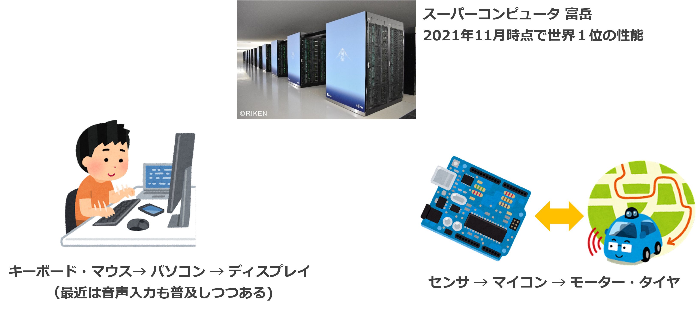
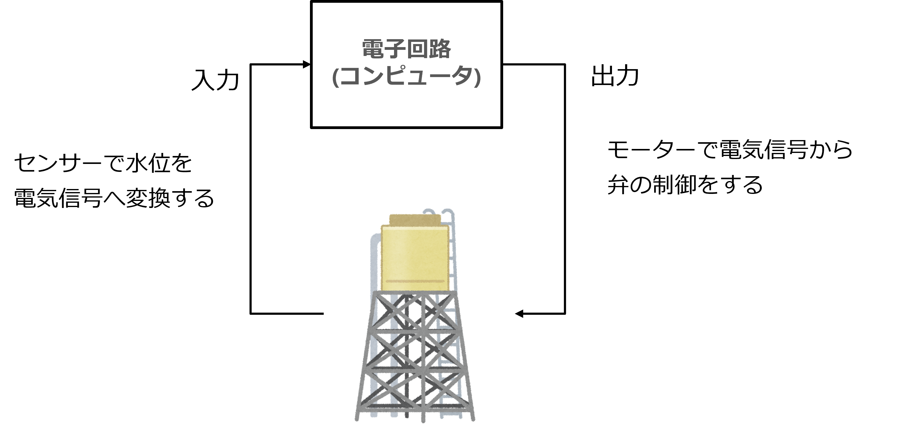
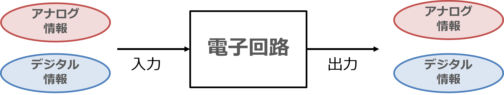
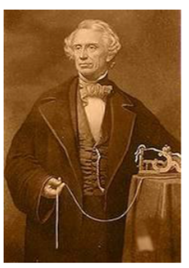
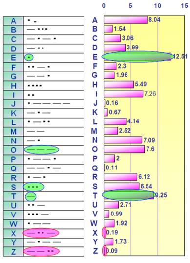
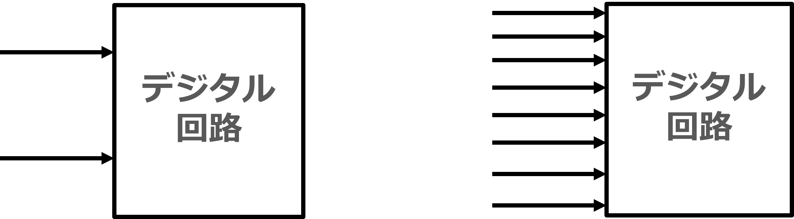
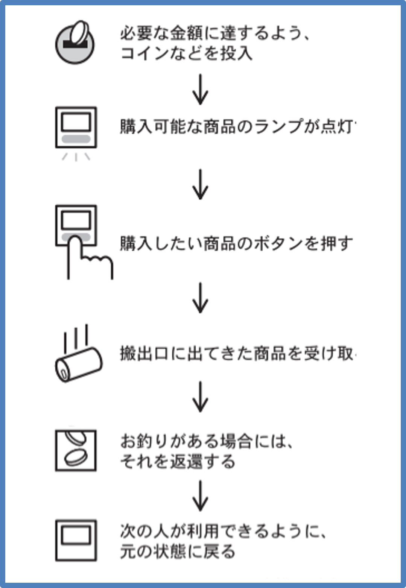
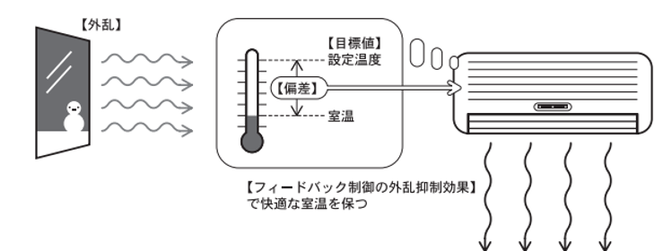

# コンピュータの基本
# コンピュータによる情報のながれ

- パソコン、スーパーコンピュータ、そしてマイコン、などコンピュータには規模や資源によっていろいろな種類がある
- 基本的な情報処理の流れは、どれもほぼ同じ  
データの入力 → データの処理 → 処理結果の出力

  

# 電子回路 (コンピュータ) の役割

コンピュータを含め、電子回路のほとんどは、**「外部からのなにかしらの情報を取り入れ、それを処理（計算）して、結果を外部に送り出す」** ことを行っている。

給水タンクであれば、センサーで水位を電気信号に変換し（入力）、水位によって、現在の貯水量を把握し（処理）、モーター（アクチュエータ）を使って弁を制御する（出力）。

  

# デジタルとアナログ

我々が電子回路（コンピュータ）を使ってなにかしらの情報を取り扱うときには、その情報の形態によって大きく２つに大別される。

- アナログ (analog)  
連続値 (連続した値) (analog は本来は「類似」という意味。そこから「相似」という意味合いもある。片方が大きくなれば、もう一方も大きくなる→温度計)
- デジタル (digital)  
離散値 (とびとびの値)

例えば、  
時刻）  
15:23:10.1293478234098323412394914321........ （時計は限界があるため、ぶつ切りに表示はしているが）いくらでも細かくなる。時間がぶつ切れになることはない。

温度）  
10 ℃ と 11 ℃ の間には 10.1 ℃, 10.11 ℃, 10.11111111111 ℃ とかいくらでも無数に桁をとることができる。

パチンコの玉）
１個、２個、３個… パチンコ玉 1.5 個というのはない。

モールス信号）
トン・ツー・ツー

  

# モールス信号
- モールスが1832年に電信用に考案した符号でデータ圧縮の草分け  
- 頻繁に現れる 'E' や 'T' に短い符号を、使用頻度の低い 'Y' や 'Z' に長い符号を割り当てることで通信時間を短縮 (情報の圧縮という)

  
  

# デジタル回路

我々がこの授業で学ぶ「マイコン」は十中十（八九ではない）、デジタル回路であり、デジタル信号を取り扱う。つまりぶつ切りになった中間のないデータ、ということである。中間がないと 3.14 とか小数点が扱えないような気になるが、そういうことはない。

たとえば、確かに相手に情報を伝えるための信号線が 1 本ならば、1 本ならば、送れる情報は 1 か 0 のどちらかである。これが２進数であり、２進数の一桁分を **1bit** と呼ぶのは、工業数学で学習したと思う。

「明日は晴れ (=1) です / 明日は雨 (=0) です」  
天気がこの２択しかないなら、この情報は 1bit である

「明日は晴れです / 明日は雨です / 明日は雪です / 明日は曇りです」
このときはどうだろうか？天気が４択のとき、「明日は雪です」という情報は何 bit の情報だろうか？ これをコンピュータが通信で送信しようと思ったら信号線は何本いるだろうか？

無数にある天気の状態を表そうと思ったら、信号線をどうしたらいいだろうか？

   
  信号線を増やせば、表現できる情報が増える
  いまのコンピュータはどんどんこの桁数が増える傾向にある

64bit コンピュータ, ハイレゾの CD, 4K テレビ, 14bit RAW 画像 etc...

# 2進数と 16進数

コンピュータは 1 or 0 というデジタル情報のみを扱う約束にしている(1 を高い電圧, 0 を低い電圧に割り当てて動いているから)。このやり方 (2進数) の欠点は、これまで述べた通り、爆発的に桁が増えていってしまうことにある。

これを多少でも緩和しようとしたのが、16 進数である。2 進数 4 ケタを 1 文字に割り当てて、ケタを減らそうとしたのである。

| 2進数   | 16進数   |
|-----|-----|
|0000 | 0
|0001 | 1
|0010 | 2
|0011 | 3
|0100 | 4
|0101 | 5
|0110 | 6
|0111 | 7
|1000 | 8
|1001 | 9
|1010 | A
|1011 | B
|1100 | C
|1101 | D
|1110 | E
|1111 | F

# 機械を制御するコンピュータ　マイコン

マイコンは Micro controller の略で、現代のさまざまな機械に組み込まれて利用されている。そのためこのような機器向けマイコンプログラムを **「組込みシステム (embedded system)」** と呼ぶことがある。機械が安全に決められた動作をするように、「制御 (controll)」が行われる。

   

# いろいろな制御方法
コンピュータ (マイコン) が行う制御方法にはざっくり２つの方法がある。覚えておこう。

## シーケンス制御

シーケンスとは「順序、順番、並び」という意味である。ドミノ倒しのように決められた動作を **順番に** 実行していく。動作の実行は、「条件」があったり、「時間」でタイミングによって決まる。

身近なシーケンス制御：自動販売機、信号機、UFOキャッチャー

   

## フィードバック制御

シーケンス制御の対となる制御方法として、**フィードバック制御** という制御方法がある。フィードバック制御は  

- 状況に応じて、機械の操作を変更する制御方法
- 動作を順番に実行するのではなく、状況の変化に応じた制御をする
- 身近なフィードバック制御：エアコン（に限らずたくさんあります）

   
  周囲の状況・環境に応じて動作を変更する

### フィードバック制御の事例　その１

- 倒立振子  
制御工学の基本  
棒が倒れないように保持する

###  フィードバック制御の事例　その２

