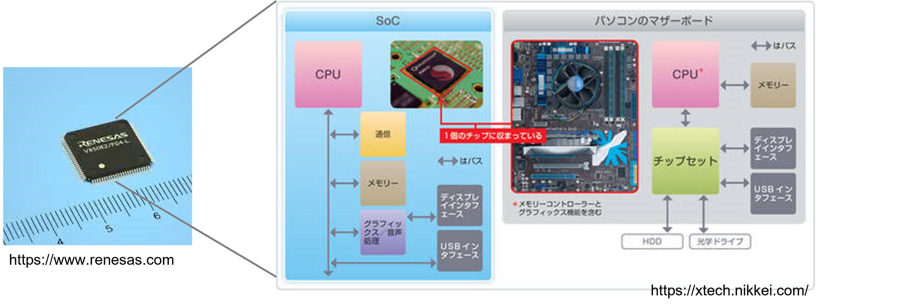
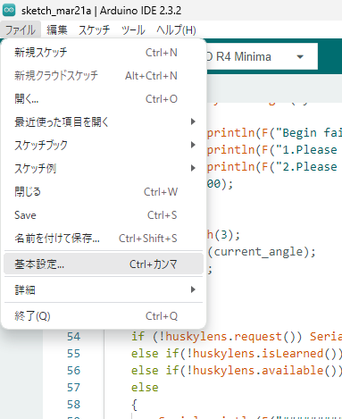
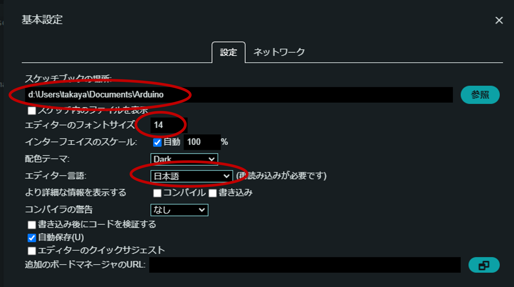
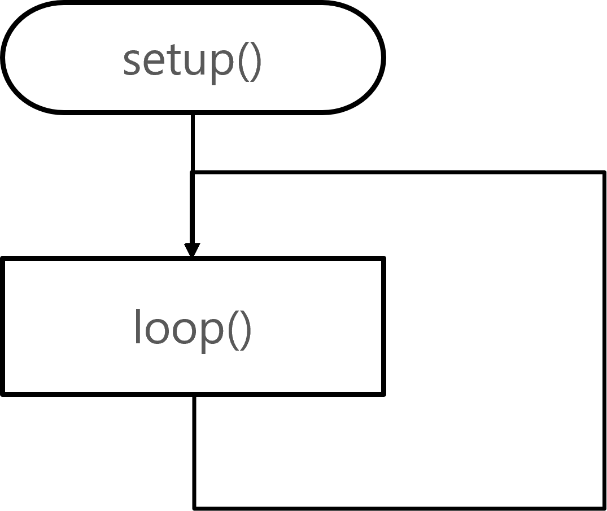

# マイコンの特徴

いまや世界中ありとあらゆるところに使われているマイコンだが、次のような特徴がある。

- 手のひらサイズの小さなコンピュータ  
    低価格（数百円で買える） → 演算能力はそれほど高くない（例外もある）
    消費電力はなるべく少なく！  
- ワンチップマイコン
    計算処理を担当する CPU の他に、センサーをはじめとする周辺機器 (ペリフェラル) を扱うための回路が初めから組み込まれている

    → **System on Chip (SoC)** という

<div style="text-align: center;">
  
</div>

# 制御にマイコンを使うメリット

制御にマイコンを使うと次のようなメリットがある。特にソフトウェアの柔軟性を利用できる点が大きい：

- マイコン制御にすると制御プログラム（ソフトウェア）の変更ができる  
    → 誤りの修正、改善、高度化がしやすい
    → データを蓄積し、比較・分析
    → 制御プログラムを書き換えることができる
- 複雑で高度な制御が行える
- 制御方法（安全性）はプログラムに依存する

三点目の特徴から、ソフトウェアの品質が重要になってくる。

# Arduino アルデュイーノ

Arduino は 2003 年にイタリアの大学で美術 (デザイン) を教えていた教授によって、コンピュータに不慣れな学生にも電子工作ができるようにするために、つくられた。

[Arduino　のホームページ](https://www.arduino.cc/en/Guide/Introduction) には次のようにある：

> Arduino is an open-source electronics platform based on easy-to-use hardware and software.

*Ref:教科書 pp.10*

## オープンソース (プラットフォーム)

Open-source (オープンソース) とは設計情報が (無償で) 公開されていて、だれでも自由に閲覧・利用・改変・再頒布できる、ということである。つまりその設計情報に基づいて誰でもその製品を作ることができる。

特にソフトウェアでは、設計情報 (プログラム) を無償で公開したものをオープンソース・ソフトウェアと呼ぶ。Linux もその一つ。

<div style="text-align: center;">
  
</div>

# Arduino IDE

Arduino 用の標準開発環境として Arduino IDE というものがある。教室の PC にもインストールされている。

Arduino IDE からプログラムを **コンパイル (実行ファイルを作ること)** をして、Arduino 本体にその実行ファイルを書き込む。

## Arduino IDE 設定

ここでは Arduino IDE を使いやすくするための設定を紹介する。
設定メニューは File (ファイル) の Preferences (基本設定) を開く。

<div style="text-align: center;">
  
</div>

- スケッチブックの場所  
    各自の自分のフォルダに Arduino というフォルダを作ってそこにスケッチブックの場所を設定する
- エディターのフォントサイズ
    14 くらいがちょうどいいのでは
- エディター言語  
    日本語

<div style="text-align: center;">
  
</div>

*Ref:教科書 pp.17*

# サンプルの実行

前回話したとおり Arduino IDE には Arduino で実行できるサンプルが多数付属している。その一つが前回動かしてもらった Blink である。
サンプルを実行するには：

1. Arduino Uno を接続する 
1. Arduino IDE を起動する 
1. 「ファイル→スケッチ例→01 Basics→Blink」を選ぶと、 Blink という ウィンドウが開く
1. 「ツール→ボード」で Arduino Uno を選ぶ 
1. 「ツール→シリアルポート」で表示されている適切な表示(COM3 Arduino Uno)を選ぶ
1. 「→」ボタン（「マイコンボードに書き込む」という表示が出る）を押す

という手順となる

# サンプルの解説

- /* ~ */ で囲まれたところはコメント
  何をするプログラムか、また著作権宣言などを書くことが多い
  // に比べてたくさんの行にまたいで書ける
- // コメント  
  その行がコメントになる
- setup()  
  電源を ON、またはリセッした直後に実行される関数
- loop()
  setup() 実行後、この loop 関数を永遠に繰り返す
- pinMode()
  その GPIO ピンのモード (入力なのか、出力なのか) を決める命令
- digitalWrite()  
  GPIO ピンに HIGH (1) か LOW (0) を出力する命令
- delay()  
  指定の時間プログラムを停止する (単位はミリ秒)

```cc
/*
  Blink

  Turns an LED on for one second, then off for one second, repeatedly.

  Most Arduinos have an on-board LED you can control. On the UNO, MEGA and ZERO
  it is attached to digital pin 13, on MKR1000 on pin 6. LED_BUILTIN is set to
  the correct LED pin independent of which board is used.
  If you want to know what pin the on-board LED is connected to on your Arduino
  model, check the Technical Specs of your board at:
  https://www.arduino.cc/en/Main/Products

  modified 8 May 2014
  by Scott Fitzgerald
  modified 2 Sep 2016
  by Arturo Guadalupi
  modified 8 Sep 2016
  by Colby Newman

  This example code is in the public domain.

  https://www.arduino.cc/en/Tutorial/BuiltInExamples/Blink
*/

// the setup function runs once when you press reset or power the board
void setup() {
  // initialize digital pin LED_BUILTIN as an output.
  pinMode(LED_BUILTIN, OUTPUT);
}

// the loop function runs over and over again forever
void loop() {
  digitalWrite(LED_BUILTIN, HIGH);  // turn the LED on (HIGH is the voltage level)
  delay(1000);                      // wait for a second
  digitalWrite(LED_BUILTIN, LOW);   // turn the LED off by making the voltage LOW
  delay(1000);                      // wait for a second
}
```

## setup(), loop()

- はじめに setup() が呼び出される
- setup() の処理が終わると、loop() が永久に繰り返される

*Ref:教科書 pp.279*

<div style="text-align: center;">
  
</div>

# シリアル通信 (USB) で Arduino からの情報をパソコン上に表示する

USB を接続した PC に Arduino から文字列の送受信ができる。
日本語はうまくいかないケースが多い。アルファベット (半角文字) を使うのが無難。

*Ref:教科書 pp.278**

```ino
void setup() {
    Serial.begin( 9600 );
}

void loop() {
    Serial.println("From Arduino Message.");

    delay(1000);
}
```
