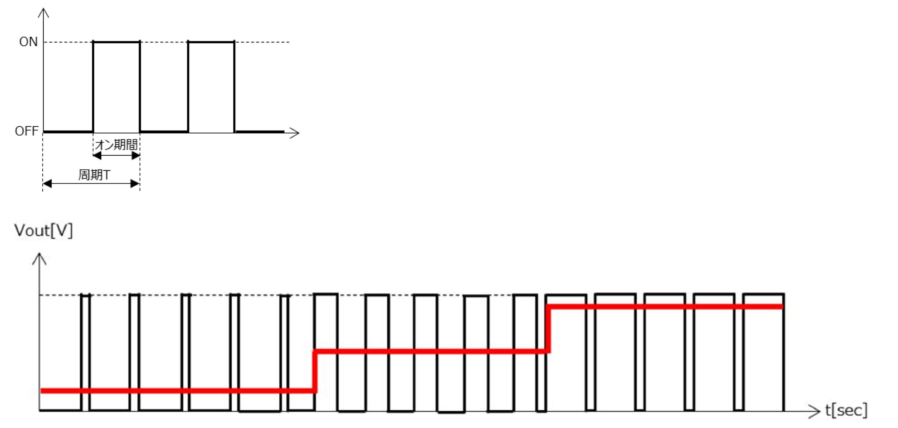

# Arduino のインターフェース

*Ref:教科書 pp.32*

Arduino には GPIO 端子が 32 個ある。ボードを注意深く見るとそれぞれにどのような用途に使えるか印字されているので、確認すること。
また、「ひとり二役」できる端子もある。PD1, PD2 は TxD, RxD を兼ねている。

# デジタルの出力

*Ref:教科書 pp35*

*digitalWrite()* 関数は GPIO へ HIGH(1) or LOW(0) を **デジタル出力** する
。
```c
const int OUTPUT_PIN = 10;

void setup(){
    pinMode( OUTPUT_PIN, OUTPUT); 
}

void loop(){
    digitalWrite( OUTPUT_PIN, HIGH );
    delay(1000);
    digitalWrite( OUTPUT_PIN, LOW );
    delay(1000);
}
```

# デジタルの入力

*Ref:教科書 pp35*

*digitalRead()* 関数は GPIO からの **デジタル入力** を読み取る。
動作させて、2 番ピンを 5V に繋いだり、GND に繋いだり、*指で触ったり*、してみよう。  
帯電していたら HIGH(1) がでるかもしれない。「浮いている」状態がどれくらい不安定かわかると思う。

```c
const int INPUT_PIN = 2;

void setup(){
    pinMode( INPUT_PIN, INPUT ); 
    Serial.begin( 9600 );
}

void loop(){
    int input_val;

    input_val = digitalRead( INPUT_PIN );

    Serial.println( input_val );
    delay(100);
}
```

# PWM

Arduino のデジタル出力では、点灯・消灯の２通りしか出力できない。**アナログ出力** を使うと、無段階に電圧を変化させることができる。

Arduino では擬似的にアナログを出力ことができる。この方法を「パルス変調」**PWM** という。

<div style="text-align: center;">
  </br>
  周囲の状況・環境に応じて動作を変更する
</div>

- ハードウェア PWM  
  ハードウェアで PWM を生成すること
  CPU (計算する本体部分) は別の処理に専念できる
  また正確な制御ができる

- ソフトウェア PWM
  ソフトウェアで PWM を生成すること
  CPU のパワーが PWM にも取られる
  タイミングなどがあまり正確ではない（波形にブレが生じる）


```c
const int OUTPUT_PIN = 3;

void setup(){
    pinMode( OUTPUT_PIN, OUTPUT );
}

void loop(){
    analogWrite( OUTPUT_PIN, 127 );     // analogWrite() 0 ~ 255 までを指定できる
}
```

## 課題
1. analogWrite() 関数の引数の 127 を 30 にして LED の明るさが変わるか確認せよ。
2. analogWrite() 関数の引数の 127 を 200 にして LED の明るさが変わるか確認せよ。
3. 教科書を参考に、LED を暗い状態からだんだん明るくなるように以下の穴埋めプログラムを完成させ、先生に動作確認してもらうこと。完成したらソースコードを kadai2-3.ino というファイル名で Google Education で提出すること。

```c
//
// 課題 3
//
const int OUTPUT_PIN = 3;
int brightness = 0;

void setup(){
    pinMode( OUTPUT_PIN, OUTPUT );
}

void loop(){
    analogWrite( OUTPUT_PIN, XXXXXXXX );     // analogWrite() 0 ~ 255 までを指定できる

    brightness = brightness + 1;
    if (brightness == YYYYYYYYY ) {
      birghtness = 0;
    }
}
```

>> brightness = brightness + 1; 
>
>この書き方は、右辺の結果を左辺に「代入する」という意味である。数学の「等しい」ではないので、注意すること。例えば brightness が 100 だったら、右辺は 100 + 1 である。それを左辺に代入（しまう、入れる）ので、この行を実行すると最終的な brightness は 101 になる。

4. 3.を改良して、LED を暗い状態からだんだん明るくして、そのあとだんだん暗くする、という動作を繰り返すプログラムを作成し、動作を先生に確認してもらうこと。完成したらソースコードを kadai2-4.ino というファイル名で Google Education で提出すること。

5. C 言語の const, そして int というキーワードはどういう意味をもつか、以下のページを参考に調べよ。  
   - **const**  
    https://wa3.i-3-i.info/word17200.html
   - **ins**  
    https://wa3.i-3-i.info/word24966.html

