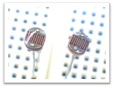

# アナログ入力

あくまでコンピュータはデジタルを扱うことをメインにした電子回路の一種だが、電子回路には 0V や 5V だけでなく 1.5V や 3V といった様々な電圧が利用される。
PWM は高速で HIGH と LOW を切り替えて擬似的に「アナログ電圧を出力する」方法であった。
ここでは、Arduino で「アナログ電圧を入力する」方法を紹介する。

*Ref: 教科書 pp.40*

# A/D コンバータ

アナログ電圧は、直接コンピュータ (CPU) で扱うことはできない。アナログ電圧をデジタルデータに変換する必要がある。

それをするための特別なハードウェアを **A/D コンバータ** という。
Arduino のプロセッサには A/D コンバータが搭載されていて、これを使うとアナログ電圧をデジタルに変換してコンピュータで読み取ることができる。

<div style="text-align: center;">
  </br>
</div>


## Arduno の A/D コンバータ

- **A0 ~ A5 の６ピンに A/D コンバータが繋がなっていて、利用できる。**
- **Arduino に搭載されている A/D コンバータは *10bit* の分解能をもち、5V の電圧を 1023 段階に分けて表現する。**
- 扱える電力の範囲は 0~5V

<div style="text-align: center;">
  </br>
</div>

## A/D 変換のステップ

A/D 変換は、主につぎの 3 つのステップで構成される：

**1. 標本化**

まず、アナログ信号を一定間隔でサンプリングする (短い間隔で区切る)。サンプリング間隔は、**サンプリング周波数**と呼ばれる逆数で表される。サンプリング周波数は、アナログ信号の最高周波数よりも**2倍以上**高くなければならない。これは、**ナイキスト定理**と呼ばれる理論に基づいている。


**2. 量子化**

次に、サンプリングされた各値を有限個のレベルに量子化する。量子化レベルは、**量子化ビット数**と呼ばれる数で決定される。量子化ビット数が多いほど、量子化レベルが細かくなり、精度が高くなる。これを **「分解能」** という。


**3. 符号化**

最後に、量子化された各値を符号化して、デジタル信号に変換する。符号化には、さまざまな方法があるが、一般的には2進数表現が使用される。

これらの3つのステップを順番に行うことで、アナログ信号をデジタル信号に変換することができる。

### 雑学

音楽データのノーマル音源とハイレゾ音源はこのサンプリング周波数と量子化のビット数が異なる。

一般の CD の音源は 44.1kHz, 16bit データである。
一方ハイレゾ音源は、96KHz, 24bit データ、192KHz, 24bit などより高いサンプリング周波数と分解能で記録されている。


**つまり、ハイレゾ音源はノーマル音源よりも**

* **より多くの音の情報**を記録しているため、
* **より原音に近い音**を再現できる。

具体的には、以下のような違いが感じられる。

* **音の広がりや奥行き感**: ハイレゾ音源の方が、楽器や歌声がよりリアルに感じられ、演奏空間に入り込んだような感覚を味わえる。
* **音の繊細さ**: ハイレゾ音源の方が、微細な音まで表現されており、楽器の質感やボーカリストの息づかいまでリアルに聴こえる。
* **音のエネルギー感**: ハイレゾ音源の方が、音のエネルギー感が強く、ライブ演奏のような迫力を感じられる。

ただし、ハイレゾ音源の恩恵を十分に受けるためには、**ハイレゾ対応の再生機器**が必要となる。また、ハイレゾ音源はファイルサイズが大きいため、**保存容量**にも注意が必要。


### AD変換の応用例

AD変換は、さまざまな分野で用いられている。代表的な例は以下のとおり：

* **音声処理**：マイクで入力された音声信号をデジタル信号に変換する。
* **画像処理**：カメラで入力された画像信号をデジタル信号に変換する。
* **計測**：温度や圧力などのアナログ量をデジタル信号に変換する。
* **通信**：アナログ信号をデジタル信号に変換して、通信回線に送る。

* **基本情報技術者平成28年秋期問5 A/D変換処理の順番**：[https://www.fe-siken.com/kakomon/28_aki/q5.html](https://www.fe-siken.com/kakomon/28_aki/q5.html)


# プログラム

- このプログラムを実行し、エネループ電池の電圧を測ってみよう。
- **質問:** (1) の行はどういうことをしているか説明せよ。

*Ref:教科書 pp.41*

```ino
const int INPUT_PIN = 1;

void setup(){
    Serial.begin( 9600 );   // USB に結果を表示するための準備
}

void loop(){
    int analog_val;
    float volt_val;

    analog_val = analogRead( INPUT_PIN );
    volt_val = (float)analog_val / 1023.0 * 5.0;    // (1)

    Serial.print( "Value:" );
    Serial.print( analog_val );
    Serial.print( " Volt:" );
    Serial.println( volt_val );

    delay(500);
}
```

# 可変抵抗の変化を読み取る

電圧を変化させるために「可変抵抗」を利用する。  
可変抵抗を変化させても、マイコンで抵抗値を直接読み取ることはできない。電圧をかけて、抵抗にかかる電圧値を読み取る。

<div style="text-align: center;">
  
</div>

<div style="text-align: center;">
  
</div>

ブレッドボード上に図のように回路を作成する。

- 可変抵抗の両端を 5V, GND に接続する
- 可変抵抗の中央の端子を A0 に接続する

## プログラムの作成

- アナログピンから電圧値を読み取るプログラムは次のようになる。
- シリアルモニタに読み取った電圧値が表示される。
- 可変抵抗の値を変化させてみよう。
- (A) の行は何をしているか説明できるだろうか。

```c++
const int VOLUME_SOCKET = 0;     // 使用するアナログピンの番号

void setup()
{
    Serial.begin(9600);         // シリアル通信 (USB) の初期設定
}

void loop()
{
    int analog_val;         // アナログ値を読み取った整数値 (0~1023) を格納する変数
    float input_volt;       // 変換した電圧値を格納する変数 (小数点)

    analog_val = analogRead( VOLUME_SOCKET );
    input_volt = float( analog_val ) * (5.0 / 1023.0);      // (A)

    Serial.print(analog_val);
    Serial.print(" : ");
    Serail.print(input_volt);
    Serial.println("V");
    delay(500);
}
```

# 分圧回路で明るさを検知する

周りの状況が変化すると、自身の抵抗値が変化する電子部品として CdS セル光センサーがある。CdS セル光センサーは、周囲が明るくなると抵抗が小さくなり、周囲が暗くなると抵抗が大きくなる。

- 明るさで抵抗値が変化する
  - 明るいとき  
  5KΩ ~ 10KΩ
  - 暗いと (まっくらで)  
  20MΩ (最大抵抗値)

<div style="text-align: center;">
  <br/>
  CdS セル光センサー
</div>


## CdS センサーを使ってみる

CdS センサーを利用する電子回路はこのようになる。

- **抵抗値 20MΩ は、使用する CdS セルの最大抵抗値によって異なる**
- 明るいとき ⇒ 読み取られる電圧は (       )
- 暗いとき ⇒ 読み取られる電圧は (       )

<div style="text-align: center;">
  <br/>
  <br/>
</div>

### プログラム

20MΩにかかる電圧値を出力するプログラムは次のようになる。

- センサーを隠して周囲を暗くしたとき、どれくらいの電圧値になるか観察せよ。
- (A) の行の 1.0 を適切な値に変更して、周囲を暗くしたときに "Darked" と表示されるようにせよ。
- LED を追加し、暗くなったら照明として LED が点灯、周囲が明るいときは消灯するように改造し、先生に報告したら ＋加点します。


```c++
const int CDS_SOCKET = 0;

void setup()
{
  Serial.begin(9600);
}

void loop()
{
  int analog_val;
  float input_volt;
  String message = "";    // String 型：文字列を格納する変数

  analog_val = analogRead( CDS_SOCKET );
  input_volt = float(analog_val) * (5.0 / 1023.0);

  if (input_volt > 1.0) {     // (A) 1.0 を適切な値にせよ
    message = "Lighted";      // 明るい
  } else {
    message = "Darked";       // 暗い
  }
  Serial.print(message);
  Serial.print(":");
  Serial.print(input_volt);
  Serial.println("V");
}
```
