# デジタル通信方式 I2C

前回まででデジタルの入出力方法、アナログの入出力方法を説明した。

ここではセンサーなどとの通信方法について説明する。

*Ref: 教科書 pp.42*

## I2C通信

I2C (正式にはアイスクエアドシーと読むが、少なくとも日本ではアイ・ツーシーでも通じる) は、IC 間で通信をするために開発された**デジタル通信方式**である。Arduino でも I2C 通信を用いて電子部品の制御ができる。ここでは I2C の概要と Arudino で I2C を利用するための手順について説明する。

### I2C通信の仕組み

I2C通信は、**マスター**と呼ばれるデバイスと**スレーブ**と呼ばれるデバイス間で行われる通信である。マスターは、通信を制御する役割を持ち、スレーブはマスターからの指示に従ってデータを送受信する。

かならず通信は **マスター** から始める。

<div style="text-align: center;">
  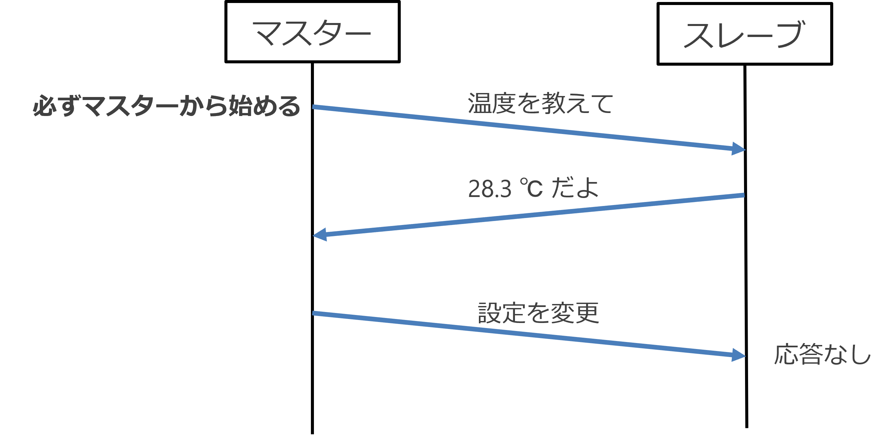<br/>
</div>

通信には、**SDA**（シリアルデータ）と**SCL**（シリアルクロック）の2本の信号線が使われる。

* **SDA:** データを送受信するための信号線
* **SCL:** 通信のタイミングを制御するためのクロック信号

マスターはSCL信号を生成し、スレーブはこの信号に同期して通信を行う。

**２本の線があれば事足りる、というのが最大の特徴**

I2C のように「複数の装置間で一本の回線を共有して使用する接続方法」を **バス接続** という。

<div style="text-align: center;">
  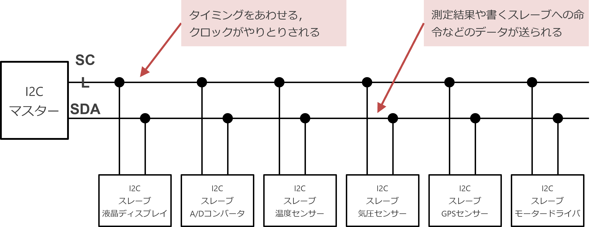<br/>
</div>

## マスターアドレスとスレーブアドレス

I2C のスレーブ装置 (センサーなどの電子機器) には固定されたアドレスがついている。

- マスターはアドレスを指定して，スレーブに命令を伝える
    - マスター           「アドレス 04 番，応答せよ」
    - スレーブ（ンサー）  「はい！」

### そこから導かれる大前提

- **バス上に同じアドレスがあってはいけない**

### I2C通信の特徴

I2C通信には、以下のような特徴がある：

* **2線式:** SDAとSCLの2本の信号線だけで通信できるため、必要な配線が少なくて済む。
* **マルチマスタ:** 複数のマスターデバイスが同じバス上で通信することができる。
* **アドレス指定:** 各スレーブデバイスには固有のアドレスが割り当てられており、マスターはこのアドレスを使って特定のデバイスと通信することができる。
* **双方向通信:** マスターとスレーブの間で双方向にデータを送受信することができる。
* **オープンコレクタ:** SDA と SCL 信号はオープンコレクタ出力であり、プルアップ抵抗が必要となる。

**利点:**

* 必要な配線が少なく、シンプルに接続できる
* 複数のデバイスを同じバス上で接続できる
* 低コストで実装できる
* 省電力

**欠点:**

* 通信速度が遅い (最大 3.4Mbps しかしあまり使われていない、普及しているのは 400Kbps 程度)
* ノイズの影響を受けやすい
* 長距離通信には向かない

# Arudino で I2C デバイスを使う注意点：

- Arduino では SCL, SDA に使用できるピンが決まっている。
- Arduino で I2C デバイスと通信するには Wire ライブラリを使う。

<div style="text-align: center;">
  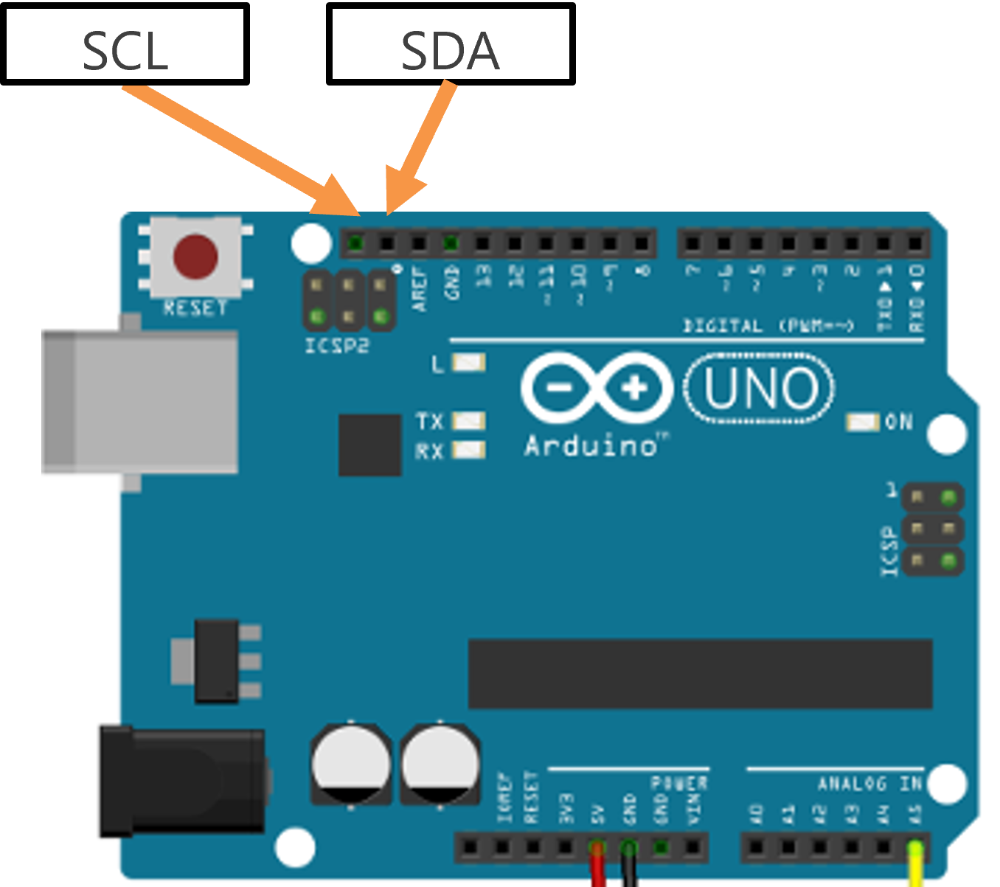<br/>
</div>

# ADT7410 温度センサー

I2C 通信でやりとりできる温度センサー ADT7410 がある。
これを使って、センサーから温度を読み取るプログラムを作ってみよう。

[ADT7410使用 高精度・高分解能 I2C・16Bit 温度センサモジュール マニュアル](https://akizukidenshi.com/goodsaffix/AE-ADT7410_aw.pdf)

<div style="text-align: center;">
  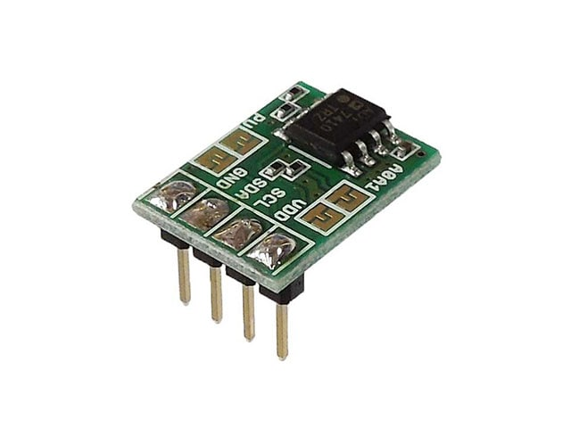<br/>
  ADT7410
</div>

<div style="text-align: center;">
  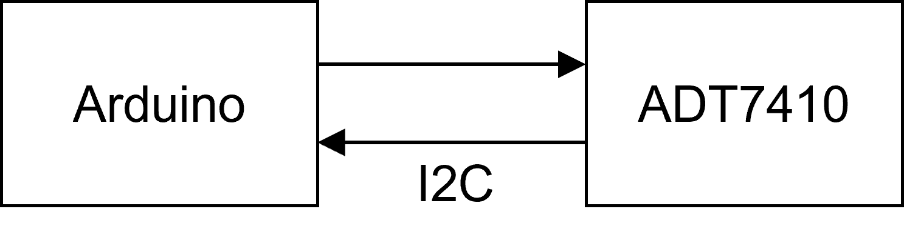<br/>
  I2C の接続状態
</div>

# 回路を作成する

- 回路を図を参考に、ADT7410 温度センサーを Arduino に接続する
  - VCC ⇒ 5V
  - GND ⇒ GND
  - SCL ⇒ AREF の２つ上 (図では緑)
  - SDA ⇒ AREF の１つ上 (図では黄色)

- この回路図とセンサーのピンの並びが異なるので注意。基盤に印刷されている文字に従うこと。

<div style="text-align: center;">
  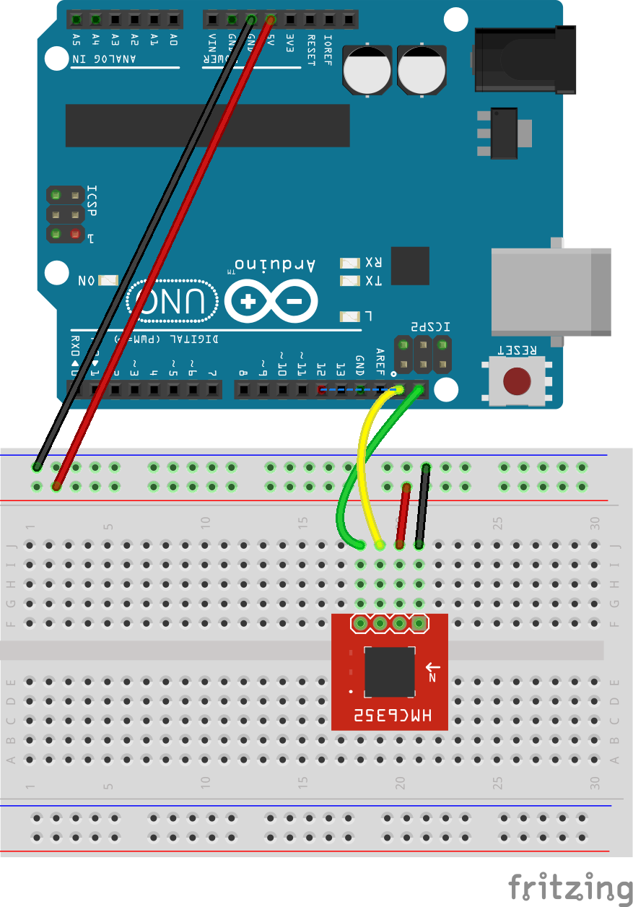
</div>

## I2C スキャナーを使って正しく接続されているか確認してみよう

- どのような I2C 機器がつながっているか表示してくれるプログラムのことを I2C スキャナーと呼ぶ。
- このページの下にある、I2C Scanner を使って温度センサーが正しく接続されているか確認してみよう。
- 温度センサーのスレーブアドレスは 0x48 である。以下のようにシリアルモニタに表示されたら正しく接続されている。

> 15:45:00.420 -> I2C device found at address 0x48
> 15:45:00.904 -> I2C device found at address 0x48

## プログラム

I2C を使ってこのセンサーモジュールから温度を読み取るプログラムは以下のようになる：

### 温度データのフォーマット

このセンサーは、読み取ったデータ (16bit または 2byte) のうち、左側 (上位側) から 13bit が有効な値である。これをマニュアルなどでは **Bits[15:3]** のように表現することがある。残りの 3bit [2:0] はめちゃくちゃな値だったり 0 だったり 1 だったり、とにかく不要な値。

また、*1bit* あたりの変化は *0.0625 ℃* であることがわかる。

**0x190 * 0.0625 は何度か？ Windows の電卓や Python, 関数電卓で計算してみよう。**

<br/>
<div style="text-align: center;">
  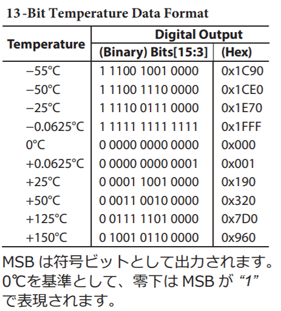
</div>
<br/>

### プログラム

```c++
#include <Wire.h> // I2Cライブラリのインクルード

const int address = 0x48; // ADT7410のアドレス

void setup() {
  Serial.begin(9600); // シリアル通信の開始
  Wire.begin(); // I2C通信の開始
}

void loop() {
  // 温度データの読み取り
  // 2byte で 1 データ (温度データ)
  byte data[2];
  
  // マスター (Arduino) からスレーブ (0x48) へ「2 バイトよこせ」というメッセージ送信
  Wire.requestFrom(address, 2);

  // スレーブ (0x48) からの返事を 1byte ずつ読み出し
  data[0] = Wire.read();
  data[1] = Wire.read();

  // 温度データの変換
  int rawTemperature = (data[0] << 8) | data[1]; // (A)
  rawTemperature = rawTemperature >> 3; // 下位 3 ビットは不要データ (捨てている) (B)
  float temperature = rawTemperature * 0.0625; // 温度データの変換 (C)

  // 温度の表示
  Serial.print("Temperature: ");
  Serial.print(temperature);
  Serial.println("°C");

  delay(1000); // 1秒間隔で読み取り
}
```

### **(A) の行でやっていること**  

> int rawTemperature = (data[0] << 8) | data[1]; // (A)
  
  1. data[0] = 11111111, data[1] = 01010101 だったとする
  1. **<<** という演算子は **左シフト** を意味する。<< 8 で、左に 8bit ずらす、という作業をする (data[0] を左に 8 ビットずらす)  
  ⇒ 結果 11111111 00000000 なる。
  1. | は、OR 演算子で data[0] をずらしたあとの値と data[1] を OR 演算している
  ⇒ 結果 11111111 01010101 (65365) という値になる
  1. それを rawTemperature に格納している

### **(B) の行でやっていること**

> rawTemperature = rawTemperature >> 3; // 下位 3 ビットは不要データ (捨てている) (B)

  1. 上の説明に従って、左に 3bit ずらして下位 3bit を捨てている  
  空いたところには０が入る

### **(C) の行でやっていること**

> float temperature = rawTemperature * 0.0625; // 温度データの変換 (C)

  1. rawTemperature はセンサーから読み取った値で整数型 (int) 

  1. 小数点型 (float) の temperature に計算結果を格納

# もう一つ I2C 電子機器をつないでみる

I2C の特徴は　**「配線が少なくてすむ」ということに尽きる。**

ここではもう一つの I2C デバイス、0.96 インチの有機 EL ディスプレイ SSD1306 をつないで、そこにセンサーから読み取った温度を表示させてみよう。

<br/>
<div style="text-align: center;">
  <br/>
  SSD1306 有機 EL ディスプレイ
</div>
<br/>

<br/>
<div style="text-align: center;">
  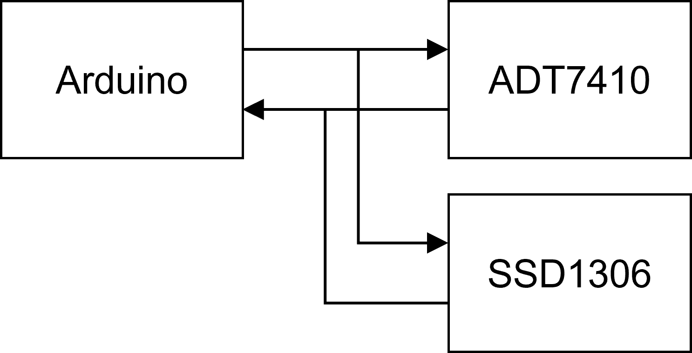<br/>
  I2C 接続形態
</div>
<br/>


# 回路を作成する

- 回路を図を参考に、有機 EL ディスプレイ SSD1306 を接続する

  - VCC ⇒ 5V
  - GND ⇒ GND
  - SCL ⇒ ブレッドボード上で温度センサーの SCL と接続, Arduino の SCL と接続
  - SDA ⇒ ブレッドボード上で音素センサーの SDA と接続, Arduino の SDA と接続

- **ここで示している回路図とセンサーのピンの並びが異なるので注意。実物の基盤に印刷されている文字に従うこと。**

<br/>
<div style="text-align: center;">
  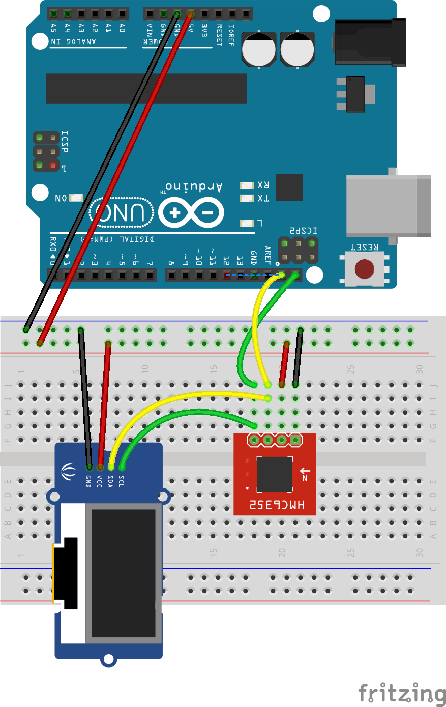
</div>
<br/>

## I2C スキャナーを使って正しく接続されているか確認する

- このページの下にある、I2C Scanner を使って温度センサーと有機 EL ディスプレイが正しく接続されているか確認する。
- 有機 EL ディスプレイのスレーブアドレスは 0x3C なので、以下の２行が表示されれば、正しく接続されている。

> 15:45:00.420 -> I2C device found at address 0x3C
> 15:45:00.904 -> I2C device found at address 0x48


## プログラム

### 準備：ライブラリのインストール

SSD1306 を動かすには追加でライブラリのインストールが必要である。
最初に以下のライブラリをインストールする：

- Adafruit GFX ライブラリ
- Adafruit SSD1306  ライブラリ

Adafruit GFX ライブラリのインストール手順：

1. 画面左側の本が並んでいるアイコンをクリックする
2. ライブラリマネージャーの検索欄に **Adafruit GFX** と入力する
3. 検索された Adafruit GFX Library をインストールする
4. 依存しているライブラリもインストールする

<br/>

<div style="text-align: center;">
  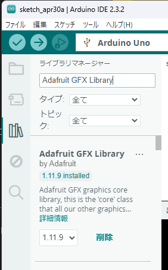<br/>
</div>


**同じ要領で、Adafruit SSD1306 ライブラリもインストールする。**
**ライブラリのインストールは１回やれば、その後は不要。**

### ディスプレイ関連の命令

- ディスプレイに関連する命令は display.XXXXXX() という形をしている。
    - display.begin()
    - display.clearDisplay()
    - display.setTextSize()
    - display.setTextColor()
    - display.setCursor()
    - display.println()
    - display.display()

- ライブラリのマニュアルを調べて、どんな命令があるかを確認すればどのようなことができるかわかるが、必要なときに調べれば良い。

```c++
#include <Wire.h> // I2Cライブラリのインクルード
#include <Adafruit_GFX.h>
#include <Adafruit_SSD1306.h>

#define SCREEN_WIDTH 128 // OLED display width, in pixels
#define SCREEN_HEIGHT 32 // OLED display height, in pixels
#define OLED_RESET     -1 // Reset pin # (or -1 if sharing Arduino reset pin)
#define SCREEN_ADDRESS 0x3C ///< See datasheet for Address; 0x3D for 128x64, 0x3C for 128x32

Adafruit_SSD1306 display(SCREEN_WIDTH, SCREEN_HEIGHT, &Wire, OLED_RESET);

const int address = 0x48; // ADT7410のアドレス


void setup() {
  Serial.begin(9600); // シリアル通信の開始
  Wire.begin(); // I2C通信の開始
  
  // SSD1306_SWITCHCAPVCC = generate display voltage from 3.3V internally
  if(!display.begin(SSD1306_SWITCHCAPVCC, SCREEN_ADDRESS)) {
    Serial.println(F("SSD1306 allocation failed"));
    for(;;); // Don't proceed, loop forever
  }

  // 初期化画面を 1 秒表示する
  display.display();
  delay(1000);

  // ディスプレイをクリア
  display.clearDisplay();
  display.display();
}


void loop() {
  // 温度データの読み取り
  byte data[2];
  Wire.requestFrom(address, 2);
  data[0] = Wire.read();
  data[1] = Wire.read();

  // 温度データの変換
  int rawTemperature = (data[0] << 8) | data[1]; // (A)
  rawTemperature = rawTemperature >> 3; // 下位 3 ビットは不要データ (捨てている)
  float temperature = rawTemperature * 0.0625; // 温度データの変換 (B)

  // 温度の表示
  Serial.print("Temperature: ");
  Serial.print(temperature);
  Serial.println("°C");

  display.clearDisplay();                   // ディスプレイをクリア
  display.setTextSize(2);                   // 文字の大きさを設定
  display.setTextColor(SSD1306_WHITE);      // 文字の色を設定
  display.setCursor(0, 0);                  // 左上 (0, 0) の位置から文字を書く
  display.println( "Temp:" );               // Temp: と表示し、改行
  display.println( temperature );           // 温度を表示し、改行
  display.display();                        // 画面に描画する

  delay(1000); // 1秒間隔で読み取り
}
```

<div style="text-align: center;">
  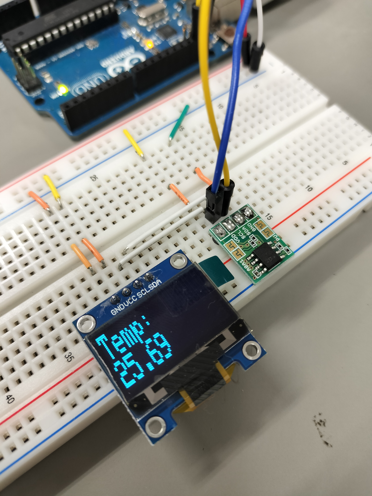
</div>

## 実行結果

# I2C Scanner (I2C スキャナー)

いまどんな I2C デバイスが Arduino に接続されているか、知りたい時がある。

接続されている I2C デバイスを調べて表示するプログラムを一般的に I2C Scanner と呼ぶ。スキャン結果をシリアルモニタに出力することで、接続されているデバイスのアドレスを確認することができる。

1. 以下のプログラムをArduino IDEのスケッチエディタに貼り付ける。  
  このプログラムはすべてのスレーブアドレス (1~127 まで) について、スレーブがつながっているか調べるプログラム。

```c++
/*
 * I2C Scanner
 *
 * このスケッチは、I2Cバスに接続されているデバイスをスキャンします。
 * スキャン結果をシリアルモニタに出力します。
 *
 * Author: unknown
 */

#include <Wire.h>

void setup() {
  Serial.begin(9600);
  Serial.println("I2C Scanner");

  Wire.begin();
}

void loop() {
  byte address;

  for (address = 1; address < 128; address++) {
    Wire.beginTransmission(address);
    if (Wire.endTransmission() == 0) {
      Serial.print("I2C device found at address 0x");
      Serial.print(address, HEX);
      Serial.println();
    }
  }

  delay(500);
}
```

2. **スケッチをArduinoボードに書き込む。**
3. **Arduino IDEのシリアルモニタを開く。**
4. シリアルモニタに、I2Cバスに接続されているデバイスのアドレスが表示される。

**例**

```
I2C Scanner
I2C device found at address 0x48
```

この例では、I2Cバスにアドレス 0x48 のデバイスが接続されている。

### I2C Scannerの応用例

* I2Cバスに接続されているデバイスをデバッグする
* 新しいデバイスを接続したときに、アドレスを確認する
* I2Cバスのトラブルシューティングを行う