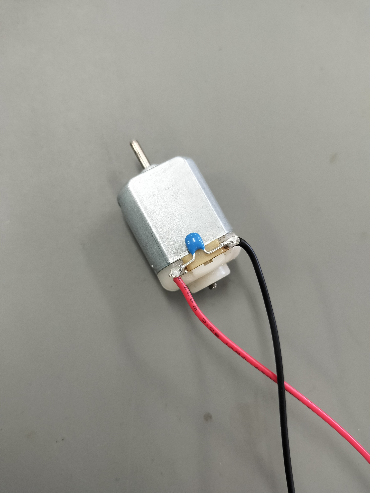
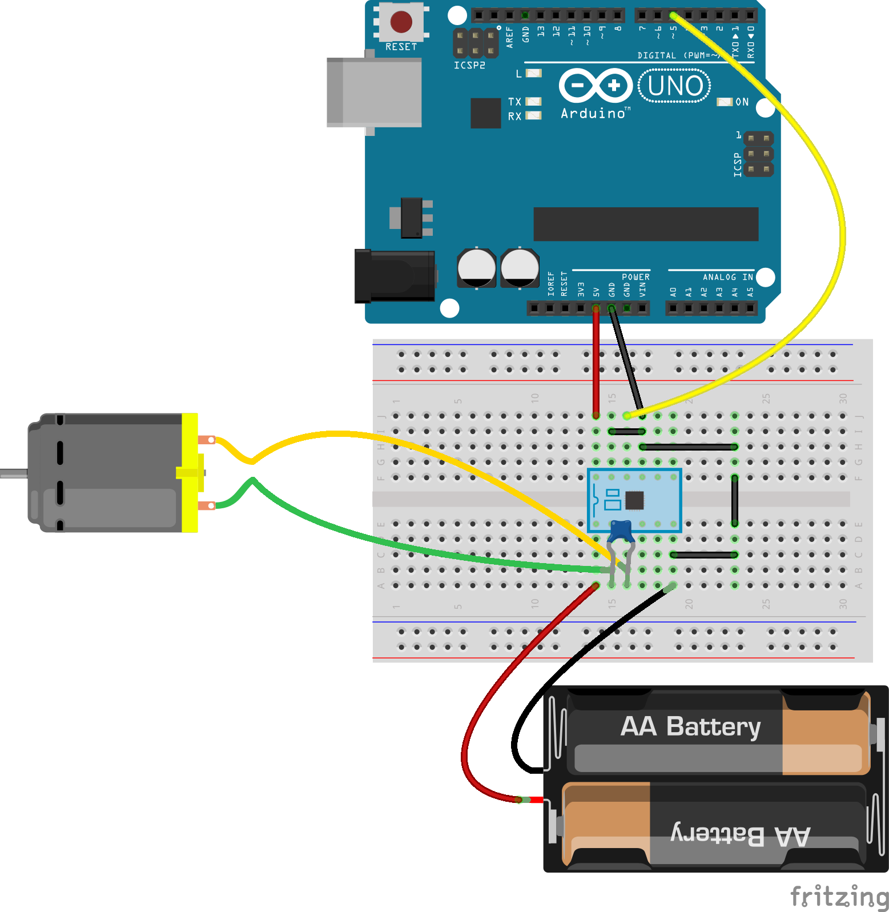
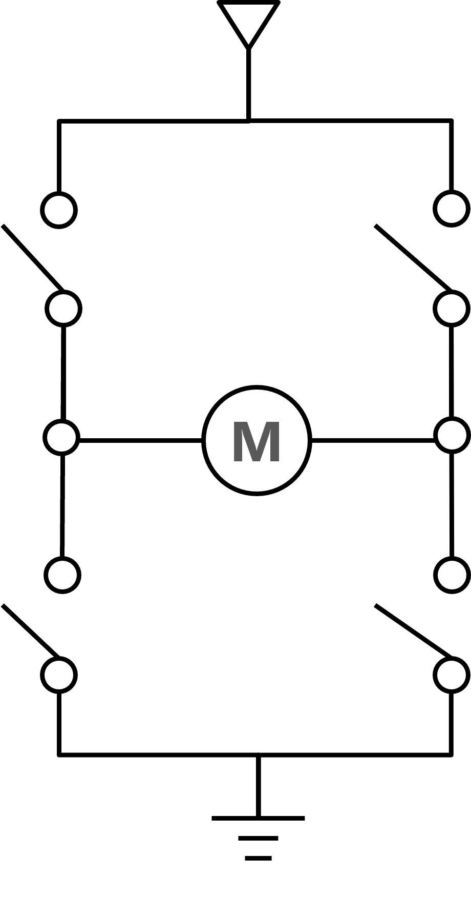
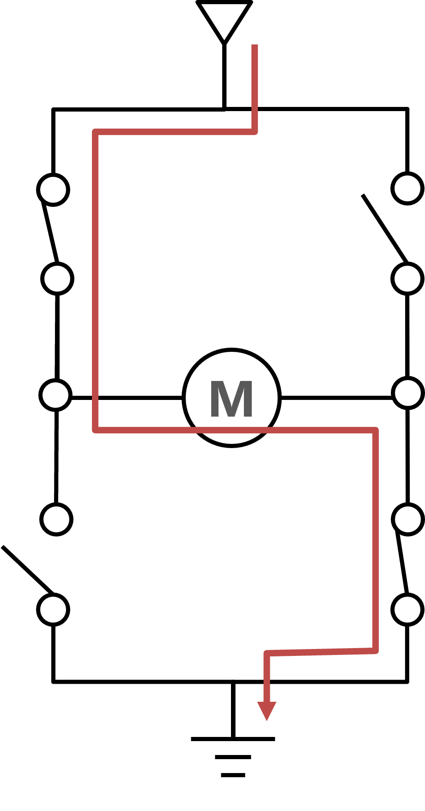
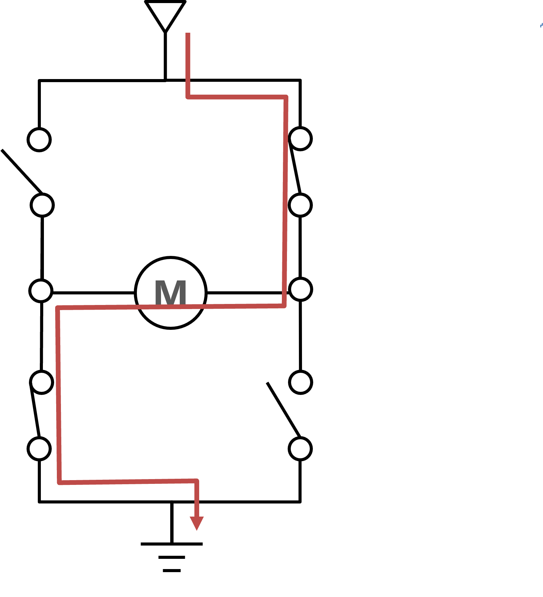
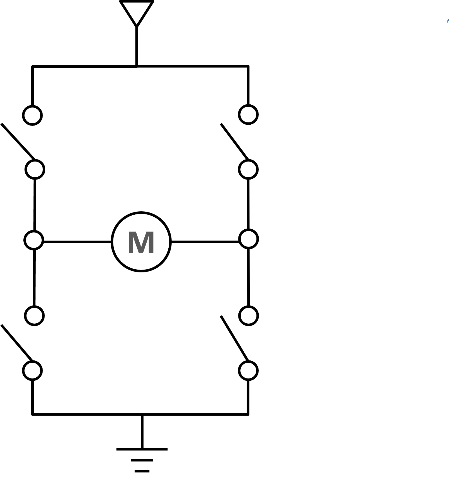
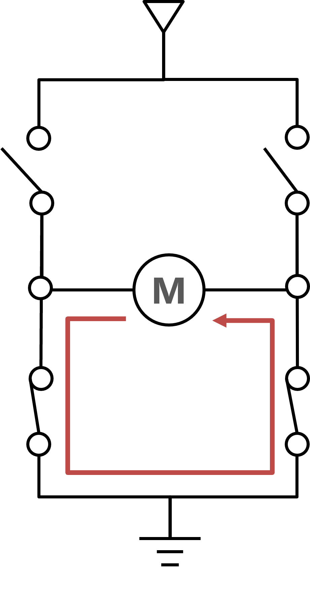
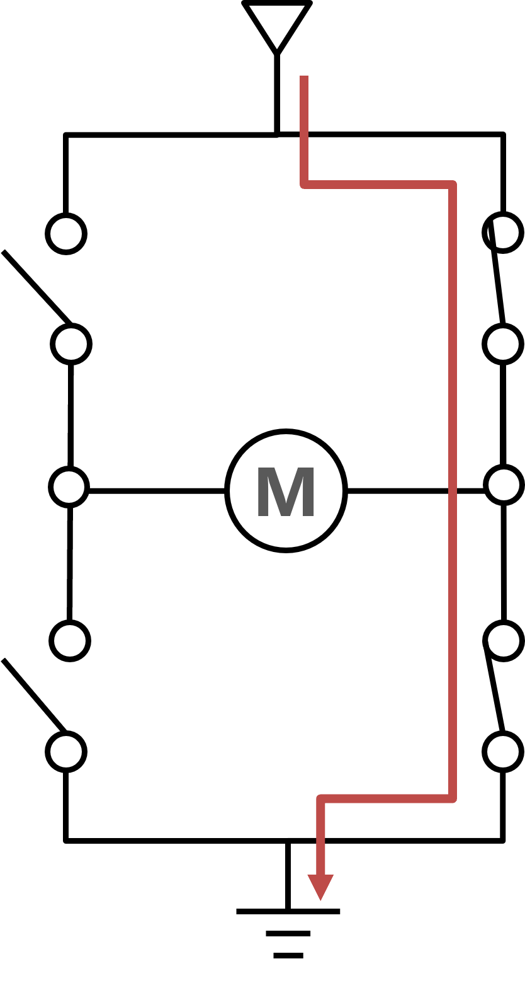

# Arduino でモーター制御
*Ref:教科書 pp.130*

いままでは、LED やセンサーなど、あまり電力を消費しない、マイコンの電源 (5V) で動作する機器を扱ってきた。

この章では、マイコンの電源では直接動作させることができないモーターをマイコンから制御する方法を紹介する。

# DC モーター
*Ref: 教科書 pp.132*

DC モーターは 2 つの端子を備えていて、端子に電池などを接続すると軸が回転する。モーターは磁気の力で回転する。メーカーもトルクも、さまざまなモーターが発売されているがここではもっとも一般的なホビーに使用する FA-130RA を使用する。FA-130RA はおよそ 100mW なので、5V 引火したときは (　　　) の電流が流れる。


<br/>
<div style="text-align: center;">
  
  <br/>
  モーターの外観
</div>
<br/>


## マイコンの GPIO から大電流は流せない
*Ref:教科書 pp.148*

上記のとおり、モーターは回転時にかなりの電流を必要とする。一方、マイコンの GPIO ピンからそのような大電流を流すことはできない。　Arduino で 20mA, Raspberry Pi で 8mA である。

このような電子部品を Arduino や Raspberry Pi に直接接続すると大電流がながれてマイコンが停止するか、最悪の場合、マイコン自体が壊れる。このため、モーターを直接マイコンで制御してはいけない。

モーターをマイコンで制御する場合は、モータードライバというモーターを動かすための専用 IC を使用する。

<br/>
<div style="text-align: center;">
  
  <br/>
  モータードライバ DRV8835
</div>
<br/>

## モータードライバ DRV8835 のピン配置
*Ref: [DRV8835 マニュアル](https://akizukidenshi.com/goodsaffix/AE-DRV8835-S_20210526.pdf)*

基盤の各ピンの機能は以下の通り (マニュアルにも記述あり)：

| ピン番号 | ピン名称 | 機能 |
|---|---|---|
| 1 | VM | モータ電源 |
| 2 | AOUT1 | A出力１ |
| 3 | AOUT2 | A出力２ |
| 4 | BOUT1 | Ｂ出力１ |
| 5 | BOUT2 | Ｂ出力２ |
| 6 | GND | グランド |
| 7 | BIN1 | Ｂ入力１/BPHASE |
| 8 | BIN2 | Ｂ入力２/BENBL |
| 9 | AIN1 | Ａ入力１/APHASE |
| 10 | AIN2 | Ａ入力２/AENBL |
| 11 | MODE | モード設定 |
| 12 | VCC | ロジック電源 |


## モータードライバ DRV8835 の動作モード

DRV8835 は 2 チャンネルあるので、2 つのモーターを制御できるが今回は一つだけを動作させてみる。
MODE (11番) を 0 (= GND = 0V) にすると、下の表のようにモーターが制御できる。

|MODE | xIN1 | xIN2 | xOUT1 | xOUT2 | 動作 |
| --- | --- | --- | --- | --- | --- |
| IN/IN モード (MODE = 0) | 0 | 0 | HiZ | HiZ | 空転 |
|  | 0 | 1 | L | H | 逆転 |
|  | 1 | 0 | H | L | 正転 |
|  | 1 | 1 | L | L | ブレーキ |
| PASE/ENABLE モード (MODE = 1) | 1 | 0 | X | L | L | ブレーキ |
|  | 1 | 1 | 1 | L | H | 逆転 |
|  | 1 | 1 | 0 | H | L | 正転 |

# 回路

## ちょっとまった！回路を組む前に

- 電池ボックスの端子をブレッドボードに刺せるように加工しよう。
- モーターにもセラミックコンデンサ 0.1uF を取り付けよう。なるべく足は短くする。

<br/>
<div style="text-align: center;">
  <br/>
  モーターにセラミックコンデンサを取り付ける  
</div>
<br/>


電池ボックスとモーターの加工が終わったら、図のような回路を組んでみよう。

- **1番 VM 端子を電池の + に接続**
- **12番 VCC 端子は Arduino の 5V 二接続**  
**<span style="color: red">1 番と 12 番をつながないように！</span>**

- 2番 AOUT1 をモーターのどちらかに接続
- 3番 AOUT2 をモーターのどちらかに接続
- 6番, 9番, 11番を GND に接続
- 10番を Arduino の D5 に接続
- 電池の - を GND に接続
- GND は Arduino と共通 (接続)

<br/>
<div style="text-align: center;">
  
</div>
<br/>


<br/>
<div style="text-align: center;">
  
</div>
<br/>

## 質問

- 11番、9番が 0 (=GND) で、10番ピンが 0 のときモーターはどうなるのか。  
  上の動作モードから判断せよ。
- 11番、9番が 0 (=GND) で、10番ピンが 1 のときモーターはどうなるのか。  
  上の動作モードから判断せよ。

# プログラム

回路ができたら、プログラミングをしてモーターを制御してみよう。
モーターの回転速度が徐々にあがり、最大電圧 (m_speed=255) に達したあとモーターが停止する、を繰り返す。

```c++
const int MOTOR_SOCKET = 5;
int m_speed = 0;

void setup()
{
    pinMode(MOTOR_SOCKET, OUTPUT);      // 5 番ピンを出力モードに
}

void loop()
{
    analogWrite(MOTOR_SOCKET, m_speed);        // analogWrite()
    delay(1000);                                // 1 秒キープ

    m_speed = m_speed + 15;                     // m_speed の値を 15 増やす
    if (m_speed > 255) {                        // 255 を超えていたら 0 にする
        m_speed = 0;
    }
}
```

# モーターの回転方向を制御する

DC モーターは逆に電圧をかけると反対方向に回転する。正転・逆転を制御するためにモータードライバを適切に設定しよう。

*Ref: 教科書 pp.145**

## H ブリッジ回路

モーターを正転・逆転させるには **H ブリッジ回路** を作る必要がある。名前の由来はもちろんその形が H の字に見えるからである。

- 4 つのスイッチにで構成されている
- スイッチをONにすると、モーターへ電流が流れ、回転する
- スイッチをOFFにすると、モーターへの電流が遮断され、停止する
- スイッチの組み合わせを変えることで、モーターの回転方向を制御できる

Hブリッジ回路で使用されるスイッチは、一般的にMOSFETやトランジスタが使われる (モータードライバはすでにこの回路が中に作られている)。

<br/>
<div style="text-align: center;">
  
  <br/>
  H ブリッジ
</div>
<br/>


### 正転

<br/>
<div style="text-align: center;">
  
  <br/>
  正転
</div>
<br/>

### 逆転

<br/>
<div style="text-align: center;">
  
  <br/>
  逆転
</div>
<br/>

### 停止

- モーターは惰性で回転する (ピタリと止まるわけではない)

<br/>
<div style="text-align: center;">
  
  <br/>
  停止
</div>
<br/>

### ブレーキ

- モーターをショートすると回転エネルギーが電気エネルギーに変換され，ブレーキがかかる

<br/>
<div style="text-align: center;">
  
  <br/>
  ブレーキ
</div>
<br/>

### 禁止！（ショート）

- 下のようにすると，電源をショートしてしまう
- このとき流れる電流を「貫通電流」という
- モータードライバではこの状態にはならないが、自分で H ブリッジを作るときには注意

<br/>
<div style="text-align: center;">
  
  <br/>
  禁止状態！
</div>
<br/>


# 回路

- 前回の回路から、9 番ピン (AIN2) を GND ではなく Arduino の D6 に接続する

## 質問

- 動作モード表から、10 番ピン (AIN1) と 9 番ピン (AIN2) をどのような組み合わせにしたら正転・逆転ができるか。

# プログラム

- まずは一定の速度 (フルスピード) で正転・逆転を制御してみよう
- 正転 ⇒ ブレーキ ⇒ 逆転 ⇒ 停止を繰り返すプログラムにしてみよう 


```c++
const int MOTOR_PIN1 = 5;
const int MOTOR_PIN2 = 6;

void setup()
{
    pinMode(MOTOR_PIN1, OUTPUT);
    pinMode(MOTOR_PIN2, OUTPUT);
}

void loop()
{
    // 正転
    digitalWrite(MOTOR_PIN1, HIGH);
    digitalWrite(MOTOR_PIN2, LOW);
    delay(2000);

    // （A)ブレーキ
    digitalWrite(MOTOR_PIN1, HIGH);
    digitalWrite(MOTOR_PIN2, HIGH);
    delay(2000);

    // (B)逆転
    digitalWrite(MOTOR_PIN1, LOW);
    digitalWrite(MOTOR_PIN2, HIGH);
    delay(2000);

    // (C)停止
    digitalWrite(MOTOR_PIN1, LOW);
    digitalWrite(MOTOR_PIN2, LOW);
    delay(2000);
}
```


# モーターの速度調整

- DC モーターは動作モードの正転と停止を高速に切り替えることで、回転速度を調節することができる
  - ずっと正転ならフルパワーでの回転だし、半分程度停止していたら半分程度の回転速度になる
  - この制御には **PWM** を使う

回路はこれまでのままで、モーターの速度制御をやってみよう。

## プログラム

- （　1　）～（　4　） の語句をうめよ

```c++
const int MOTOR_PIN1 = 5;
const int MOTOR_PIN2 = 6;

void setup() {
    pinMode(MOTOR_PIN1, OUTPUT);  // 5 番PIN 出力
    pinMode(MOTOR_PIN2, OUTPUT);  // 6 番PIN 出力
    
    // モーターを（　1　）にする
    analogWrite( MOTOR_PIN1, 0);
    analogWrite( MOTOR_PIN2, 0);
}


void loop() {
  int speed;

  speed = 0;
  // モーターを（　2　）にする
  while ( speed <= 255 ) {
    analogWrite( MOTOR1_PIN, speed );
    analogWrite( MOTOR2_PIN, 0 );
    delay( 100 );
    speed = speed + 4;
  }

  // モーターを（　3　）にする
  analogWrite( MOTORO1_PIN, 255 );
  analogWrite( MOTORO2_PIN, 255 );
  delay( 2000 );

  speed = 0;
  // モーターを（　4　）にする
  while ( speed <= 255 ) {
    analogWrite( MOTOR1_PIN, 0 );
    analogWrite( MOTOR2_PIN, speed );
    delay( 100 );
    speed = speed + 4;
  }

  // モーターを（　1　）にする
  analogWrite( MOTORO1_PIN, 0 );
  analogWrite( MOTORO2_PIN, 0 );
  delay( 2000 );
}
```

## 課題

以下の動作をする Arduino を使った回路とプログラムを作成し、レポートとしてワードのファイル kadai7.docx というファイル名で提出する。

**■ プログラム**

- タクトスイッチを２つを使い、一つを加速スイッチ、一つを減速スイッチとする  
- 加速スイッチを押すとだんだん回転が速くなり、減速スイッチを押すとだんだん回転が遅くなり最終的には止まる
- ２つのスイッチには Arduino の使用していないデジタルピンを使用する
- **<span style="color: red">スイッチを使うときにはプルアップ抵抗を使うこと(もしくは Arduino に内蔵されているプルアップ抵抗でも可) </span>**
- **<span style="color:red">速度は最大 255、最低 0 をはみ出さないようにすること (256 や -1 といった値はおかしな動作をする)</span>**

**■ レポートの内容**

- レポートには
  - 表紙 (名前)
  - 回路図
  - フローチャート  
    参考：[初心者必見！標準フローチャート記号と使い方](https://www.edrawsoft.com/jp/flowchart-symbols.html)
  - プログラム  
  - 完成したシステムの外観 (写真)  
  - 考察 (気づいたこと、工夫したこと)
  
  を含める
