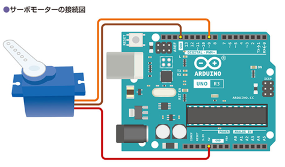

# サーボモータ

*Ref:教科書 pp.152*

DC モーターは電気を回転運動を変化させる電子部品であった。モーターにはサーボモーターという一定の角度をいじるするモーターもある。

サーボモーターは、ラジコンカーのステアリングの保持や、ロボットの関節の角度、姿勢維持などに使用される。ここでは Arduino をつかってサーボモーターを制御してみよう。

<br/>
<div style="text-align: center;">
  <br/>
  サーボモータ SG-90
</div>
<br/>

## サーボモーターの動作

サーボモーターは 3 本の端子を備えている。多くの場合、「茶」「赤」「オレンジ」の三色である。

|色|用途  |
|---|----|
|茶色|GND|
|赤色|電源 (5V) |
|オレンジ|角度信号|

に利用する。

オレンジの線は、どの程度回転させるか、を**パルス波**を送って指定する。
今回使用する「SG-90」はパルス波の周期は 20ms である。


<br/>
<div style="text-align: center;">
  <br/>
</div>

角度は、20ms の間でどの程度 ON にするかの幡で決定する。
(ここでも PWM が顔を出す)

<br/>
<div style="text-align: center;">
  <br/>
</div>

# SG-90 を動かしてみる

図のように接続する。

- 茶色 GND
- 赤色 5V
- オレンジ 9 番PIN (PWM出力)
<br/>
<div style="text-align: center;">
  <br/>
</div>

## プログラム

プログラムで指定した角度まで動かしてみよう。
Arduino にはサーボモーターを動かすためのライブラリ Servo が標準で用意されている。

```c++
#include <Servo.h>  # サーボモータ用の機能を使えるようにする

const int SERVO_PIN = 9;

Servo myservo;

void setup() {
  myservo.attach( SERVO_PIN );  // 9 番 PIN にサーボーモータがつながっていることを定義
}

void loop() {
  myservo.write( 0 );   // 0 度にする
  delay( 1000 );

  myservo.write( 90 );  // 90 度にする
  delay( 1000 );

  myservo.write( 180 );  // 180 度にする
  delay( 1000 );

  myservo.write( 90 );  // 90 度にする
  delay( 1000 );
}
```

## 課題

以下の動作をする Arduino を使った回路とプログラムを作成し、レポートとしてワードのファイル kadai8.docx というファイル名で提出する。

**■ プログラム**

- サーボモーターをもう一つ 10番 PIN に接続し、ふたつにする
- アナログピン A0 ~ A5 のいずれかに 1kΩの可変抵抗を接続する
- サーボモーターは可変抵抗と連動して動き、可変抵抗のつまみを左いっぱいに回すと２つのサーボモーターも左に 0 度となり、可変抵抗のつまみを右いっぱいに回すと 180 度となるようにする

**■ レポートの内容**

- レポートには
  - 表紙 (名前)
  - 回路図
  - フローチャート  
    参考：[初心者必見！標準フローチャート記号と使い方](https://www.edrawsoft.com/jp/flowchart-symbols.html)
  - プログラム  
  - 完成したシステムの外観 (写真)  
  - 考察 (気づいたこと、工夫したこと)
  
  を含める


