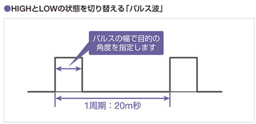
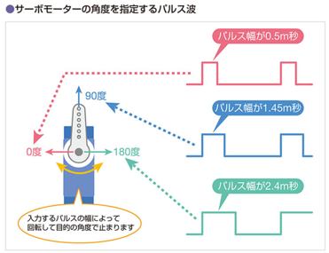

# サーボモータ

*Ref:教科書 pp.152*

DC モーターは電気を回転運動を変化させる電子部品であった。モーターにはサーボモーターという一定の角度をいじるするモーターもある。

サーボモーターは、ラジコンカーのステアリングの保持や、ロボットの関節の角度、姿勢維持などに使用される。ここでは Arduino をつかってサーボモーターを制御してみよう。

 

   
  サーボモータ SG-90

 

## サーボモーターの動作

サーボモーターは 3 本の端子を備えている。多くの場合、「茶」「赤」「オレンジ」の三色である。

|色|用途  |
|---|----|
|茶色|GND|
|赤色|電源|
|オレンジ|角度信号|

に利用する。

オレンジの線は、どの程度回転させるか、を**パルス波**を送って指定する。
今回使用する「SG-90」はパルス波の周期は 20ms である。

 

   

角度は、20ms の間でどの程度 ON にするかの幡で決定する。

 

   

