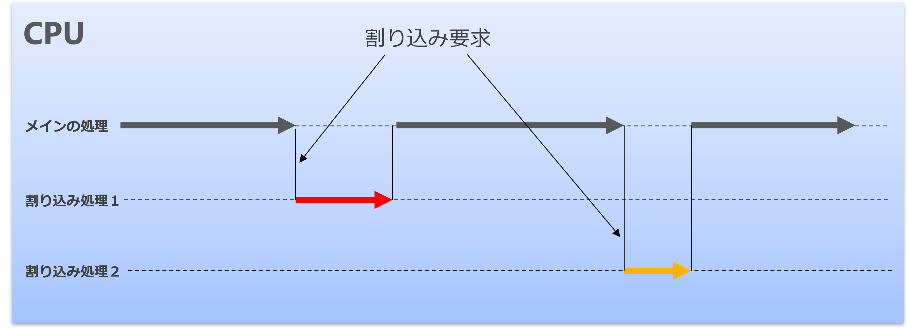

# 割り込み (interrupt)

割り込み（わりこみ、英: interrupt）とは、コンピュータがその周辺機器などから受
け取る要求の一種である。現在の多くの CPU は、割り込みを処理するための機能を備
えている。 (from ウィキペディア)

→ 文字通り、通常の処理に割り込んで別の処理を行い、**自動的に** もとの処理に戻るための仕組み

<br/>
<div style="text-align: center;">
  <br/>
</div>

## 割り込みがないと（１）

長い時間がかかる処理 (重い処理) を中断させることができない

以下のようなプログラムを動かしたとする：

```c++
void loop()
{
    Serial.println("wait for long long time…");
    delay(100000000000000000000);
    Serial.println("Hello!!");
}
```
馬鹿げていると思うかも知れないが、Arduino が３行目の Hello!! と表示するまで、プログラムを止める方法はリセットするか電源を OFF するしかない。これが車載システムやロボット、ピックアンドプレースだったらどうだろうか。
緊急停止などの処理には割り込みが必要である。

## 割り込みがないと（２）

正確なタイミング処理ができない。
正確に 1 秒を測って、カウントアップしたい。

```c++
void loop()
{
    Serial.println(counter);
    counter = counter + 1;
    delay(1000);
}
```

このようなコードを書いた場合、println 文自体にも couter の足し算にも、ほんの少しだが処理時間が必要になる。そのため、この処理方法だと deley がぴったり１秒だったとしても、処理時間が積もり積もって少しずつタイミングが遅くなっていく。

一方で、割り込みを使うと、マイコンが内蔵しているタイマーは正確に (クロックに従うが) 時間を計測するため、正確な処理が可能になる。（ただし、処理そのものが１秒を超えるのは、通常 NG）

# 割り込みの種類

割り込みの要因にはさまざまなものがある：

- プログラムで想定外の事象が起きたとき  
  ゼロ除算、桁あふれ、書き込みできない場所に書こうとしたとき

- 入力装置 (キーボードなど) に入力があったとき
  ネットワークからパケットを受信したとき  
  GPIO ピンに信号変化があったとき  
  ＾C でプログラムを止める「Keyboard Interrupt」←これも割り込み  
- 機械に不具合が発生したとき  
  電源に異常がある　← "low voltage" の警告
- タイマー  
  タイマーによって一定間隔で割り込みが発生させることができる

**条件が成立すると動き出す「イベント駆動」と密接に関連している**  
**ひいてはシーケンス制御と類似している**  
  - *「〇〇が起きたら✕✕する」*

# Arduino で 割り込み - FlexiTimer2 ライブラリ -

ここでは Arduino のタイマー割り込みを扱うライブラリ FlexiTimer2 を紹介する。

1. https://playground.arduino.cc/Main/FlexiTimer2/ にアクセスし、FlexiTimer2.zip をダウンロードする
2. スケッチ → ライブラリをインクルード → .ZIP 形式のライブラリをインストール
    - ダウンロードした FlexiTimer2.zip をインストールする
    - ネット上で提供されている、その他の Arduino 用のライブラリもこの方法でインストールできる

## FlexiTimer2 の使い方

- `#include <FlexiTimer2.h>` をファイルの頭に書く
- void setup() のなかで、  
  `FlexiTimer2::set(ミリ秒, 関数名);`
  `FlexiTimer2::start();`
  でタイマー割り込みを開始する
  ミリ秒が経過するたびに、関数が呼び出される
- 不要なときは `FlexiTimer2::stop();` を実行すると、割り込み処理がなくなる

```c++
#include <FlexiTimer2.h>    // タイマーライブラリのインクルード

const int ledPin = 13;      // LEDに接続するピン番号

void timer_func() {
  digitalWrite(ledPin, !digitalRead(ledPin)); // LEDの状態を反転
}

void setup() {
  pinMode(ledPin, OUTPUT);  // LEDピンをアウトプットモードに設定
  FlexiTimer2::set(500, timer_func); // 500ミリ秒後に割り込み発生、割り込みハンドラ関数をtimerISRに設定
  FlexiTimer2::start();   // タイマーを開始
}

void loop() {
  //
  // 注目！loop内では何も処理しない！
  //
}
```

これでなにがうれしいのか？ `loop() 関数` がまるまる開いている。

loop() 関数にやらせたい仕事を指せることができる。

たとえば、
  - センサーから値を取ってくる
  - なにか計算をする
  - モーターを動かす

など。

次の例は、単純に PC の画面 (シリアルモニタ) に 0~100 までの数字を出すプログラム。

```c++
#include <FlexiTimer2.h>    // タイマーライブラリのインクルード

const int ledPin = 13;      // LEDに接続するピン番号

void timer_func() {
  digitalWrite(ledPin, !digitalRead(ledPin)); // LEDの状態を反転
}

void setup() {
  Serial.begin(9600);
  pinMode(ledPin, OUTPUT);  // LEDピンをアウトプットモードに設定
  FlexiTimer2::set(500, timer_func); // 500ミリ秒後に割り込み発生、割り込みハンドラ関数をtimerISRに設定
  FlexiTimer2::start();   // タイマーを開始
}

uint32_t number = 0;
void loop() {
  //
  // 100 まで数えて、0 に戻る
  //
  Serial.println(number); // number が 1 増える
  number = number + 1;
  if (number == 101) {
    number = 0;
  }
}
```
