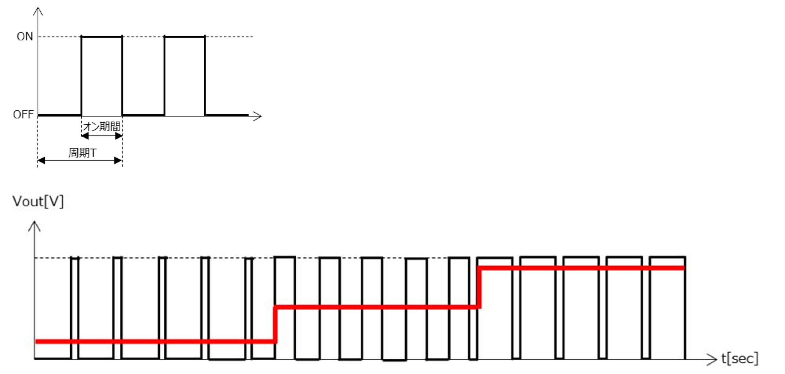

# Arduino のインターフェース

*Ref:教科書 pp.32*

Arduino には GPIO 端子が 32 個ある。ボードを注意深く見るとそれぞれにどのような用途に使えるか印字されているので、確認すること。
また、「ひとり二役」できる端子もある。PD1, PD2 は TxD, RxD を兼ねている。

# デジタルの出力

*Ref:教科書 pp35*

```c
const int OUTPUT_PIN = 10;

void setup(){
    pinMode( OUTPUT_PIN, OUTPUT); 
}

void loop(){
    digitalWrite( OUTPUT_PIN, HIGH );
    delay(1000);
    digitalWrite( OUTPUT_PIN, LOW );
    delay(1000);
}
```

# デジタルの入力

*Ref:教科書 pp35*

動作させて、2 番ピンを 5V に繋いだり、GND に繋いだり、指で触ったり、してみよう。  
「浮いている」状態がどれくらい不安定かわかると思う。

```c
const int INPUT_PIN = 2;

void setup(){
    pinMode( INPUT_PIN, INPUT ); 
    Serial.begin( 9600 );
}

void loop(){
    int input_val;

    input_val = digitalRead( INPUT_PIN );

    Serial.println( input_val );
    delay(100);
}
```

# PWM

Arduino のデジタル出力では、点灯・消灯の２通りしか出力できない。**アナログ出力** を使うと、無段階に電圧を変化させることができる。

Arduino では擬似的にアナログを出力ことができる。この方法を「パルス変調」**PWM** という。

<div style="text-align: center;">
  </br>
  周囲の状況・環境に応じて動作を変更する
</div>

- ハードウェア PWM  
  ハードウェアで PWM を生成すること
  CPU (計算する本体部分) は別の処理に専念できる
  また正確な制御ができる

- ソフトウェア PWM
  ソフトウェアで PWM を生成すること
  CPU のパワーが PWM にも取られる
  タイミングなどがあまり正確ではない（波形にブレが生じる）


```c
const int OUTPUT_PIN = 3;

void setup(){
    pinMode( OUTPUT_PIN, OUTPUT );
}

void loop(){
    analogWrite( OUTPUT_PIN, 127 );     // analogWrite() 0 ~ 255 までを指定できる
}
```