# UIFlow プログラミング環境のセットアップ

UIFlow には ver.1 と ver.2 があるが、M5StickCPLUS2 では ver.1 が安定して動作するため、ver.1 を使う。教科書も ver.1 を利用している。

## M5Burner のインストール

M5Stick C PLUS2 (以下、Stick C) にファームウェア (基本となるソフトウェア部分) を書き込むツールとして M5Burner がある。

UIFlow も M5Burner を使って利用可能となる。

1. https://docs.m5stack.com/en/download　にアクセス し、M5Bunrer Win10 x64 v3.0 をダウンロードする。

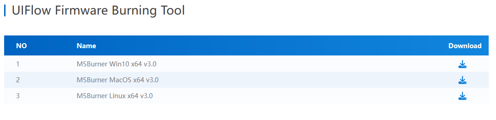

2. ダウンロードした ZIP ファイルを適当な (自分が管理しやすいフォルダに置き) 展開する。ファイルを右クリックして「すべて展開」を選ぶ。exe ファイルが展開される。

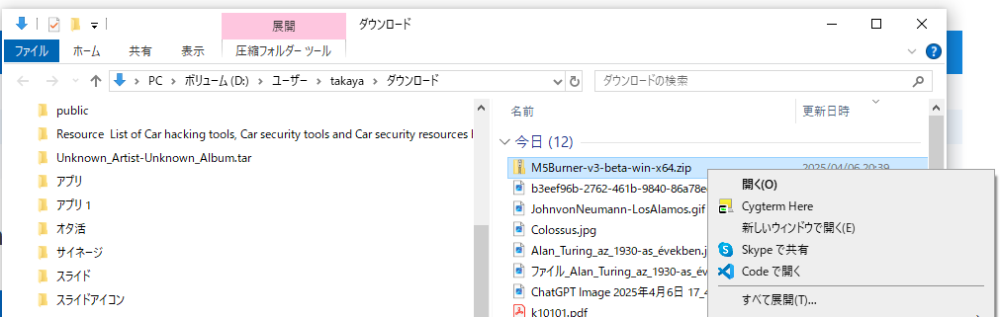
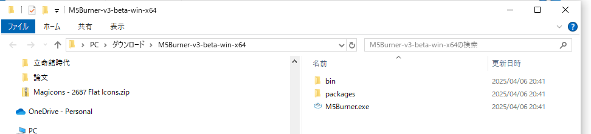

3. 警告が表示されたら、詳細情報をクリックし、「実行」をクリックする。

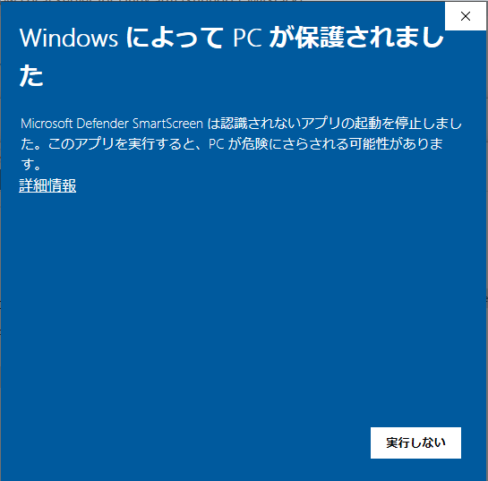

4. 右下に「更新版があるよ」というメッセージが表示されたら、リスタートする。

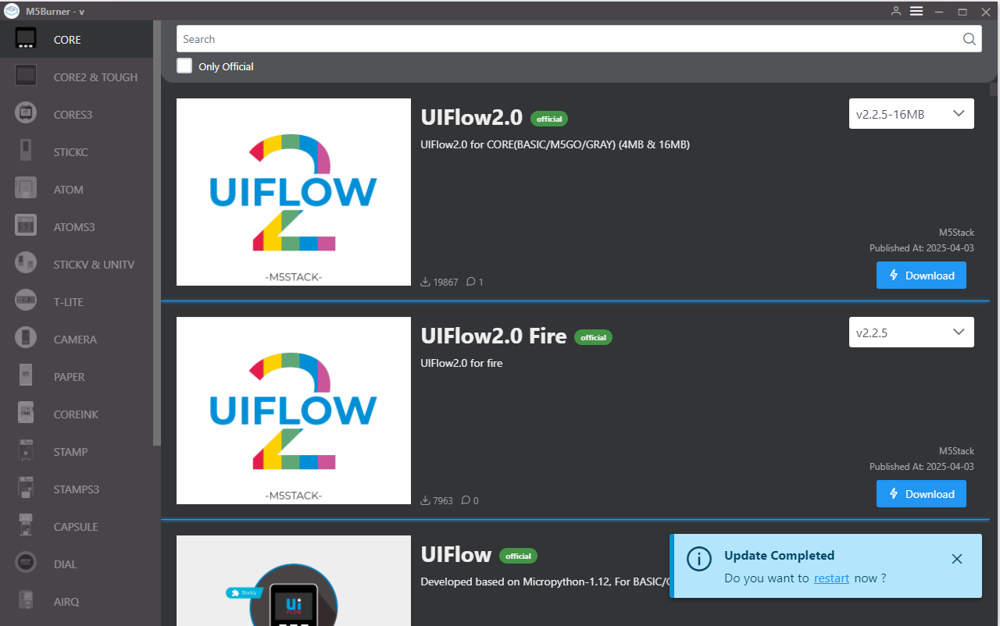

5. 左のアイコンから STICKC を選択、右のプログラム一覧から UIFlow_StickC_Plus2 の「Download」ボタンをクリックする。バージョンは v1.14.3。

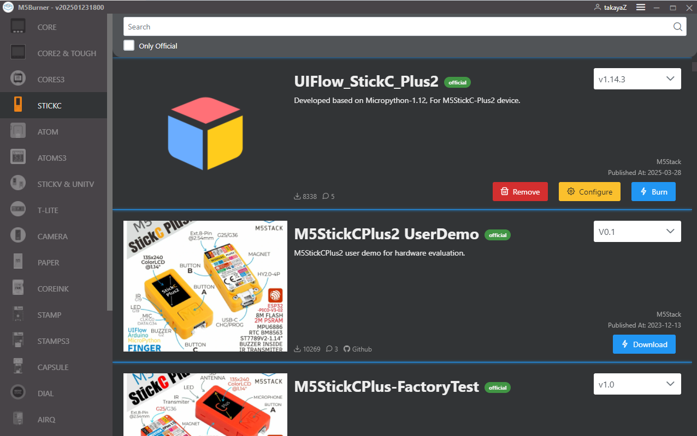

6. Stick C を PC と接続し、Burn をクリック、WIFI には以下を設定する。
   - WIFI SSID: IoT
   - WIFI Passowrd: Iotpass2020
   - Server: flow-jp.m5stack.com

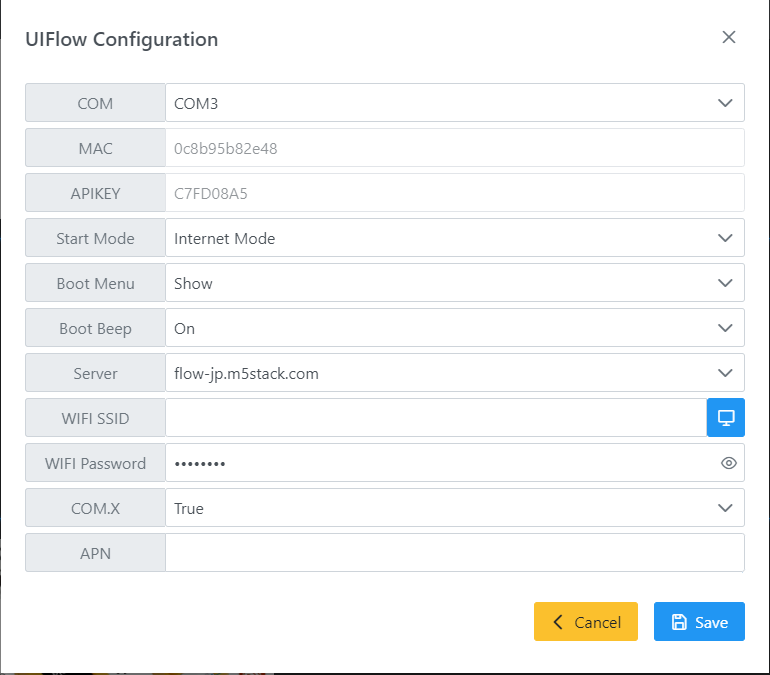

7. Burn ボタンをクリックする。Burn (マイコンにファームウェアを書き込む) には USB の接続が必要だが、Burn したあとは実は USB のケーブルすら必要ない。（電源供給には必要だけど）

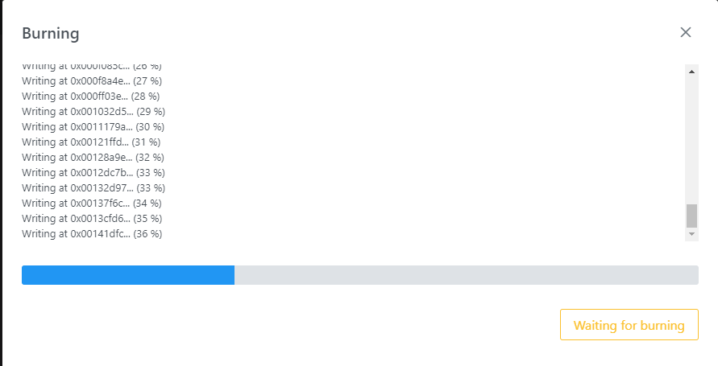

## UIFlow を使う

1. https://flow-jp.m5stack.com/ にアクセスし、右上の横線三本アイコンをクリックし、Setting を開く。**API KEY** は Stick C と通信するためのパスワードのようなもので、一致しないとマイコンにプログラムを書くことはできない。
- API KEY: Stick C に表示されている API KEY を設定
- Server: flow-jp.m5stack.com
- Language: 日本語
- Device: M5Stick C PLUS 2

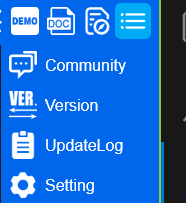

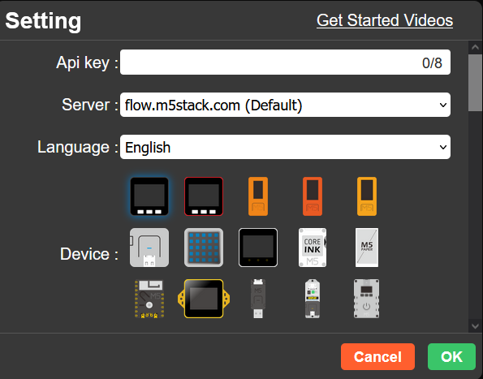

2. セットアップ完了  
ここまでいったら、セットアップ OK !
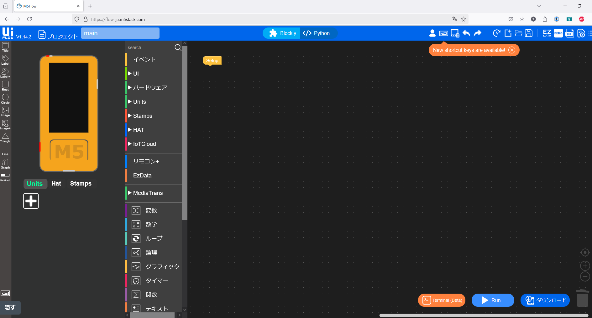

## 練習

M5Burner にはいろいろなファームウェアが用意されている。
M5Stick C PLUS2 用のものをいくつか書き込んで動作させてみよう。
たとえば、買った直後（みなさんに配った状態）の M5Stick には M5StickCPlus2 UserDemo が書き込まれている。
買った直後の状態に戻してみよう。
(試したら UIFlow を書き込んで置くように)

