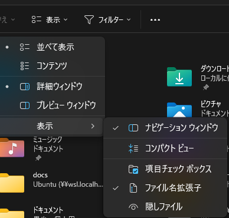
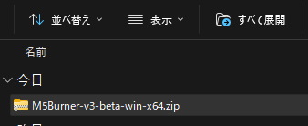

# PC の設定

改めて、PC のエクスプローラーの設定で「拡張子」を表示するようにしておくことを **強く！** 推奨します。
拡張子というのはファイル名の '.' (ピリオド) の後ろ３文字のことです。(たまに３文字以上のこともある) 

この３文字を見て、PC は、クリックされたとき何をするかを決定しています。

Windows の初期設定は拡張子を表示しない設定になっています。ぜひ、拡張子を表示する設定にしておいてください。

**この設定は各パソコンについてする必要があります**

## ZIP ファイル

拡張子が zip で終わるファイルは ZIP という形式で、複数のファイルが一つにまとめられて、かつ、サイズが小さくなるように圧縮されています。

「zip を解凍する、展開する」というのは zip ファイルを開いて元のファイルの状態に戻すことをいいます。

エクスプローラーは展開しなくても、ファイルの一覧だけは表示してくれますが、実はまだまとめられたままです。なので、その中に実行ファイルがあっても実行することはできません。

zip ファイルは展開して、はじめてちゃんと動作します。

すべてを展開を選ぶ。
