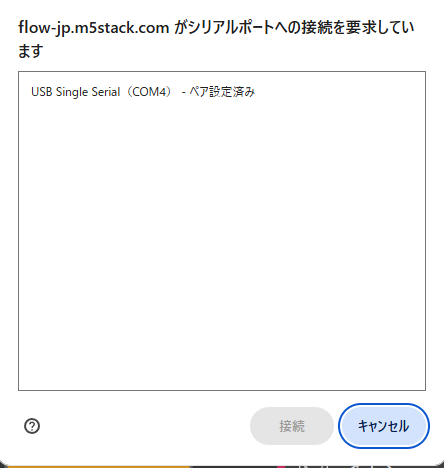

# シリアル出力 (USB ポート) の使い方

テキスト → <空> をシリアルに出力する

というブロックがある。これを使うとマイコンから USB ポートに文字を出力することができる。
(もちろん USB 接続必須)

以下のブロックを使うと、PC からマイコンへ文字 (データ) を入力することもできる。  

## Terminal

シリアル出力を確認するには Terminal (ターミナル、日本語では「端末」) を使う。
1. M5Stick を USB ケーブルで PC とつなぐ。

2. UIFlow の Terminal (Beta) を開く。

3. 左上の鎖マークをクリック。  
   どのポートと接続するか尋ねられるので、M5Stick がつながっている COMXX を選び、接続をクリック。
   

1. ボタンの説明
- RUN ボタン  
プログラムを実行する
- マイコンに書き込む  
**これをクリックしてはいけない！** これをクリックすると、現在のプログラムが M5Stick に書き込まれ、WiFI 接続が切れて UIFlow からのプログラム変更ができなくなる。  
こうなったときは、B ボタン長押しでリセットを掛け、その後 A ボタン連打する。(もちろん、意図をもって M5Stick にプログラムを書き込んで使いたいときは利用していい)

- 画面クリア  
画面がクリアされる。

- Select, Send, Get は今のところ使用しない。

